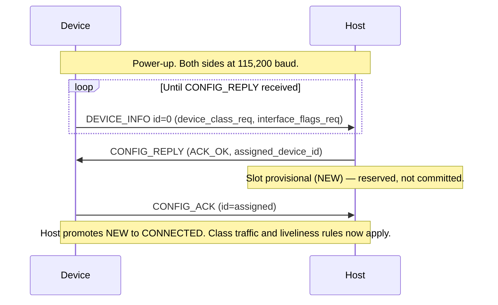

# APEX — Core

**APEX — Adaptive Payload EXchange**

**Status:** Draft | **Scope:** Core standard and discovery protocol for the standard 10-pin APEX connector

---

<a id="1--overview" name="1--overview"></a>
## 1.  Overview

APEX (Adaptive Payload EXchange) provides a "plug-and-play" architecture for
drone platforms (hosts) and payloads (devices) — analogous to USB in that the bus
protocol itself is small and class-agnostic, while payload-specific behavior is
defined through
separate **device classes** (Activation, Analog HMI, Wayfinding, Repeater,
etc).

This document defines the **core** protocol only: framing, the outer header,
baud negotiation, the discovery handshake, capability exchange, and the
device-level lifecycle status the host uses to track devices on the bus. **It
does not define Device behavior.** Once a device is discovered and its class
accepted, all further traffic is routed by `traffic_type` to a device-class spec
— see [APEX — Device Classes](APEX_Device_Classes.md) for the registry.

**Terminology.** APEX uses two role terms throughout this and all companion
specifications. The **Host** is the bus controller that runs discovery and
configuration — generally a drone's flight controller. The **Device** is the
attached unit being configured — generally a payload. The specs say *Host* and
*Device*; *flight controller* and *payload* are the typical real-world
instances of those roles.

---

<a id="2--physical--electrical-interface-10-pin" name="2--physical--electrical-interface-10-pin"></a>
## 2.  Physical & Electrical Interface (10-Pin)

### Physical Interface

The APEX standard uses a modified V-lock mechanism to align and engage a pair of
electrical blade connectors in a one-handed, toolless interface with high
rigidity and zero backlash. The payload engages and locks to the carrier by
sliding in the rear-to-front direction. The payload can be removed by reversing
this motion while depressing a button to move the spring-loaded "release slider".

(Mechanically, the **Host** is the *carrier* and the **Device** is the *payload*;
the spec uses Host and Device throughout — see [§1](#1--overview).)

This standard aims to define the critical geometry and tolerances necessary to
ensure proper engagement and interoperability between platforms. The standard
also aims to keep these requirements as simple as possible, leaving designers
maximum flexibility to integrate the components into their carrier or payload in
the most optimal way. This includes the decision not to specify the materials or
finishes of any components. The designer should ensure that their choices result
in adequate strength and rigidity to perform in all of their anticipated
carrier-payload combinations. Lubrication for the release slider may improve
performance depending on material and finish choices.

Appropriate tolerances are important to minimize rattle and maximize the
stiffness of the connection between the Host and the Device — rattle in the
Device can affect the flight stability of the Host. The critical geometry and
tolerances are defined by the mechanical standard package (STEP model and
drawing) published alongside this document.

**Key APEX components:**

- **Carrier (Host):** APEX RECEIVER (carrier side), APEX RELEASE SLIDER, RETURN
  SPRING, CARRIER PCB (with female receptacle connector).
- **Payload (Device):** APEX WEDGE (payload side), PAYLOAD PCB (with male blade
  connector).

### Electrical Interface

The electrical connectors chosen for APEX are the
[TE "DC Jack Connector" range of 2.5 mm-pitch blade connectors](https://www.te.com/en/plp/battery-connectors-dc-jacks/Y30na.html).
Any alternate brand or custom connector is also an acceptable choice if it can be
shown to be fully interoperable with the TE series with equivalent dimensional
control. Care should be taken to route and/or shield any PCBAs or wire harnesses
such that signal integrity is preserved in the vicinity of high-current motors
and ESCs.

| Pin | Label | Description |
| --- | --- | --- |
| Pin 1 | **Motor Current** | Analog Current Sense |
| Pin 2 | **VBATT** | Direct Battery Voltage (6V–30V†). |
| Pin 3 | **DIO 3.3V / I2C SDA** | Discrete Output (3.3V) or I2C Serial Data |
| Pin 4 | **DIO 3.3V / I2C SCL** | Discrete Output (3.3V) or I2C Serial Clock |
| Pin 5 | **UART RX** | Upstream Link (Device to Host). |
| Pin 6 | **UART TX** | Downstream Link (Host to Device). |
| Pin 7 | **CVBS+ / USB D+** | Analog Video Signal (Positive) / Full Speed USB D+  |
| Pin 8 | **CVBS- / USB D-** | Analog Video Signal (Negative) / Full Speed USB D- |
| Pin 9 | **12V 2 Amps** | Regulated high-power rail for payload electronics. |
| Pin 10 | **GND** | Common Ground. |

*Pins with secondary assignments are selectable during discovery — see [§5.3](#5-3--secondary-pin-assignments).*

† We believe that 8S lithium polymer voltages (33.6V) are possible within IPC-2221A B1 specifications where the continuous
curve interpolation places the limit over 40 volts with a confirmed minimum clearance and creepage of 0.4mm.
For IEC 60664-1, this is only applicable in an environment consistent with B1 assumptions.  For Pollution Degree 2 or 3,
conformal coating of the non-mating surfaces of the connector is a potential avenue to maintain full compliance.


---

<a id="3--communication-protocol-uart" name="3--communication-protocol-uart"></a>
## 3.  Communication Protocol (UART)

**Default Baud Rate:** 115,200 bps (all sessions begin here — see [§3.4](#3-4--baud-rate-negotiation)) |
**Format:** 8N1 |
**Framing:** Consistent Overhead Byte Stuffing (COBS) —
[Wikipedia](https://en.wikipedia.org/wiki/Consistent_Overhead_Byte_Stuffing).
Frames are delimited by `0x00`. Frame sizing is given in [§3.1.4](#3-1-4--frame-sizing).

<a id="3-1--frame-layout" name="3-1--frame-layout"></a>
### 3.1.  Frame Layout

All multi-byte fields in APEX V0 frames are transmitted little-endian (low byte first).

Each APEX V0 frame, prior to COBS encoding, has the following structure:

```
[ Outer Header ][   Inner Payload   ][   CRC   ]
     4 bytes         0 – 255 bytes      2 bytes
```

The **Outer Header** is fixed at 4 bytes ([§3.1.1](#3-1-1--outer-header-apexv0hdr_t)); the **CRC** is 2 bytes ([§3.1.2](#3-1-2--crc)). Total decoded-frame and on-wire sizes are given in [§3.1.4](#3-1-4--frame-sizing).

The **Inner Payload** is `payload_length` bytes (`0`–`255`). Its layout is determined by the frame's `traffic_type` ([§3.1.1](#3-1-1--outer-header-apexv0hdr_t)). `traffic_type = 0` is CONFIG, whose payload is defined by this spec in [§3.2](#3-2--config-traffic-traffic_type--0); every other value selects a device class whose companion spec defines the payload — see [APEX — Device Classes](APEX_Device_Classes.md). A `payload_length` of `0` carries no inner payload and is the implicit heartbeat ([§3.5](#3-5--heartbeat)).

<a id="3-1-1--outer-header-apexv0hdr_t" name="3-1-1--outer-header-apexv0hdr_t"></a>
#### 3.1.1.  Outer Header (`ApexV0Hdr_t`)

| Field | Size | Description |
| --- | --- | --- |
| `protocol_version` | `u8` | APEX protocol version. `0` = V0. |
| `traffic_type` | `u8` | Selects the device class / traffic channel for this frame. `0` = CONFIG (defined here); all other values are routed to a device-class spec — see [APEX — Device Classes](APEX_Device_Classes.md). |
| `device_id` | `u8` | Identifier of the device for this frame. Devices send `0x00` (unassigned) until the host assigns them an ID via CONFIG_REPLY ([§3.2.2](#3-2-2--config_reply-msg_id--2)); thereafter they use the assigned ID. `0xFF` is reserved for host-originated broadcast frames. See [§3.1.3](#3-1-3--device_id-ownership-and-reserved-values). |
| `payload_length` | `u8` | Length, in bytes, of the inner payload that follows the header (0–255). |

<a id="3-1-2--crc" name="3-1-2--crc"></a>
#### 3.1.2.  CRC

A 16-bit CRC follows the inner payload, transmitted little-endian (low byte first).

| Property | Value |
| --- | --- |
| Algorithm | CRC-16/CCITT-FALSE |
| Polynomial | `0x1021` |
| Initial value | `0xFFFF` |
| Input reflection | none |
| Output reflection | none |
| Final XOR | `0x0000` |
| Coverage | All bytes of the outer header ([§3.1.1](#3-1-1--outer-header-apexv0hdr_t)) and inner payload, in transmission order, computed prior to COBS encoding. |

A receiver MUST discard any frame whose computed CRC does not match the transmitted value.

<a id="3-1-3--device_id-ownership-and-reserved-values" name="3-1-3--device_id-ownership-and-reserved-values"></a>
#### 3.1.3.  `device_id` Ownership and Reserved Values

The host is the sole authority for `device_id` assignment. A device's lifecycle on the bus is:

1. On power-up, the device has no assigned `device_id` and uses `0x00` in its DEVICE_INFO frames ([§3.2.1](#3-2-1--device_info-msg_id--1)).
2. The host returns an assigned ID in CONFIG_REPLY's `assigned_device_id` field on `ACK_OK` ([§3.2.2](#3-2-2--config_reply-msg_id--2)).
3. The device adopts that ID and uses it in the outer header for all subsequent frames in the session.

**Reserved values:**

| Value | Meaning |
| --- | --- |
| `0x00` | Unassigned. A device uses this in its outer header until the host assigns it an ID. The host MUST never assign `0x0000` to a CONNECTED device. |
| `0xFF` | Broadcast. Reserved for host-originated frames addressed to all devices on the bus. V0 defines no broadcast traffic; receivers must accept frames with `device_id = 0xFFFF` only when explicitly defined by a future spec revision. |
| `0x01`–`0xFE` | Valid assigned IDs. |

**Persistence.** `device_id` is **ephemeral per session**. A device that resets
returns to `device_id = 0x00` and re-runs discovery. Hosts likewise discard
their assignment table on reset.

**Assignment policy.** The host (specifically _root host_) MUST ensure assigned
IDs are unique among currently-CONNECTED devices on its bus. The specific
allocation strategy is implementation-defined; a monotonic counter starting at
`0x01` and skipping `0xFF` is a recommended default.

<a id="3-1-4--frame-sizing" name="3-1-4--frame-sizing"></a>
#### 3.1.4.  Frame Sizing

A frame exists in two forms, and an implementation needs a buffer for each.

The **decoded frame** is the logical frame an implementation builds and parses — the outer header, the inner payload, and the CRC, before COBS encoding. Its maximum size is:

| Part | Bytes |
| --- | --- |
| Outer header ([§3.1.1](#3-1-1--outer-header-apexv0hdr_t)) | 4 |
| Inner payload (`payload_length` max) | 255 |
| CRC ([§3.1.2](#3-1-2--crc)) | 2 |
| **`APEX_V0_MAX_FRAME_LENGTH`** | **261** |

The **encoded frame** is what is transmitted on the wire: the decoded frame after COBS encoding, plus the trailing `0x00` delimiter. COBS adds at most ⌈N / 254⌉ overhead bytes for an N-byte input — for a 261-byte input, `⌈261 / 254⌉ = 2` overhead bytes. Its maximum size is:

| Part | Bytes |
| --- | --- |
| Decoded frame (`APEX_V0_MAX_FRAME_LENGTH`) | 261 |
| COBS overhead | 2 |
| `0x00` delimiter | 1 |
| **`APEX_V0_MAX_ENCODED_FRAME_LENGTH`** | **264** |

Receive and transmit buffers that hold a raw on-wire frame MUST be sized to `APEX_V0_MAX_ENCODED_FRAME_LENGTH` (264 bytes). Buffers that hold a decoded frame for parsing or construction need only `APEX_V0_MAX_FRAME_LENGTH` (261 bytes).

<a id="3-1-5--frame-notation" name="3-1-5--frame-notation"></a>
#### 3.1.5.  Frame notation

Worked examples throughout this spec and the device-class specs display frames using a common notation, defined here.

Each frame is shown as a single line of hex bytes — the complete frame as it exists *before* CRC-16 is appended and *before* COBS encoding. The 2-byte CRC ([§3.1.2](#3-1-2--crc)) and the COBS framing are applied by the sender and are not reproduced in the byte lines.

The four-byte **outer header** ([§3.1.1](#3-1-1--outer-header-apexv0hdr_t)) is separated from the **inner payload** by a wider gap:

```
PV TT ID LN    M1 ..  ..  ..       <- outer header (4 B)   inner payload (N B)
```

where `PV` = `protocol_version`, `TT` = `traffic_type`, `ID` = `device_id`, `LN` = `payload_length`, and `M1` = the inner payload's leading `class_msg_id` byte. `LN` equals the inner-payload byte count. An example states the fixed `PV`, `TT`, and `ID` values that hold throughout it.

A field table under each frame names every inner-payload byte. Bytes that **change** from the previous frame of the same type are called out, since those are where the device's progress is visible.

<a id="3-2--config-traffic-traffic_type--0" name="3-2--config-traffic-traffic_type--0"></a>
### 3.2.  CONFIG Traffic (`traffic_type = 0`)

CONFIG is the only traffic type defined by this core spec. It carries the
implicit heartbeat plus all discovery and capability-exchange messages.

A CONFIG frame with `payload_length = 0` is the implicit heartbeat ([§3.5](#3-5--heartbeat)) and carries no inner payload. Otherwise (`payload_length > 0`), the inner payload begins with a one-byte `msg_id` identifying the message; the bytes that follow are message-specific and are defined in the subsection for that message.

| `msg_id` | Name | Direction | Meaning |
| --- | --- | --- | --- |
| `0` | *(reserved)* | — | Reserved; never sent. The implicit heartbeat ([§3.5](#3-5--heartbeat)) carries no `msg_id` byte. |
| `1` | **DEVICE_INFO** | Device → Host | Declares the device's requested class and interfaces ([§3.2.1](#3-2-1--device_info-msg_id--1)). |
| `2` | **CONFIG_REPLY** | Host → Device | Host's response to DEVICE_INFO ([§3.2.2](#3-2-2--config_reply-msg_id--2)). |
| `3` | **NAME_REQUEST** | Host → Device | Requests the device's human-readable name ([§3.2.3](#3-2-3--name_request-msg_id--3)). |
| `4` | **NAME_REPLY** | Device → Host | Carries the device's human-readable name ([§3.2.4](#3-2-4--name_reply-msg_id--4)). |
| `5` | **HOST_STATE** | Host → Device | Host's flight state, broadcast to all devices ([§3.2.5](#3-2-5--host_state-msg_id--5)). |
| `6` | **CONFIG_ACK** | Device → Host | Confirms the device latched its assigned `device_id`, completing the handshake ([§3.2.6](#3-2-6--config_ack-msg_id--6)). |

All multi-byte fields in CONFIG messages are little-endian ([§3.1](#3-1--frame-layout)).

<a id="3-2-1--device_info-msg_id--1" name="3-2-1--device_info-msg_id--1"></a>
#### 3.2.1.  DEVICE_INFO (`msg_id = 1`)

Sent by the device during discovery to declare the class it wishes to operate as
and which secondary interfaces it requires.

| Field | Size | Description |
| --- | --- | --- |
| `device_class_req` | `u8` | The device class the Device wishes to operate as. Matches a `traffic_type` value — see [APEX — Device Classes](APEX_Device_Classes.md). |
| `interface_flags_req` | `u8` | Bitfield of secondary interfaces requested (see below). |

**`interface_flags_req` bit layout:**

```
0b76543210
       ||- bit 0: I2C supported (Pins 3 & 4)
       |-- bit 1: GPIO supported (Pins 3 & 4, default)
       --- bit 2: USB supported (Pins 7 & 8)
           bit 3: CVBS video supported (Pins 7 & 8, default)
           bits 4–7: reserved
```

<a id="3-2-2--config_reply-msg_id--2" name="3-2-2--config_reply-msg_id--2"></a>
#### 3.2.2.  CONFIG_REPLY (`msg_id = 2`)

Sent by the host in response to DEVICE_INFO.

| Field | Size | Description |
| --- | --- | --- |
| `ack` | `u8` | Host's response code (see below). |
| `assigned_device_id` | `u8` | On `ACK_OK`, the `device_id` the host has assigned to this device ([§3.1.3](#3-1-3--device_id-ownership-and-reserved-values)). On any reject, this field is `0x0000`. |

**`ack` values:**

| Value | Name | Meaning |
| --- | --- | --- |
| `0x00` | `ACK_OK` | Host accepts the requested class and interface flags. The device adopts `assigned_device_id` ([§3.1.3](#3-1-3--device_id-ownership-and-reserved-values)) and **MUST** confirm by sending CONFIG_ACK ([§3.2.6](#3-2-6--config_ack-msg_id--6)). Class-specific traffic on `traffic_type = device_class_req` becomes valid. On the host side the device slot stays **provisional** (NEW) until the device confirms — see [§3.3](#3-3--startup-discovery-handshake). |
| `0x01` | `ACK_REJECT_CLASS` | Host does not support the requested `device_class_req`. The device should not retry the same DEVICE_INFO. |
| `0x02` | `ACK_REJECT_INTERFACE` | Host supports the class but cannot grant the requested `interface_flags_req`. The device may retry DEVICE_INFO with reduced flags. |
| `0x03` | `ACK_REJECT_VERSION` | Host does not support the requested `protocol_version` ([§3.6](#3-6--versioning)). The device may retry with a lower version. |

A device that receives a CONFIG_REPLY with an `ack` value not enumerated above
MUST treat it as `ACK_REJECT_CLASS`.

On any reject (`ACK_REJECT_CLASS`, `ACK_REJECT_INTERFACE`, `ACK_REJECT_VERSION`), the host **should** surface the reason to the operator. A device that fails discovery has no other channel to explain why — without host-side feedback, an integrator sees only a Device that never connects.

The host MUST set the CONFIG_REPLY's outer-header `device_id` to match the
`device_id` of the DEVICE_INFO it is replying to (which is `0x00` for an
initial DEVICE_INFO from an unassigned device).

<a id="3-2-3--name_request-msg_id--3" name="3-2-3--name_request-msg_id--3"></a>
#### 3.2.3.  NAME_REQUEST (`msg_id = 3`)

Sent by the host after successful configuration.  Used to fetch the "friendly name" of the attached device.

| Field | Size | Description |
| --- | --- | --- |
| `bytes_allocated` | `u8` | Number of ASCII characters the host is capable of using to display the name |

NAME_REQUEST is optional and is not part of the configuration process; a host need not send it. Device handling of NAME_REPLY is described in [§3.2.4](#3-2-4--name_reply-msg_id--4).

<a id="3-2-4--name_reply-msg_id--4" name="3-2-4--name_reply-msg_id--4"></a>
#### 3.2.4.  NAME_REPLY (`msg_id = 4`)

Sent by the device after a NAME_REQUEST packet.  Used to send the "friendly name" of the attached device.

| Field | Size | Description |
| --- | --- | --- |
| `name` | `char[<256]` | Name of the device encoded in ASCII characters, size should not exceed `bytes_allocated` from NAME_REQUEST |

NAME_REPLY is optional. A device is not required to send one in response to NAME_REQUEST. If the host does not receive a NAME_REPLY, it may assign its own name for the device, display a default, or show nothing to the user — the choice is implementation-defined and does not affect the configuration process.

<a id="3-2-5--host_state-msg_id--5" name="3-2-5--host_state-msg_id--5"></a>
#### 3.2.5.  HOST_STATE (`msg_id = 5`)

Sent by the host to advertise its high-level flight state to devices on the
bus. HOST_STATE is **class-agnostic** — it carries no device-class content and
any device class may consume it. It is defined here, in the core spec, rather
than in any one device-class spec.

| Field | Size | Description |
| --- | --- | --- |
| `flight_state` | `u8` | Host's current flight state (see below). |

**`flight_state` values:**

| Value | Name | Description |
| --- | --- | --- |
| `0x00` | `UNKNOWN` | Host has not determined its flight state. |
| `0x01` | `STANDBY` | Powered on; propellers off. |
| `0x02` | `PROPS_ON_GND` | Propellers on; airframe on the ground. |
| `0x03` | `PROPS_ON_FLYING` | Propellers on; airframe airborne. |
| `0xFF` | `FAULT` | Critical failure of the Host. |

**Transport.** HOST_STATE is a host-originated **broadcast**: the outer-header
`device_id` is `0xFF` ([§3.1.3](#3-1-3--device_id-ownership-and-reserved-values)), so a
single frame reaches every device on the bus, and passthrough nodes forward it
to all downstream ports ([§3.7.2](#3-7-2--routing-by-device_id)). The host
**should** send HOST_STATE periodically at 1–5 Hz and **may** additionally send
it immediately on a flight-state change. Sending HOST_STATE satisfies the
host's [§3.5](#3-5--heartbeat) 1 Hz transmit floor.

HOST_STATE is advisory context only. The host does not drive any device's
class state machine; a device class spec defines whether and how a device
consumes `flight_state`. A device that has never received a HOST_STATE frame
treats the host flight state as `UNKNOWN`.

<a id="3-2-6--config_ack-msg_id--6" name="3-2-6--config_ack-msg_id--6"></a>
#### 3.2.6.  CONFIG_ACK (`msg_id = 6`)

Sent by the device exactly once, immediately after it adopts the `assigned_device_id` from an `ACK_OK` CONFIG_REPLY ([§3.2.2](#3-2-2--config_reply-msg_id--2)). It confirms to the host that the device received its ID and has latched it, completing the discovery handshake ([§3.3](#3-3--startup-discovery-handshake)).

| Field | Size | Description |
| --- | --- | --- |
| `assigned_device_id` | `u8` | The `device_id` the device adopted. Echoes `assigned_device_id` from the CONFIG_REPLY and **must** equal the frame's outer-header `device_id`. |

The device sends CONFIG_ACK with its outer-header `device_id` set to the newly-adopted ID (not `0x00`) — it is the first frame the device emits under its assigned identity. The host promotes the device's slot from the provisional **NEW** state to **CONNECTED** ([§4](#4--device-lifecycle-status)) on receipt. A host that receives a CONFIG_ACK whose body does not match its outer `device_id`, or for which it holds no assignment, drops it silently ([§3.8](#3-8--receiver-error-handling)).

CONFIG_ACK is the explicit, immediate confirmation. Because it may itself be lost, the host **also** treats *any* subsequent frame bearing the assigned `device_id` — the device's first implicit heartbeat or class frame — as confirmation and promotes the slot then. A device that sends CONFIG_ACK and then its normal traffic therefore connects promptly, and one whose CONFIG_ACK is dropped still connects within the heartbeat interval.

<a id="3-3--startup-discovery-handshake" name="3-3--startup-discovery-handshake"></a>
### 3.3.  Startup Discovery Handshake

On power-up the Device retransmits **DEVICE_INFO** ([§3.2.1](#3-2-1--device_info-msg_id--1)) until the host
returns a **CONFIG_REPLY** ([§3.2.2](#3-2-2--config_reply-msg_id--2)). There is no discovery timeout; the Device
retries indefinitely so a slow-booting host is never missed. Retransmit cadence
is implementation-defined within bounds: at least once per second, and no faster
than 100 Hz.

The handshake is three legs: **DEVICE_INFO → CONFIG_REPLY → CONFIG_ACK**.

The CONFIG_REPLY `ack` determines what happens next:

- **`ACK_OK`** — the device adopts `assigned_device_id`, considers itself CONNECTED, and **immediately sends CONFIG_ACK** ([§3.2.6](#3-2-6--config_ack-msg_id--6)) under its new ID. Class traffic on `traffic_type = device_class_req` is now valid and the [§3.5](#3-5--heartbeat) liveliness rules apply. The host does not consider the slot CONNECTED until it receives the confirmation (see below).
- **`ACK_REJECT_CLASS`** — device stops retrying.
- **`ACK_REJECT_INTERFACE`** — device may retry with a reduced `interface_flags_req`.



<a id="3-3-1--slot-assignment-and-recycling" name="3-3-1--slot-assignment-and-recycling"></a>
<a id="3-3-1--slot-assignment-dedup-and-recycling" name="3-3-1--slot-assignment-dedup-and-recycling"></a>
#### 3.3.1.  Slot assignment, dedup, and recycling

The host keeps a bounded table of device slots. To keep a single slow or noisy
device from exhausting it, the host manages slots as follows:

- **Provisional assignment.** On a DEVICE_INFO from an unassigned device (`device_id = 0`), the host assigns a `device_id`, replies `ACK_OK`, and holds the slot in the provisional **NEW** state ([§4](#4--device-lifecycle-status)). The slot is reserved but **not** yet CONNECTED — it carries no class traffic and does not count as a committed device.
- **Confirmation.** The slot transitions NEW → CONNECTED only when the host receives a frame bearing the assigned ID — the device's CONFIG_ACK ([§3.2.6](#3-2-6--config_ack-msg_id--6)), or, if that was lost, its first heartbeat or class frame.
- **Dedup of repeated DEVICE_INFO.** A device whose CONFIG_REPLY was lost keeps sending DEVICE_INFO(`device_id = 0`). While the host still holds a provisional (NEW) assignment, it **resends the same CONFIG_REPLY** for that slot rather than allocating a new one, so a device that never latches occupies at most one slot. (On a point-to-point link there is one unassigned device at a time; this dedup is defined for that case.)
- **Recycling.** A provisional slot whose device goes silent for the [§3.5](#3-5--heartbeat) watchdog window (5 s) is freed and returned to the pool. A CONNECTED slot that misses the watchdog transitions to FAULT ([§4](#4--device-lifecycle-status)); the host frees a FAULT slot a few seconds later (recommended: ≥ 5 s after the fault) so its slot and `device_id` can be reused by a recovered or replacement device, which re-discovers from scratch.

<a id="3-4--baud-rate-negotiation" name="3-4--baud-rate-negotiation"></a>
### 3.4.  Baud Rate Negotiation

All APEX transactions begin at **115,200 baud**. Higher baud rates may be requested and must be ACK'd by the host before they take effect.

| Value | Baud |
| --- | --- |
| `0` | 115,200 (default) |
| `1` | 460,800 |
| `2` | 921,600 |

**Passthrough / Hub Rule:** when a downstream device requests a higher baud rate of a passthrough device (see [§3.7](#3-7--bus-topology) for passthrough nodes), the passthrough device should:

1. Verify locally that the requested rate is supported.
2. Request **at least** that rate from its upstream host.
3. Wait for an upstream ACK.
4. Only then ACK the downstream request.

This makes reasonable assurance that sufficient bandwidth is available
end-to-end before any link transitions.
(There are complications in the case of hub devices handling more than one link
at a time, but for now they must at least verify that the upstream link can
handle their highest rate device alone, but likely they should go beyond that.)

<a id="3-5--heartbeat" name="3-5--heartbeat"></a>
### 3.5.  Heartbeat

The liveliness rules in this section apply once a device is **CONNECTED** ([§4](#4--device-lifecycle-status)); they do not apply during discovery ([§3.3](#3-3--startup-discovery-handshake)).

**Host → Device watchdog.** To ensure Device liveliness, the Host must receive a frame from each connected Device at least once every 5 seconds. If the Host does not receive *any frame* from a connected Device within a 5-second window, it **should** reset the Device by cycling Pin 9 power and reattempt discovery ([§3.3](#3-3--startup-discovery-handshake)). Hosts that cannot control Pin 9 **should** mark the device as FAULT ([§4](#4--device-lifecycle-status)) and surface that state to the operator.

**Device → Host watchdog.** Symmetrically, the Device must receive a frame from the Host at least once every 5 seconds. If the Device does not receive *any frame* from the Host within a 5-second window, it **should** transition to its initial state and restart the discovery handshake ([§3.3](#3-3--startup-discovery-handshake)).

**Implicit heartbeat.** When a side has no normal traffic to send, it emits an empty `CONFIG` frame as an implicit heartbeat — `traffic_type = CONFIG` and `payload_length = 0` with no `msg_id` byte.

Each side **must** send at least one frame per second (implicit heartbeat or normal traffic). The 5-second watchdog plus 1 Hz floor gives a margin of four consecutive dropped frames before recovery is triggered. The discovery retransmit cadence bounds in [§3.3](#3-3--startup-discovery-handshake) match this same lower bound.

<a id="3-6--versioning" name="3-6--versioning"></a>
### 3.6.  Versioning

The `protocol_version` field in the outer header ([§3.1.1](#3-1-1--outer-header-apexv0hdr_t)) identifies the APEX protocol revision used by the sender. V0 (`protocol_version = 0`) is the only version defined by this document.

**Receiver behavior on unknown version.** A frame whose `protocol_version` the receiver does not support **must** be dropped without acting on its contents. For DEVICE_INFO specifically, the host **must** reply with `ACK_REJECT_VERSION` ([§3.2.2](#3-2-2--config_reply-msg_id--2)) so the device can fall back.

**Single-version sessions.** Once a device is CONNECTED at a given `protocol_version`, all frames in that session use the same version. Changing version requires a reset and re-discovery.

**Forward-compatibility pattern.** A device implementing a newer revision attempts DEVICE_INFO at its highest supported version first. On `ACK_REJECT_VERSION`, it falls back to the next-lower version it supports. The negotiation burden lies with the device; hosts always accept the highest version they support and never request a downgrade.

<a id="3-7--bus-topology" name="3-7--bus-topology"></a>
### 3.7.  Bus Topology

APEX is logically point-to-point UART, but real deployments may include **passthrough nodes** — devices that have one or more additional UART ports downstream and forward APEX frames between the host and downstream devices — and **multi-class devices** that implement more than one device class simultaneously. The root host remains the single authority for `device_id` assignment across the entire tree ([§3.1.3](#3-1-3--device_id-ownership-and-reserved-values)).

Passthrough is a structural property of a node, not a device class: a node may be a passthrough regardless of which class it declares in DEVICE_INFO.

<a id="3-7-1--passthrough-self-discovery" name="3-7-1--passthrough-self-discovery"></a>
#### 3.7.1.  Passthrough Self-Discovery

A passthrough node **must** complete its own discovery handshake ([§3.3](#3-3--startup-discovery-handshake)) and reach `ACK_OK` before forwarding any frames to or from its downstream port(s). Until the passthrough is CONNECTED, downstream devices retransmit DEVICE_INFO unanswered (per [§3.3](#3-3--startup-discovery-handshake)) and idle harmlessly.

<a id="3-7-2--routing-by-device_id" name="3-7-2--routing-by-device_id"></a>
#### 3.7.2.  Routing by `device_id`

A passthrough node routes frames by the `device_id` field in the outer header:

- Host → downstream: frames whose `device_id` matches a known-downstream device are forwarded to that downstream port.
- Host → broadcast (`device_id = 0xFF`): the passthrough processes the frame locally **and** forwards it to all downstream ports.
- Downstream → host: frames received on a downstream port are forwarded upstream unchanged. The originating device's `device_id` is preserved in the outer header so the host can identify the source; the passthrough MUST NOT rewrite it.
- Frames whose `device_id` matches the passthrough's own assigned ID are terminated locally.

A downstream device's initial DEVICE_INFO carries `device_id = 0x00`. **The
passthrough device may at this point choose to reject the connection on its
own.**  This is primarily to accommodate situtions like the passthrough device
not possessing the necessary secondary interfaces to allocate to that downstream
device.  If the passthrough device does not reject the connection outright, then
passthrough forwards it upstream without modification; the host assigns an ID
and replies via CONFIG_REPLY, which the passthrough relays back. The downstream
device adopts the host-assigned ID and uses it for all subsequent traffic.
Because the host is the sole assigner, IDs are unique across the entire tree
without requiring passthrough nodes to maintain their own assignment tables.

<a id="3-7-3--passthrough-device-liveliness" name="3-7-3--passthrough-device-liveliness"></a>
#### 3.7.3.  Passthrough Device Liveliness

Passthrough devices should also ensure they also deliver any implicit heartbeat
packetts from their subordinate devices to the host device.  This allows the
host to have an understanding of all devices on the bus.  If a device connected
through a passthrough goes missing, the host will *not* power cycle the whole
bus unless the directly attached device *also* goes missing.  However, the host
may issue a TBD config request to the direct attached device to reset power to
one of its subordinate devices.  This may or may not be supported based on the
electrical design of the passthrough device, but if possible the instruction
should be executed.

> **Open:** Passthrough/hub devices present a large number of corner cases to
handle so they are not as well defined yet as single devices.

<a id="3-7-4--multi-class-devices" name="3-7-4--multi-class-devices"></a>
#### 3.7.4.  Multi-Class Devices

A device that implements more than one device class **must** complete discovery separately for each class. Each class instance is a logically distinct device on the bus and receives its own `device_id`.

Multi-class discovery is **serial**: the device sends DEVICE_INFO for one class, waits for `ACK_OK`, then sends DEVICE_INFO for the next class.

> **⚠️ Important:** A device **must not** have more than one DEVICE_INFO in flight. All pre-discovery DEVICE_INFOs share `device_id = 0x00`, so concurrent ones are ambiguous to the host — it cannot tell which class a CONFIG_REPLY belongs to.

A multi-class device shares a single physical UART, so the [§3.5](#3-5--heartbeat) heartbeat watchdog is satisfied by any frame on that UART regardless of which logical `device_id` it carries. After the first class is configured, the device's `interface_flags_req` for subsequent classes **must** be `0x00` — the physical pin configuration is set once during the first successful discovery and cannot be re-requested.

Multi-class devices should send heartbeat packets for all of their applicable
device IDs, but as long as one of those device IDs is in a healthy state, the
bus should not be power-cycled.  That said, the host _will_ mark the offending
device ID as in a fault state which will inhibit normal operation of that
device.

<a id="3-8--receiver-error-handling" name="3-8--receiver-error-handling"></a>
### 3.8.  Receiver Error Handling

The default rule is **drop the frame silently and resume listening**. APEX V0 has no NACK frames; sustained communication failures are caught by the [§3.5](#3-5--heartbeat) watchdog. A single malformed or unexpected frame must not transition the receiver to FAULT.

| Condition | Action |
| --- | --- |
| COBS decode failure | Drop. Resume reception from the next `0x00` delimiter. |
| CRC mismatch | Drop. |
| Unknown `protocol_version` | Drop. For DEVICE_INFO, host replies `ACK_REJECT_VERSION` ([§3.6](#3-6--versioning)). |
| Unknown `traffic_type` | Drop. Host **may** log for diagnostics. |
| `payload_length` exceeds buffer or is inconsistent with the received frame length | Drop. Indistinguishable from a corrupted header. |
| Frame from unknown `device_id` (host side, post-discovery) | Drop. Host **should** log; this signals a Device that reset without re-discovering or a misbehaving device. |
| Frame from `device_id = 0x00` outside the discovery path (host side, post-discovery) | Drop. The only legal use of `0x0000` as a sender ID is in DEVICE_INFO from an unassigned device. |

**Device-side address filter.** A device acts only on frames whose outer-header `device_id` matches:

- Its own assigned ID, or
- The broadcast value `0xFF`, or
- `0x00`, during its own pre-discovery period only.

All other frames are dropped at the device. This prevents passthrough downstream ports from acting on frames intended for a sibling device.

Logging is implementation-defined and outside the wire protocol.

---

<a id="4--device-lifecycle-status" name="4--device-lifecycle-status"></a>
## 4.  Device Lifecycle Status

The host tracks each connected device through the following lifecycle states (`ApexV0DeviceStatus_t`). These are **device-level** states managed by the host as devices come and go on the bus, and are distinct from any class-specific state machine (which lives in the corresponding device-class spec).

| Value | Name | Description |
| --- | --- | --- |
| `0x00` | **UNKNOWN** | No information available for this device slot (empty / recycled). |
| `0x01` | **NEW** | **Provisional.** The host has assigned a `device_id` and replied `ACK_OK`, but the device has not yet confirmed the latch ([§3.2.6](#3-2-6--config_ack-msg_id--6)). The slot is reserved, not committed; no class traffic flows. A NEW slot whose device never confirms is recycled ([§3.3.1](#3-3-1--slot-assignment-and-recycling)). |
| `0x02` | **CONNECTED** | Device has confirmed its ID and is ready to receive class-specific commands. |
| `0x03` | **EXPENDED** | Device has signaled it is expended; heartbeat tracking may be disabled. |
| `0xFF` | **FAULT** | Device fault — missed heartbeats or other error condition. The host frees (recycles) a FAULT slot a few seconds later so its `device_id` returns to the pool ([§3.3.1](#3-3-1--slot-assignment-and-recycling)). |

---

<a id="5--implementation-notes" name="5--implementation-notes"></a>
## 5.  Implementation Notes

<a id="5-1--framing" name="5-1--framing"></a>
### 5.1.  Framing

APEX uses COBS framing with `0x00` as the inter-frame delimiter. Implementations should size on-wire receive and transmit buffers to `APEX_V0_MAX_ENCODED_FRAME_LENGTH` (264 bytes) — see [§3.1.4](#3-1-4--frame-sizing) for the full sizing breakdown.

<a id="5-2--motor-current" name="5-2--motor-current"></a>
### 5.2.  Motor Current

Pin 1 provides motor current as an analog value, which Devices may use to confirm the drone has taken off before becoming active.

<a id="5-3--secondary-pin-assignments" name="5-3--secondary-pin-assignments"></a>
### 5.3.  Secondary Pin Assignments

To allow more flexible integrations, secondary interface pins are available and selected via `interface_flags_req` in DEVICE_INFO ([§3.2.1](#3-2-1--device_info-msg_id--1)):

- **Pins 3 & 4** can be used for discrete outputs or I2C (e.g., to address multiple connected Devices).
- **Pins 7 & 8** can be used for CVBS analog video or Full-Speed USB (higher-bandwidth digital comms).

These secondary pins are **not defined at startup**. Until the discovery handshake ([§3.3](#3-3--startup-discovery-handshake)) completes and the host accepts the device's `interface_flags_req` via CONFIG_REPLY, **no functions may be assumed from the secondary interface pins**. A device must not assume any particular functions of those pins (logically or ideally, electrically) prior to receiving an accepting CONFIG_REPLY.

An ideal implementation is for all functions of those pins to be electrically gated such that they are entirely disconnected prior to receiving
an affirmative CONFIG_REPLY.

> **Open:** This area is not well defined yet, and compliance with the electrical decoupling portion of the spec early on will be a challenge.

<a id="5-4--analog-video" name="5-4--analog-video"></a>
### 5.4.  Analog Video

Analog video defaults to a single-wire PAL-encoded signal.

<a id="5-5--device-correlation" name="5-5--device-correlation"></a>
### 5.5.  Device Correlation

Request and reply correlation is performed via `device_id` in the outer header ([§3.1.1](#3-1-1--outer-header-apexv0hdr_t)). The prior spec's per-message `SYNC` byte has been removed; correlation is now implicit in `device_id` plus traffic-type semantics.

---