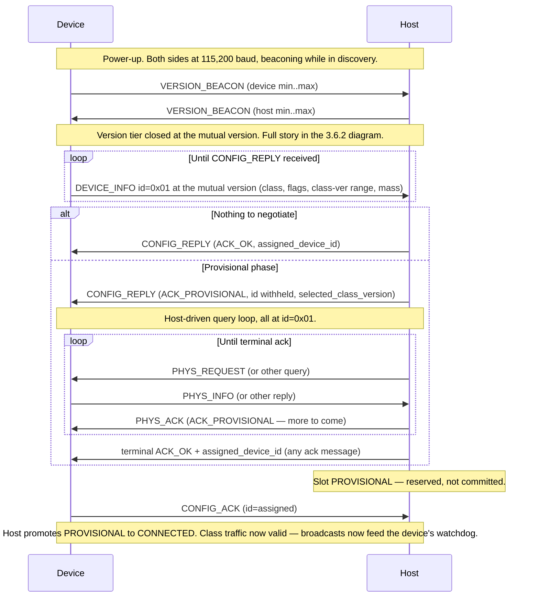
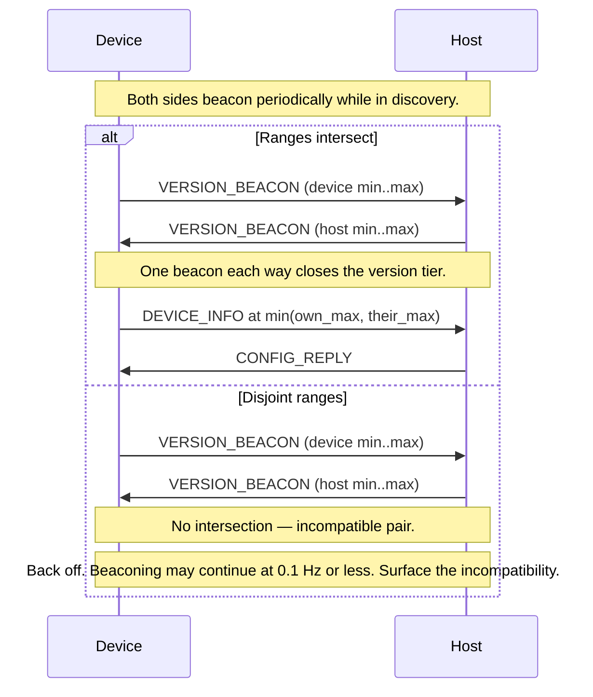

# APEX — Core

**APEX — Adaptive Payload EXchange**

**Status:** Draft | **Scope:** Core standard and discovery protocol for the standard 10-pin APEX connector

---

<a id="1--overview" name="1--overview"></a>
## 1.  Overview

APEX (Adaptive Payload EXchange) provides a "plug-and-play" architecture for
drone platforms (hosts) and payloads (devices) — analogous to USB in that the bus
protocol itself is small and class-agnostic, while payload-specific behavior is
defined through
separate **device classes** (Activation, Analog HMI, Wayfinding, Repeater,
etc).

This document defines the **core** protocol only: framing, the outer header,
baud negotiation, the discovery handshake, capability exchange, and the
device-level lifecycle status the host uses to track devices on the bus. **It
does not define Device behavior.** Once a device is discovered and its class
accepted, all further traffic is routed by `traffic_type` to a device-class spec
— see [APEX — Device Classes](APEX_Device_Classes.md) for the registry.

This document specifies **protocol version 1** (`protocol_version = 0x01`). v1 is
a deliberately breaking revision of the earlier v0 protocol: the outer-header
semantics change (all `traffic_type` values shift by one, the unassigned
`device_id` marker moves, and `protocol_version = 0x00` is retired as the
permanent legacy-v0 marker), so v1 frames are not v0-compatible. How versions are
identified, negotiated, and bridged — including the optional v0 transition
path — is defined in [§3.6](#3-6--versioning).

**Terminology.** APEX uses two role terms throughout this and all companion
specifications. The **Host** is the bus controller that runs discovery and
configuration — generally a drone's flight controller. The **Device** is the
attached unit being configured — generally a payload. The specs say *Host* and
*Device*; *flight controller* and *payload* are the typical real-world
instances of those roles.

---

<a id="2--physical--electrical-interface-10-pin" name="2--physical--electrical-interface-10-pin"></a>
## 2.  Physical & Electrical Interface (10-Pin)

### Physical Interface

The APEX standard uses a modified V-lock mechanism to align and engage a pair of
electrical blade connectors in a one-handed, toolless interface with high
rigidity and zero backlash. The payload engages and locks to the carrier by
sliding in the rear-to-front direction. The payload can be removed by reversing
this motion while depressing a button to move the spring-loaded "release slider".

(Mechanically, the **Host** is the *carrier* and the **Device** is the *payload*;
the spec uses Host and Device throughout — see [§1](#1--overview).)

This standard aims to define the critical geometry and tolerances necessary to
ensure proper engagement and interoperability between platforms. The standard
also aims to keep these requirements as simple as possible, leaving designers
maximum flexibility to integrate the components into their carrier or payload in
the most optimal way. This includes the decision not to specify the materials or
finishes of any components. The designer should ensure that their choices result
in adequate strength and rigidity to perform in all of their anticipated
carrier-payload combinations. Lubrication for the release slider may improve
performance depending on material and finish choices.

Appropriate tolerances are important to minimize rattle and maximize the
stiffness of the connection between the Host and the Device — rattle in the
Device can affect the flight stability of the Host. The critical geometry and
tolerances are defined by the mechanical standard package (STEP model and
drawing) published alongside this document.

**Key APEX components:**

- **Carrier (Host):** APEX RECEIVER (carrier side), APEX RELEASE SLIDER, RETURN
  SPRING, CARRIER PCB (with female receptacle connector).
- **Payload (Device):** APEX WEDGE (payload side), PAYLOAD PCB (with male blade
  connector).

### Electrical Interface

The electrical connectors chosen for APEX are the
[TE "DC Jack Connector" range of 2.5 mm-pitch blade connectors](https://www.te.com/en/plp/battery-connectors-dc-jacks/Y30na.html).
Any alternate brand or custom connector is also an acceptable choice if it can be
shown to be fully interoperable with the TE series with equivalent dimensional
control. Care should be taken to route and/or shield any PCBAs or wire harnesses
such that signal integrity is preserved in the vicinity of high-current motors
and ESCs.

| Pin | Label | Description |
| --- | --- | --- |
| Pin 1 | **Motor Current** | Analog Current Sense |
| Pin 2 | **VBATT** | Direct Battery Voltage (6V–30V†). |
| Pin 3 | **DIO 3.3V / I2C SDA** | Discrete Output (3.3V) or I2C Serial Data |
| Pin 4 | **DIO 3.3V / I2C SCL** | Discrete Output (3.3V) or I2C Serial Clock |
| Pin 5 | **UART RX** | Upstream Link (Device to Host). |
| Pin 6 | **UART TX** | Downstream Link (Host to Device). |
| Pin 7 | **CVBS+ / USB D+** | Analog Video Signal (Positive) / Full Speed USB D+  |
| Pin 8 | **CVBS- / USB D-** | Analog Video Signal (Negative) / Full Speed USB D- |
| Pin 9 | **12V 2 Amps** | Regulated high-power rail for payload electronics. |
| Pin 10 | **GND** | Common Ground. |

*Pins with secondary assignments are selectable during discovery — see [§5.3](#5-3--secondary-pin-assignments).*

† We believe that 8S lithium polymer voltages (33.6V) are possible within IPC-2221A B1 specifications where the continuous
curve interpolation places the limit over 40 volts with a confirmed minimum clearance and creepage of 0.4mm.
For IEC 60664-1, this is only applicable in an environment consistent with B1 assumptions.  For Pollution Degree 2 or 3,
conformal coating of the non-mating surfaces of the connector is a potential avenue to maintain full compliance.


<a id="2-1--payload-reference-frame--datum" name="2-1--payload-reference-frame--datum"></a>
### 2.1.  Payload Reference Frame & Datum

The host consumes each device's declared mass and inertia
([§3.2.1](#3-2-1--device_info-msg_id--1),
[§3.2.10](#3-2-10--phys_info-msg_id--10)) as flight-performance input, so every
device MUST report those quantities in one common body-fixed reference frame,
defined here.

**Origin (datum).** The origin is the **CG reference point** called out on the
mechanical drawings: **36.71 mm from the front face of the wedge** measured along
the +X engagement axis, **laterally centered in the wedge profile** in Y, and on
the **plane of the mating surface** in Z. It is fully constrained by the
mechanical standard package ([§2](#2--physical--electrical-interface-10-pin)), so
every vendor derives the identical datum point from the published STEP model and
drawings alone — no per-vendor convention is required.

**Axes.** The frame is a **NED-aligned body frame (FRD)** — the body-fixed analog
of world-NED, matching the PX4/ArduPilot convention:

| Axis | Direction |
| --- | --- |
| **+X** | Engagement direction — the rear-to-front slide, carrier-forward. |
| **+Y** | Payload-right. |
| **+Z** | Down, from the mating surface into the payload body. |

The design-ideal center of gravity sits on the +Z axis directly below the port —
i.e. `cg_offset_z > 0` with `x ≈ 0` and `y ≈ 0` — but a device always reports its
**real** measured values, not the ideal.

**Units.** Mass in **grams**; linear offsets in **millimetres**; moments and
products of inertia in **gram·centimetre²** (g·cm²). These units and this frame
govern `mass_grams`, `cg_offset_*_mm`, and the inertia fields `ixx`/`iyy`/`izz`
and `pxy`/`pxz`/`pyz` throughout this spec.

The datum is shown below. The plan view fixes the origin — the CG reference
point, 36.71 mm from the front face and laterally centered — on the mating
surface; the isometric view shows the full body-fixed FRD triad on the payload.


*Wedge profile at the mating surface, viewed along +Z (down into the payload). The origin is the CG reference point — the dimension shown is its 36.71 mm offset from the front face along +X — laterally centered in the profile in Y. In-plane, +X is the engagement direction and +Y is payload-right.*


*The NED-aligned body frame (FRD) at the datum: +X along the rear-to-front engagement slide, +Y payload-right, +Z down from the mating surface into the payload body.*

---

<a id="3--communication-protocol-uart" name="3--communication-protocol-uart"></a>
## 3.  Communication Protocol (UART)

**Default Baud Rate:** 115,200 bps (all sessions begin here — see [§3.4](#3-4--baud-rate-negotiation)) |
**Format:** 8N1 |
**Framing:** Consistent Overhead Byte Stuffing (COBS) —
[Wikipedia](https://en.wikipedia.org/wiki/Consistent_Overhead_Byte_Stuffing).
Frames are delimited by `0x00`. Frame sizing is given in [§3.1.4](#3-1-4--frame-sizing).

<a id="3-1--frame-layout" name="3-1--frame-layout"></a>
### 3.1.  Frame Layout

All multi-byte fields in APEX v1 frames are transmitted little-endian (low byte first).

Each APEX v1 frame, prior to COBS encoding, has the following structure:

```
[ Outer Header ][   Inner Payload   ][   CRC   ]
     4 bytes         0 – 255 bytes      2 bytes
```

The **Outer Header** is fixed at 4 bytes ([§3.1.1](#3-1-1--outer-header-apexhdr_t)); the **CRC** is 2 bytes ([§3.1.2](#3-1-2--crc)). Total decoded-frame and on-wire sizes are given in [§3.1.4](#3-1-4--frame-sizing).

The **Inner Payload** is `payload_length` bytes (`0`–`255`). Its layout is determined by the frame's `traffic_type` ([§3.1.1](#3-1-1--outer-header-apexhdr_t)). `traffic_type = 1` is CONFIG, whose payload is defined by this spec in [§3.2](#3-2--config-traffic-traffic_type--1); every other value selects a device class whose companion spec defines the payload — see [APEX — Device Classes](APEX_Device_Classes.md). A `payload_length` of `0` carries no inner payload and is the implicit heartbeat ([§3.5](#3-5--heartbeat)).

<a id="3-1-1--outer-header-apexv0hdr_t" name="3-1-1--outer-header-apexv0hdr_t"></a>
<a id="3-1-1--outer-header-apexhdr_t" name="3-1-1--outer-header-apexhdr_t"></a>
#### 3.1.1.  Outer Header (`ApexHdr_t`)

| Field | Size | Description |
| --- | --- | --- |
| `protocol_version` | `u8` | APEX wire-protocol version. v1 session frames carry `0x01`. `0x00` is illegal in v1+ (it is the permanent legacy-v0 marker); `0xFF` marks a VERSION_BEACON frame only ([§3.6](#3-6--versioning)). Valid session versions are `0x01`–`0xFE`. **Non-zero by construction.** |
| `traffic_type` | `u8` | Selects the device class / traffic channel for this frame. `0x00` is invalid; `1` = CONFIG (defined here); all other values route to a device-class spec — see [APEX — Device Classes](APEX_Device_Classes.md). **Non-zero by construction.** |
| `device_id` | `u8` | Identifier of the device for this frame. `0x00` is invalid; a device uses the unassigned marker `0x01` in its outer header until the host assigns it an ID via a terminal CONFIG_REPLY ([§3.2.2](#3-2-2--config_reply-msg_id--2)); thereafter it uses the assigned ID. `0xFF` is broadcast (host-originated) and the VERSION_BEACON `device_id`. See [§3.1.3](#3-1-3--device_id-ownership-and-reserved-values). **Non-zero by construction.** |
| `payload_length` | `u8` | Length, in bytes, of the inner payload that follows the header (0–255). May be `0` (heartbeat). |

**Non-zero header prefix.** The three header-prefix bytes — `protocol_version`,
`traffic_type`, `device_id` — are non-zero in every legal v1 frame by
construction; only `payload_length` may be `0`. This is what makes the frame's
routing/identity bytes survive COBS encoding verbatim
([§3.1.6](#3-1-6--cobs-header-prefix-transparency)). Inner-payload bytes carry no
such guarantee and may freely be `0x00`.

<a id="3-1-2--crc" name="3-1-2--crc"></a>
#### 3.1.2.  CRC

A 16-bit CRC follows the inner payload, transmitted little-endian (low byte first).

| Property | Value |
| --- | --- |
| Algorithm | CRC-16/CCITT-FALSE |
| Polynomial | `0x1021` |
| Initial value | `0xFFFF` |
| Input reflection | none |
| Output reflection | none |
| Final XOR | `0x0000` |
| Coverage | All bytes of the outer header ([§3.1.1](#3-1-1--outer-header-apexhdr_t)) and inner payload, in transmission order, computed prior to COBS encoding. |

A receiver MUST discard any frame whose computed CRC does not match the transmitted value.

<a id="3-1-3--device_id-ownership-and-reserved-values" name="3-1-3--device_id-ownership-and-reserved-values"></a>
#### 3.1.3.  `device_id` Ownership and Reserved Values

The host is the sole authority for `device_id` assignment. A device's lifecycle on the bus is:

1. On power-up, the device has no assigned `device_id` and uses the unassigned marker `0x01` in the outer header of its DEVICE_INFO frames ([§3.2.1](#3-2-1--device_info-msg_id--1)) and throughout the provisional configuration phase ([§3.3](#3-3--startup-discovery-handshake)).
2. The host returns an assigned ID in the `assigned_device_id` field of the **terminal** `ACK_OK` ([§3.3](#3-3--startup-discovery-handshake)) — carried by CONFIG_REPLY ([§3.2.2](#3-2-2--config_reply-msg_id--2)) or by whichever provisional-phase ack message concludes the phase.
3. The device adopts that ID and uses it in the outer header for all subsequent frames in the session.

**Reserved values:**

| Value | Meaning |
| --- | --- |
| `0x00` | **Invalid.** Never appears as a `device_id` in any legal v1 frame (non-zero-header rule). |
| `0x01` | **Unassigned marker.** A device uses this in its outer header until the host assigns it an ID. The host never assigns `0x01` to a device. |
| `0x02`–`0xFE` | **Assigned pool** — 253 valid assignable IDs. |
| `0xFF` | **Broadcast** — host-originated frames addressed to all devices on the bus (e.g. HOST_STATE) — and the `device_id` of the link-local VERSION_BEACON ([§3.6](#3-6--versioning)). |

**Outer marker vs. inner field.** The outer-header **unassigned marker is
`0x01`**. This is distinct from the inner-payload `assigned_device_id` **field**
carried by CONFIG_REPLY, CONFIG_ACK, and the provisional-phase acks: in those
inner payloads the value **`0x00`** means "no ID assigned yet" (inner-payload
bytes are exempt from the non-zero-header rule). The two never collide — `0x01`
is an outer-header address, `0x00` is an inner-payload "not yet" sentinel.

**Persistence.** `device_id` is **ephemeral per session**. A device that resets
returns to the unassigned marker `0x01` and re-runs discovery. Hosts likewise
discard their assignment table on reset.

**Assignment policy.** The host (specifically _root host_) MUST ensure assigned
IDs are unique among currently-CONNECTED devices on its bus. The specific
allocation strategy is implementation-defined; a monotonic counter starting at
`0x02` and skipping `0xFF` is a recommended default.

<a id="3-1-4--frame-sizing" name="3-1-4--frame-sizing"></a>
#### 3.1.4.  Frame Sizing

A frame exists in two forms, and an implementation needs a buffer for each.

The **decoded frame** is the logical frame an implementation builds and parses — the outer header, the inner payload, and the CRC, before COBS encoding. Its maximum size is:

| Part | Bytes |
| --- | --- |
| Outer header ([§3.1.1](#3-1-1--outer-header-apexhdr_t)) | 4 |
| Inner payload (`payload_length` max) | 255 |
| CRC ([§3.1.2](#3-1-2--crc)) | 2 |
| **`APEX_MAX_FRAME_LENGTH`** | **261** |

The **encoded frame** is what is transmitted on the wire: the decoded frame after COBS encoding, plus the trailing `0x00` delimiter. COBS adds at most ⌈N / 254⌉ overhead bytes for an N-byte input — for a 261-byte input, `⌈261 / 254⌉ = 2` overhead bytes. Its maximum size is:

| Part | Bytes |
| --- | --- |
| Decoded frame (`APEX_MAX_FRAME_LENGTH`) | 261 |
| COBS overhead | 2 |
| `0x00` delimiter | 1 |
| **`APEX_MAX_ENCODED_FRAME_LENGTH`** | **264** |

Receive and transmit buffers that hold a raw on-wire frame MUST be sized to `APEX_MAX_ENCODED_FRAME_LENGTH` (264 bytes). Buffers that hold a decoded frame for parsing or construction need only `APEX_MAX_FRAME_LENGTH` (261 bytes).

<a id="3-1-6--cobs-header-prefix-transparency" name="3-1-6--cobs-header-prefix-transparency"></a>
#### 3.1.6.  COBS Header-Prefix Transparency

Because the three header-prefix bytes are non-zero by construction
([§3.1.1](#3-1-1--outer-header-apexhdr_t)), v1 framing has a property that COBS
does not generally provide:

> **In every legal v1 encoded frame, the leading COBS code byte is ≥ 4, and
> encoded bytes 1, 2, 3 are `protocol_version`, `traffic_type`, `device_id`
> verbatim** — the three routing/identity bytes, unmangled and at fixed offsets.

**Proof sketch.** A decoded v1 frame is `[PV][TT][ID][LN][payload…][CRC][CRC]`
with `PV`, `TT`, `ID` (decoded indices 0–2) all non-zero. COBS's leading code
byte is the distance to the first `0x00` in the block. With no zero among the
first three bytes, that first zero is at decoded index ≥ 3, so the code byte is
≥ 4 and the run it introduces copies decoded bytes 0–2 through to encoded
offsets 1–3 unchanged. This holds for **every** frame, including the zero-length
heartbeat: `LN = 0` places the first zero exactly at decoded index 3, giving a
code byte of exactly 4.

Two consequences used elsewhere in this spec:

- **Free malformed-frame check:** any encoded frame whose leading code byte is
  `< 4` cannot be a legal v1 frame and MAY be dropped before COBS decoding
  ([§3.8](#3-8--receiver-error-handling)).
- **Decode-free routing and diagnostics:** a router or sniffer can read `PV`,
  `TT`, `ID` straight off encoded offsets 1–3 without decoding the frame
  ([§3.7.5](#3-7-5--routing-without-decoding)); `PV = 0xFF` beacons
  ([§3.6](#3-6--versioning)) are likewise identifiable pre-decode.

<a id="3-1-5--frame-notation" name="3-1-5--frame-notation"></a>
#### 3.1.5.  Frame notation

Worked examples throughout this spec and the device-class specs display frames using a common notation, defined here.

Each frame is shown as a single line of hex bytes — the complete frame as it exists *before* CRC-16 is appended and *before* COBS encoding. The 2-byte CRC ([§3.1.2](#3-1-2--crc)) and the COBS framing are applied by the sender and are not reproduced in the byte lines.

The four-byte **outer header** ([§3.1.1](#3-1-1--outer-header-apexhdr_t)) is separated from the **inner payload** by a wider gap:

```
PV TT ID LN    M1 ..  ..  ..       <- outer header (4 B)   inner payload (N B)
```

where `PV` = `protocol_version`, `TT` = `traffic_type`, `ID` = `device_id`, `LN` = `payload_length`, and `M1` = the inner payload's leading `msg_id` / `class_msg_id` byte. `LN` equals the inner-payload byte count. In v1 examples `PV` is `01` (or `FF` for a VERSION_BEACON); an example states the fixed `PV`, `TT`, and `ID` values that hold throughout it.

A field table under each frame names every inner-payload byte. Bytes that **change** from the previous frame of the same type are called out, since those are where the device's progress is visible.

<a id="3-2--config-traffic-traffic_type--0" name="3-2--config-traffic-traffic_type--0"></a>
<a id="3-2--config-traffic-traffic_type--1" name="3-2--config-traffic-traffic_type--1"></a>
### 3.2.  CONFIG Traffic (`traffic_type = 1`)

CONFIG is the only traffic type defined by this core spec. It carries the
implicit heartbeat plus all discovery and capability-exchange messages.

A CONFIG frame with `payload_length = 0` is the implicit heartbeat ([§3.5](#3-5--heartbeat)) and carries no inner payload. Otherwise (`payload_length > 0`), the inner payload begins with a one-byte `msg_id` identifying the message; the bytes that follow are message-specific and are defined in the subsection for that message.

| `msg_id` | Name | Direction | Meaning |
| --- | --- | --- | --- |
| `0` | *(reserved)* | — | Reserved; never sent. The implicit heartbeat ([§3.5](#3-5--heartbeat)) carries no `msg_id` byte. |
| `1` | **DEVICE_INFO** | Device → Host | Declares the device's requested class, interfaces, class-version range, and mass ([§3.2.1](#3-2-1--device_info-msg_id--1)). |
| `2` | **CONFIG_REPLY** | Host → Device | Host's response to DEVICE_INFO ([§3.2.2](#3-2-2--config_reply-msg_id--2)). |
| `3` | **NAME_REQUEST** | Host → Device | Requests the device's human-readable name ([§3.2.3](#3-2-3--name_request-msg_id--3)). |
| `4` | **NAME_REPLY** | Device → Host | Carries the device's human-readable name ([§3.2.4](#3-2-4--name_reply-msg_id--4)). |
| `5` | **HOST_STATE** | Host → Device | Host's flight state, broadcast to all devices ([§3.2.5](#3-2-5--host_state-msg_id--5)). |
| `6` | **CONFIG_ACK** | Device → Host | Confirms the device latched its assigned `device_id`, completing the handshake ([§3.2.6](#3-2-6--config_ack-msg_id--6)). |
| `7` | **BAUD_CHANGE_REQUEST** | Device → Host | Post-CONNECTED request for a baud-rate change ([§3.2.7](#3-2-7--baud_change_request-msg_id--7)). |
| `8` | **BAUD_CHANGE_ACK** | Host → Device | Host's response to BAUD_CHANGE_REQUEST ([§3.2.8](#3-2-8--baud_change_ack-msg_id--8)). |
| `9` | **PHYS_REQUEST** | Host → Device | Requests the device's full physical (inertia) declaration ([§3.2.9](#3-2-9--phys_request-msg_id--9)). |
| `10` | **PHYS_INFO** | Device → Host | Carries the device's CG offset and inertia tensor ([§3.2.10](#3-2-10--phys_info-msg_id--10)). |
| `11` | **PHYS_ACK** | Host → Device | Host's response to PHYS_INFO ([§3.2.11](#3-2-11--phys_ack-msg_id--11)). |
| `12` | **VERSION_BEACON** | Either role | Wire-version negotiation beacon; only ever under `protocol_version = 0xFF` ([§3.2.12](#3-2-12--version_beacon-msg_id--12), [§3.6](#3-6--versioning)). |
| `13` | **RESET_REQUEST** | Either role | Session re-enumeration ([§3.2.13](#3-2-13--reset_request-msg_id--13)). |

All multi-byte fields in CONFIG messages are little-endian ([§3.1](#3-1--frame-layout)).

<a id="3-2--ack-code-namespace" name="3-2--ack-code-namespace"></a>
#### Global ack-code namespace

Several CONFIG messages carry an `ack` byte (CONFIG_REPLY, PHYS_ACK,
BAUD_CHANGE_ACK, and the provisional-phase acks). All of them draw from **one
shared namespace**. `ACK_OK` and `ACK_PROVISIONAL` have identical numeric values
and meaning everywhere; **each reject code is defined by exactly one message**.

| Code | Name | Defined by | Meaning |
| --- | --- | --- | --- |
| `0x00` | `ACK_OK` | shared | **Terminal accept.** Carries the assigned `device_id` ([§3.1.3](#3-1-3--device_id-ownership-and-reserved-values)). |
| `0x01` | `ACK_REJECT_CLASS` | CONFIG_REPLY | Requested `device_class_req` not supported. |
| `0x02` | `ACK_REJECT_INTERFACE` | CONFIG_REPLY | Class supported, requested `interface_flags_req` cannot be granted. |
| `0x03` | *(retired)* | — | Was v0's `ACK_REJECT_VERSION`; obsolete — version mismatch is resolved by the VERSION_BEACON before it can reach the message layer ([§3.6.2](#3-6-2--immutable-version-discovery-version_beacon)). **Never reused.** |
| `0x04` | `ACK_PROVISIONAL` | shared | **Conditional accept.** The provisional configuration phase continues ([§3.3](#3-3--startup-discovery-handshake)); ID withheld. |
| `0x05` | `ACK_REJECT_CLASS_VERSION` | CONFIG_REPLY | No overlap between the device's and host's class-version ranges. |
| `0x06` | `ACK_REJECT_MASS` | CONFIG_REPLY | Declared mass incompatible with the host's flight envelope. |
| `0x07` | `ACK_REJECT_BAUD` | BAUD_CHANGE_ACK | Requested baud not granted; carries a counter-offer hint. |
| `0x08` | `ACK_REJECT_PHYS` | PHYS_ACK | Physical declaration missing or unacceptable. Terminal in the provisional phase; advisory post-CONNECTED ([§3.2.11](#3-2-11--phys_ack-msg_id--11)). |
| `0x09` | `ACK_REJECT_POLICY` | CONFIG_REPLY | Generic "host policy declines this device." |

A receiver MUST treat any `ack` code that is not defined by the message it
arrived in — whether defined by a different message, or not defined anywhere — as
a **terminal reject of unknown cause**, scoped like any other reject of that
message: pre-latch it ends the phase; post-CONNECTED it fails the exchange it
arrived in, never the session ([§3.3](#3-3--startup-discovery-handshake)
acceptance invariant). This global-uniqueness rule is a cheap
firmware-safety property: code that branches on the `ack` byte without strictly
re-checking `msg_id` still cannot mistake an accept for a reject, or a
provisional continue for a terminal outcome.

<a id="3-2-1--device_info-msg_id--1" name="3-2-1--device_info-msg_id--1"></a>
#### 3.2.1.  DEVICE_INFO (`msg_id = 1`)

Sent by the device during discovery to declare the class it wishes to operate as,
which secondary interfaces it requires, the class-version range it supports, and
its mass. Inner payload is **7 bytes**.

| Offset | Field | Size | Description |
| --- | --- | --- | --- |
| 0 | `msg_id` | `u8` | `1`. |
| 1 | `device_class_req` | `u8` | The device class the Device wishes to operate as. Matches a `traffic_type` value — see [APEX — Device Classes](APEX_Device_Classes.md). |
| 2 | `interface_flags_req` | `u8` | Bitfield of secondary interfaces requested (see below). |
| 3 | `class_version_min` | `u8` | Lowest class version the device supports for `device_class_req`. |
| 4 | `class_version_max` | `u8` | Highest class version supported. Support MUST be a contiguous range `min..max` ([§3.6](#3-6--versioning)). |
| 5 | `mass_grams` | `u16` | Payload mass in grams (LE), 1 g resolution (0–65 535 g). Reports the device's **current** mass at (re-)discovery time: for a fixed-mass payload, the manufacturer-declared static value; a variable-mass payload that re-enumerates after dispensing declares what it weighs *now*, not its datasheet value. A device **MUST NOT** report `0` to mean "unknown". For a multi-class device, real mass is reported only in the **first** class's DEVICE_INFO; subsequent class instances of the same physical unit report `0` = "no additional mass" ([§3.7.4](#3-7-4--multi-class-devices)). |

**`interface_flags_req` bit layout:**

```
0b76543210
       ||- bit 0: I2C supported (Pins 3 & 4)
       |-- bit 1: GPIO supported (Pins 3 & 4, default)
       --- bit 2: USB supported (Pins 7 & 8)
           bit 3: CVBS video supported (Pins 7 & 8, default)
           bits 4–7: reserved
```

A device sends DEVICE_INFO only after the beacon exchange has closed the version
tier, and sends it at the **mutual** wire version — never blind
([§3.3](#3-3--startup-discovery-handshake),
[§3.6.2](#3-6-2--immutable-version-discovery-version_beacon)). The outer-header
`device_id` is the unassigned marker `0x01` until the host assigns one.

<a id="3-2-2--config_reply-msg_id--2" name="3-2-2--config_reply-msg_id--2"></a>
#### 3.2.2.  CONFIG_REPLY (`msg_id = 2`)

Sent by the host in response to DEVICE_INFO. Inner payload is **6 bytes**.

| Offset | Field | Size | Description |
| --- | --- | --- | --- |
| 0 | `msg_id` | `u8` | `2`. |
| 1 | `ack` | `u8` | Host's response code (see below). |
| 2 | `assigned_device_id` | `u8` | On terminal `ACK_OK`, the `device_id` assigned to this device ([§3.1.3](#3-1-3--device_id-ownership-and-reserved-values)). On `ACK_PROVISIONAL` and on every reject, `0x00` ("not assigned yet"). |
| 3 | `selected_class_version` | `u8` | Valid on `ACK_OK` and `ACK_PROVISIONAL`: the class version this session will run. `0` otherwise. |
| 4 | `host_class_min` | `u8` | Host's supported class-version range for the requested class — diagnostic, especially for `ACK_REJECT_CLASS_VERSION`. `0` if the class is unsupported. |
| 5 | `host_class_max` | `u8` | Upper bound of that range. `0` if the class is unsupported. |

**`ack` values CONFIG_REPLY may carry** (drawn from the global namespace above):

| Value | Name | Meaning |
| --- | --- | --- |
| `0x00` | `ACK_OK` | **Terminal accept.** Host accepts the requested class, interfaces, class version, and mass, with nothing further to negotiate. The device adopts `assigned_device_id` and **MUST** confirm with CONFIG_ACK ([§3.2.6](#3-2-6--config_ack-msg_id--6)). |
| `0x04` | `ACK_PROVISIONAL` | **Conditional accept.** Class and class-version are accepted (`selected_class_version` is valid) and the host opens the provisional configuration phase ([§3.3](#3-3--startup-discovery-handshake)); the ID is withheld until a later terminal `ACK_OK`. |
| `0x01` | `ACK_REJECT_CLASS` | Host does not support the requested `device_class_req`. Device stops retrying. |
| `0x02` | `ACK_REJECT_INTERFACE` | Host supports the class but cannot grant the requested `interface_flags_req`. Device may retry with reduced flags. |
| `0x05` | `ACK_REJECT_CLASS_VERSION` | The device's `class_version_min..max` and the host's `host_class_min..max` do not overlap. Device may retry only if it can offer an in-range version; `host_class_min/max` tell it (and the operator surface) exactly what would work. |
| `0x06` | `ACK_REJECT_MASS` | Declared `mass_grams` is incompatible with the host's flight envelope. Device stops retrying. |
| `0x09` | `ACK_REJECT_POLICY` | Host policy declines this otherwise-protocol-valid device (unsupported vendor, fleet allowlist, an unmet required negotiation, etc.). Device stops retrying. |

Ack code `0x03` is **retired** (was v0's `ACK_REJECT_VERSION`) — under immutable
version discovery ([§3.6.2](#3-6-2--immutable-version-discovery-version_beacon)),
a wire-version mismatch never reaches the message layer, so no such ack is ever
emitted. A device that receives
a CONFIG_REPLY `ack` not defined for this message treats it as a terminal reject
of unknown cause.

**Class selection.** On accept, `selected_class_version = min(class_version_max,
host_class_max)` provided the ranges intersect; the host never selects below the
maximum mutual version. If the ranges are disjoint the host replies
`ACK_REJECT_CLASS_VERSION`.

On any reject the host **should** surface the reason to the operator. A device
that fails discovery has no other channel to explain why — without host-side
feedback, an integrator sees only a Device that never connects.

The host MUST set the CONFIG_REPLY's outer-header `device_id` to match the
`device_id` of the DEVICE_INFO it is replying to (the unassigned marker `0x01`
for an initial DEVICE_INFO from an unassigned device).

<a id="3-2-3--name_request-msg_id--3" name="3-2-3--name_request-msg_id--3"></a>
#### 3.2.3.  NAME_REQUEST (`msg_id = 3`)

Sent by the host after successful configuration.  Used to fetch the "friendly name" of the attached device.

| Field | Size | Description |
| --- | --- | --- |
| `bytes_allocated` | `u8` | Number of ASCII characters the host is capable of using to display the name |

NAME_REQUEST is optional and is not part of the configuration process; a host need not send it. Device handling of NAME_REPLY is described in [§3.2.4](#3-2-4--name_reply-msg_id--4).

<a id="3-2-4--name_reply-msg_id--4" name="3-2-4--name_reply-msg_id--4"></a>
#### 3.2.4.  NAME_REPLY (`msg_id = 4`)

Sent by the device after a NAME_REQUEST packet.  Used to send the "friendly name" of the attached device.

| Field | Size | Description |
| --- | --- | --- |
| `name` | `char[<256]` | Name of the device encoded in ASCII characters, size should not exceed `bytes_allocated` from NAME_REQUEST |

NAME_REPLY is optional. A device is not required to send one in response to NAME_REQUEST. If the host does not receive a NAME_REPLY, it may assign its own name for the device, display a default, or show nothing to the user — the choice is implementation-defined and does not affect the configuration process.

<a id="3-2-5--host_state-msg_id--5" name="3-2-5--host_state-msg_id--5"></a>
#### 3.2.5.  HOST_STATE (`msg_id = 5`)

Sent by the host to advertise its high-level flight state to devices on the
bus. HOST_STATE is **class-agnostic** — it carries no device-class content and
any device class may consume it. It is defined here, in the core spec, rather
than in any one device-class spec.

| Field | Size | Description |
| --- | --- | --- |
| `flight_state` | `u8` | Host's current flight state (see below). |

**`flight_state` values:**

| Value | Name | Description |
| --- | --- | --- |
| `0x00` | `UNKNOWN` | Host has not determined its flight state. |
| `0x01` | `STANDBY` | Powered on; propellers off. |
| `0x02` | `PROPS_ON_GND` | Propellers on; airframe on the ground. |
| `0x03` | `PROPS_ON_FLYING` | Propellers on; airframe airborne. |
| `0xFF` | `FAULT` | Critical failure of the Host. |

**Transport.** HOST_STATE is a host-originated **broadcast**: the outer-header
`device_id` is `0xFF` ([§3.1.3](#3-1-3--device_id-ownership-and-reserved-values)), so a
single frame reaches every device on the bus, and passthrough nodes forward it
to all downstream ports ([§3.7.2](#3-7-2--routing-by-device_id)). The host
**should** send HOST_STATE periodically at 1–5 Hz and **may** additionally send
it immediately on a flight-state change. Sending HOST_STATE satisfies the
host's [§3.5](#3-5--heartbeat) 1 Hz transmit floor toward CONNECTED devices.
It does **not** feed a pre-CONNECTED device's liveliness watchdog — before
CONNECTED, only frames addressed to the device count ([§3.5](#3-5--heartbeat)).

HOST_STATE is advisory context only. The host does not drive any device's
class state machine; a device class spec defines whether and how a device
consumes `flight_state`. A device that has never received a HOST_STATE frame
treats the host flight state as `UNKNOWN`.

> **Open:** On a mixed-wire-version bus, the `protocol_version` a broadcast
> frame such as HOST_STATE should carry is not yet resolved — a single broadcast
> reaches devices that may have negotiated different wire versions. Pending a
> future spec detail, a host running a single wire version stamps that version;
> multi-wire-version broadcast is left to that future detail.

<a id="3-2-6--config_ack-msg_id--6" name="3-2-6--config_ack-msg_id--6"></a>
#### 3.2.6.  CONFIG_ACK (`msg_id = 6`)

Sent by the device exactly once, immediately after it adopts the `assigned_device_id` from a **terminal** `ACK_OK` ([§3.3](#3-3--startup-discovery-handshake)) — whether that `ACK_OK` arrived in a CONFIG_REPLY or in a provisional-phase ack message. It confirms to the host that the device received its ID and has latched it, completing the discovery handshake.

| Field | Size | Description |
| --- | --- | --- |
| `assigned_device_id` | `u8` | The `device_id` the device adopted. Echoes `assigned_device_id` from the terminal `ACK_OK` and **must** equal the frame's outer-header `device_id`. |

The device sends CONFIG_ACK with its outer-header `device_id` set to the newly-adopted ID (not the unassigned marker) — it is the first frame the device emits under its assigned identity. The host promotes the device's slot from the provisional **PROVISIONAL** state to **CONNECTED** ([§4](#4--device-lifecycle-status)) on receipt. A host that receives a CONFIG_ACK whose body does not match its outer `device_id`, or for which it holds no assignment, drops it silently ([§3.8](#3-8--receiver-error-handling)).

CONFIG_ACK is the explicit, immediate confirmation of the terminal `ACK_OK` that concluded the provisional phase. Because it may itself be lost, the host **also** treats *any* subsequent frame bearing the assigned `device_id` — the device's first implicit heartbeat or class frame — as confirmation and promotes the slot then. A device that sends CONFIG_ACK and then its normal traffic therefore connects promptly, and one whose CONFIG_ACK is dropped still connects within the heartbeat interval.

<a id="3-2-7--baud_change_request-msg_id--7" name="3-2-7--baud_change_request-msg_id--7"></a>
#### 3.2.7.  BAUD_CHANGE_REQUEST (`msg_id = 7`)

Device-initiated request to change the link baud rate, legal **only while
CONNECTED** and sent under the device's assigned `device_id`. It is a
post-configuration reconfiguration message: it carries no `assigned_device_id`
and never participates in or terminates the provisional phase. Inner payload is
**2 bytes**.

| Offset | Field | Size | Description |
| --- | --- | --- | --- |
| 0 | `msg_id` | `u8` | `7`. |
| 1 | `baud_code` | `u8` | The single baud rate the device proposes ([§3.4](#3-4--baud-rate-negotiation) table: `0` = 115 200, `1` = 460 800, `2` = 921 600). |

A device requesting more than the default bandwidth typically sends this
first-thing-after-config, but may send it at any time while CONNECTED (an
operating mode that newly needs bandwidth may ask late). The device proposes one
code, and on rejection ladders down toward its minimum acceptable rate
([§3.4](#3-4--baud-rate-negotiation)). If its minimum steady-state rate is
refused all the way down, the device self-transitions to FAULT
([§4](#4--device-lifecycle-status)) — the device rejecting the host.

<a id="3-2-8--baud_change_ack-msg_id--8" name="3-2-8--baud_change_ack-msg_id--8"></a>
#### 3.2.8.  BAUD_CHANGE_ACK (`msg_id = 8`)

Host's response to BAUD_CHANGE_REQUEST. Inner payload is **3 bytes**.

| Offset | Field | Size | Description |
| --- | --- | --- | --- |
| 0 | `msg_id` | `u8` | `8`. |
| 1 | `ack` | `u8` | `ACK_OK` (rate accepted; both sides switch) or `ACK_REJECT_BAUD` (no switch). |
| 2 | `baud_code` | `u8` | On `ACK_OK`: echo of the accepted request's `baud_code`, so a stale or retransmitted ack can never be mistaken for a verdict on a different rung. On `ACK_REJECT_BAUD`: the **counter-offer hint** — the highest code the host supports **strictly below** the rejected request (`0` = nothing above the default is available). |

This message carries no `assigned_device_id` and is not a provisional-phase
message. Switch timing, ladder semantics, recovery, and the passthrough rule are
defined in [§3.4](#3-4--baud-rate-negotiation).

<a id="3-2-9--phys_request-msg_id--9" name="3-2-9--phys_request-msg_id--9"></a>
#### 3.2.9.  PHYS_REQUEST (`msg_id = 9`)

Host-initiated query for the device's full physical (inertia) declaration. Inner
payload is **1 byte** (`msg_id` only).

| Offset | Field | Size | Description |
| --- | --- | --- | --- |
| 0 | `msg_id` | `u8` | `9`. |

Issued during the provisional configuration phase ([§3.3](#3-3--startup-discovery-handshake)) as one query in the host-driven loop, and also legal at any time while CONNECTED (as with NAME_REQUEST) for a host that decides it wants the data later. A device that implements the exchange replies with PHYS_INFO ([§3.2.10](#3-2-10--phys_info-msg_id--10)); a device that does not silently drops the frame (the unknown-`msg_id` rule, [§3.6](#3-6--versioning)), so non-support is detected by timeout. A host **should** retry a bounded number of times — recommended 3 × 500 ms — then apply policy ([§3.2.11](#3-2-11--phys_ack-msg_id--11)).

<a id="3-2-10--phys_info-msg_id--10" name="3-2-10--phys_info-msg_id--10"></a>
#### 3.2.10.  PHYS_INFO (`msg_id = 10`)

Sent by the device in response to PHYS_REQUEST — and, post-CONNECTED,
**unsolicited as an in-flight physical update** (see below). PHYS_INFO is the
canonical **complete current physical state** of the payload: the full
10-parameter rigid-body spatial inertia about the APEX dovetail datum — mass,
CG offset (first moment), and the symmetric inertia tensor — in the reference
frame and units of [§2.1](#2-1--payload-reference-frame--datum). One message
always describes the whole rigid body. Inner payload is **33 bytes**.

| Offset | Field | Size | Description |
| --- | --- | --- | --- |
| 0 | `msg_id` | `u8` | `10`. |
| 1 | `mass_grams` | `u16` | Current payload mass in grams (LE; same units and rules as DEVICE_INFO, [§3.2.1](#3-2-1--device_info-msg_id--1)). Duplicates the discovery-time value at configuration; diverges after in-flight changes. |
| 3 | `cg_offset_x_mm` | `i16` | CG offset from the dovetail datum along +X, mm (first moment = mass × offset). |
| 5 | `cg_offset_y_mm` | `i16` | CG offset along +Y, mm. |
| 7 | `cg_offset_z_mm` | `i16` | CG offset along +Z, mm (positive = into the payload; the design-ideal CG is on this axis). |
| 9 | `ixx` | `i32` | Moment of inertia about the datum X axis, g·cm² (`∫(y²+z²)dm`). |
| 13 | `iyy` | `i32` | Moment of inertia about the datum Y axis, g·cm². |
| 17 | `izz` | `i32` | Moment of inertia about the datum Z axis, g·cm². |
| 21 | `pxy` | `i32` | Product of inertia in **un-negated product form** — `pxy = +∫xy dm`, g·cm² (see below). |
| 25 | `pxz` | `i32` | `pxz = +∫xz dm`, g·cm². |
| 29 | `pyz` | `i32` | `pyz = +∫yz dm`, g·cm². |

**Product-of-inertia sign.** The `p*` fields carry the products **exactly as CAD
mass-properties output prints them** — the un-negated integral form `pxy =
+∫xy dm`. These are still **signed** quantities (the integral itself can be
negative); "product form" means no definitional minus has been applied, **not**
absolute value. The host applies the definitional minus exactly once when
assembling the inertia tensor: `Ixy = −pxy` (and likewise for the others). A
flipped sign is definitionally incorrect yet nearly undetectable downstream (the
matrix stays symmetric and plausible), so the negation is placed in host code
written against this spec rather than transcribed independently by each vendor.

A vendor that knows CG but not the tensor sends the point-mass equivalent derived
from mass + CG — the host could compute nothing better from less. The first
moment (CG offset) is carried alongside the tensor for physical completeness: the
tensor about a fixed datum alone does not determine the CG (a point mass at +x vs
−x yields the identical tensor about the datum but opposite static trim moments).

**In-flight physical updates.** Electromechanical payloads can change their
physical parameters in flight — an articulating arm moves the CG, a dispenser
loses mass — so the configuration-time snapshot must be updatable:

- Post-CONNECTED, a device **MAY** send PHYS_INFO **unsolicited**, under its
  assigned id, whenever its physical parameters meaningfully change. There is no
  separate update message: the provisional-phase reply and the in-flight update
  are the same canonical frame.
- The host acknowledges with PHYS_ACK ([§3.2.11](#3-2-11--phys_ack-msg_id--11)):
  `ACK_OK` confirms receipt — an update is a notification of reality, not a
  negotiation; the host cannot reject what the payload already *is* — and
  `ACK_REJECT_PHYS` is the advisory envelope signal defined there. A
  post-CONNECTED PHYS_ACK carrying `ACK_PROVISIONAL` is contextually
  meaningless and is treated as a plain receipt.
- Should a provisional-phase PHYS_INFO report a mass that differs from the
  DEVICE_INFO declaration, the PHYS_INFO value governs — latest-wins, exactly
  as for an in-flight update.
- **Report configurations, not motion.** A device reports **quasi-static
  configuration changes** — the new steady state after an articulation, the mass
  after a dispense — not transient or oscillatory motion. Change thresholds are
  payload-defined (per-payload profile). Sustained update rate MUST NOT exceed
  **2 Hz**.
- **Failure mode:** the device retransmits an un-acked update per the command
  doctrine (3 × 500 ms) — this is flight-relevant data; receipt matters.
- Host-side, an update feeds the same consumer as the configuration-time query:
  the latest state wins, one record per physical unit
  ([§3.7.4](#3-7-4--multi-class-devices)).

Provisional-phase usage is unchanged: within the phase, PHYS_INFO is sent only
in reply to PHYS_REQUEST.

<a id="3-2-11--phys_ack-msg_id--11" name="3-2-11--phys_ack-msg_id--11"></a>
#### 3.2.11.  PHYS_ACK (`msg_id = 11`)

Host's response to PHYS_INFO. Inner payload is **3 bytes**.

| Offset | Field | Size | Description |
| --- | --- | --- | --- |
| 0 | `msg_id` | `u8` | `11`. |
| 1 | `ack` | `u8` | `ACK_OK` (terminal accept in the provisional phase; receipt confirmation post-CONNECTED), `ACK_PROVISIONAL` (accepted; more queries coming), or `ACK_REJECT_PHYS` (terminal in the provisional phase; **advisory** post-CONNECTED — see below). |
| 2 | `assigned_device_id` | `u8` | On `ACK_OK`: the assigned id (PHYS_ACK may itself terminate the provisional phase, [§3.3](#3-3--startup-discovery-handshake)). Otherwise `0x00`. |

**Kinematics-required hosts.** A host is entitled to require detailed kinematic
information from every device it accepts and to reject those that cannot provide
it. Because the id is withheld until `ACK_OK`, both failure shapes are ordinary
pre-commitment rejects that need no teardown:

- **Device reports, values unacceptable** → `ACK_REJECT_PHYS`: the device stops
  retrying, the host frees the slot and surfaces the reason.
- **Device never reports** (PHYS_REQUEST retries exhaust) → the host **MAY** send
  an unsolicited `PHYS_ACK(ACK_REJECT_PHYS)` as a best-effort courtesy (a device
  that predates the message drops it), then stops addressing the device. The
  timeout is guaranteed: host broadcasts do not feed a pre-CONNECTED device's
  liveliness watchdog ([§3.5](#3-5--heartbeat)), so ongoing HOST_STATE traffic
  cannot keep the abandoned device alive. When its watchdog drives it back into
  discovery, the host answers its DEVICE_INFO with `ACK_REJECT_POLICY`
  ([§3.2.2](#3-2-2--config_reply-msg_id--2)), terminating the retry loop honestly.

**Post-CONNECTED semantics.** After CONNECTED — whether acknowledging an
in-flight update ([§3.2.10](#3-2-10--phys_info-msg_id--10)) or the answer to a
re-query — PHYS_ACK has **no session effect**. `ACK_OK` confirms receipt.
`ACK_REJECT_PHYS` is **advisory**: it signals "the declared physical state
violates the host's flight envelope," and what the device does with that signal
is payload-defined (per-payload profile — an articulating payload might retract,
for example). Neither code terminates the session
([§3.3](#3-3--startup-discovery-handshake) acceptance invariant). A host that
wants a device *gone* post-CONNECTED uses explicit re-enumeration: RESET_REQUEST
([§3.2.13](#3-2-13--reset_request-msg_id--13)) returns the device to discovery,
where the host answers its DEVICE_INFO with `ACK_REJECT_POLICY`. Within the
provisional phase, PHYS_ACK is unchanged — a pre-latch terminal gate as
described above.

<a id="3-2-12--version_beacon-msg_id--12" name="3-2-12--version_beacon-msg_id--12"></a>
#### 3.2.12.  VERSION_BEACON (`msg_id = 12`)

The wire-version discovery beacon — the one CONFIG message carried under
`protocol_version = 0xFF` rather than a session version. Either role emits it
periodically while in discovery; it is never sent in response to received input.
Its frame layout and its emission/consumption rules form the immutable core of
APEX versioning: frozen forever, and defined in full in
[§3.6.2](#3-6-2--immutable-version-discovery-version_beacon). Its inner payload is
**5 bytes**: `msg_id` (`12`) plus a `u16` LE `min_version` and `max_version`
naming the sender's supported wire-version range.

VERSION_BEACON is link-local: it is never forwarded by passthroughs or routers,
and is ignored inside an established session.

<a id="3-2-13--reset_request-msg_id--13" name="3-2-13--reset_request-msg_id--13"></a>
#### 3.2.13.  RESET_REQUEST (`msg_id = 13`)

Commands (or announces) a **session re-enumeration**. Inner payload is **1 byte**
(`msg_id` only).

| Offset | Field | Size | Description |
| --- | --- | --- | --- |
| 0 | `msg_id` | `u8` | `13`. |

Both directions are defined:

- **Host → Device**, addressed to an assigned `device_id`, to the unassigned
  marker `0x01` (un-wedges a stuck pre-CONNECTED device on this link), or
  broadcast `0xFF` (bus-wide re-enumeration).
- **Device → Host**, under the device's assigned `device_id`: announces a
  **voluntary** re-enumeration (e.g. a hot firmware update), sent **before** the
  device drops its session. A pre-latch device — still in the provisional phase,
  holding no id — MAY announce under the unassigned marker `0x01`; the host maps
  such an announce to the provisional slot it holds on that link and frees it.

**Scope.** RESET_REQUEST is strictly **session-scoped**. It commands the discard
of session state only — everything established at discovery — and is **not** a
device reboot and **not** a power command. A device that receives one (or that
has just announced one), in order:

1. Discards its session state: the assigned `device_id` (reverting to the
   unassigned marker `0x01`), the negotiated wire and class versions
   ([§3.6](#3-6--versioning)), and host display capabilities such as
   NAME_REQUEST's `bytes_allocated`.
2. Reverts its UART to 115 200 ([§3.4](#3-4--baud-rate-negotiation)).
3. Re-enters discovery per [§3.3](#3-3--startup-discovery-handshake) —
   discovery-phase beaconing, then DEVICE_INFO retransmission.

A RESET_REQUEST received while already in discovery state is ignored — there is
no session to discard. Conversely, a terminally-rejected device does **not**
re-enter discovery on receiving a beacon: recovery from a terminal reject
requires a device reset or power cycle. (The evicting host's port is unlinked
after the reject and beacons like any other idle port — if a beacon could
restart the rejected device's discovery, eviction would defeat itself.)

Class state is **not** commanded by this message; each device-class spec defines
what survives re-enumeration. A class spec MAY define **safety-deferral** states
in which the device defers honoring RESET_REQUEST — deferral is bounded: the
device MUST honor the reset at the next safe state. A deferring device continues
its normal traffic in the meantime, so a host's reactive resets
([§3.8](#3-8--receiver-error-handling)) simply repeat at their ≤ 1 Hz limit until
the reset is honored — a bounded exchange, because the deferral itself is bounded.

**No dedicated ack.** The device's subsequent DEVICE_INFO is the implicit
acknowledgement. If no DEVICE_INFO arrives within the [§3.5](#3-5--heartbeat)
watchdog window, the host falls back to the Pin 9 power-cycle lever.

**Host obligations.** After sending a RESET_REQUEST (host-initiated) or on
receiving one (device-initiated), the host: reverts that link's baud to 115 200,
frees the device's slot (the `device_id` returns to the pool,
[§3.3.1](#3-3-1--slot-assignment-and-recycling)), and expects DEVICE_INFO.

When hosts send RESET_REQUEST — the boot sweep and the reactive reset — is
covered in [§3.3](#3-3--startup-discovery-handshake) and
[§3.8](#3-8--receiver-error-handling); passthrough forwarding rules in
[§3.7.2](#3-7-2--routing-by-device_id).

<a id="3-3--startup-discovery-handshake" name="3-3--startup-discovery-handshake"></a>
### 3.3.  Startup Discovery Handshake

Discovery begins with the version tier. While in discovery, both sides
periodically beacon their supported wire-version ranges (VERSION_BEACON,
[§3.6.2](#3-6-2--immutable-version-discovery-version_beacon)); one beacon
arriving on each side closes the tier at the mutual version. The Device then
retransmits **DEVICE_INFO** ([§3.2.1](#3-2-1--device_info-msg_id--1)) — at the
mutual wire version, outer `device_id = 0x01` — until the host returns a
**CONFIG_REPLY** ([§3.2.2](#3-2-2--config_reply-msg_id--2)); the host answers
only once it holds the device's beacon. When the tier closes, the device MUST
have transmitted its own beacon before its first DEVICE_INFO: a hello that
outruns the device's beacon would be dropped by the host's gate, stalling a
retry period for nothing. There is no discovery timeout; the
Device retries indefinitely so a slow-booting host is never missed. Retransmit
cadence — for beacons and DEVICE_INFO alike — is implementation-defined within
bounds: at least once per second, and no faster than 100 Hz.

**The whole handshake runs at 115 200 baud.** The provisional phase is fixed at
the default rate; baud changes are post-CONNECTED only ([§3.4](#3-4--baud-rate-negotiation)).

**Discovery entry points.** A device enters — or re-enters — this handshake on
power-up, on Device → Host watchdog expiry ([§3.5](#3-5--heartbeat)), and on
**session re-enumeration**: receiving a RESET_REQUEST, or announcing a voluntary
one ([§3.2.13](#3-2-13--reset_request-msg_id--13)). All entry points converge on
the same state: unassigned marker `0x01`, 115 200 baud, discovery-phase
beaconing, DEVICE_INFO retransmission.

**Boot sweep.** A host SHOULD broadcast RESET_REQUEST (`device_id = 0xFF`) on
startup — up to three times within its first second, the first before serving
discovery — **stopping early once it completes any enumeration of its own**: a
fresh session proves the sweep has done its job on this link, and a further
broadcast would reset sessions this incarnation itself just created — needless
churn for a device that enumerated between sweeps. Stale devices that have not
yet spoken remain covered by the remaining sweeps or, failing that, by the
[§3.8](#3-8--receiver-error-handling) reactive reset. The sweep exists because a
rebooted or reflashed host otherwise deadlocks with a device still CONNECTED to
its predecessor ([§3.8](#3-8--receiver-error-handling)).

#### The provisional configuration phase

The CONFIG_REPLY `ack` determines what happens next:

- **`ACK_OK` (terminal accept)** — the host had nothing further to negotiate. The
  device adopts `assigned_device_id`, considers itself CONNECTED, and
  **immediately sends CONFIG_ACK** ([§3.2.6](#3-2-6--config_ack-msg_id--6)) under
  its new ID. This is byte-for-byte the plain three-leg
  DEVICE_INFO → CONFIG_REPLY → CONFIG_ACK handshake — the zero-cost simple case.
- **`ACK_PROVISIONAL` (conditional accept)** — the host has accepted the class and
  class version but wants to negotiate more before committing. The `device_id` is
  **withheld**; the device stays at the unassigned marker `0x01` and the host runs
  a **host-driven query loop** (all frames still at `device_id = 0x01`):
  - The host issues queries — e.g. PHYS_REQUEST → PHYS_INFO → PHYS_ACK
    ([§3.2.9](#3-2-9--phys_request-msg_id--9)) — choosing which to run, in what
    order, and which are mandatory. (The loop is host-driven because only the host
    can know when it is done.)
  - **Every** ack-bearing message in the loop carries `{ack, assigned_device_id}`,
    so **any** of them can conclude the phase by delivering a terminal
    `ACK_OK` + assigned id. The host **may** also conclude the phase unprompted —
    including mid-loop — by sending a fresh CONFIG_REPLY(`ACK_OK` + id).
  - A `ACK_PROVISIONAL` on any query means "more to come." A **terminal reject**
    (e.g. `ACK_REJECT_PHYS`, `ACK_REJECT_POLICY`) ends the phase: the device stops
    retrying, exactly as for `ACK_REJECT_CLASS`.
  - On the terminal `ACK_OK`, the device latches the id and confirms with
    CONFIG_ACK; the host promotes the slot to CONNECTED on receipt (or on the
    device's first subsequent frame — the lost-ACK fallback).
- **Terminal rejects** (`ACK_REJECT_CLASS`, `ACK_REJECT_INTERFACE`,
  `ACK_REJECT_CLASS_VERSION`, `ACK_REJECT_MASS`, `ACK_REJECT_POLICY`) — the device
  stops retrying; `ACK_REJECT_INTERFACE` is the one it may retry (with reduced
  `interface_flags_req`).

Because the id is withheld until the terminal `ACK_OK`, **holding an assigned id
means "passed every gate the host cares about."** Provisional-phase rejects
therefore need no teardown semantics, and running the loop at `device_id = 0x01`
is safe for the same reason DEVICE_INFO dedup is: at most one unassigned device is
present per link at a time. Class traffic stays gated until CONNECTED.

This is a normative invariant, not a convention: **an assigned `device_id` is a
certificate of acceptance.** Every acceptance gate the host enforces MUST run
before the terminal `ACK_OK` — a device whose startup state is unsuitable does
not get an id. After CONNECTED, **no host verdict terminates the session**; the
only lever a host has against an accepted device is explicit re-enumeration
(RESET_REQUEST, [§3.2.13](#3-2-13--reset_request-msg_id--13)), which returns the
device to discovery, where pre-latch verdicts apply. Post-CONNECTED reject codes
are correspondingly bounded: exchange-scoped (`ACK_REJECT_BAUD`,
[§3.2.8](#3-2-8--baud_change_ack-msg_id--8)) or advisory (`ACK_REJECT_PHYS`,
[§3.2.11](#3-2-11--phys_ack-msg_id--11)) — never session-terminating. (A device's
own self-transition to FAULT, [§3.4](#3-4--baud-rate-negotiation), is the
device's verdict, not the host's.)

Because broadcast frames do not feed a pre-CONNECTED device's liveliness watchdog
([§3.5](#3-5--heartbeat)), a provisional device the host has abandoned times out
and re-runs discovery *even while host broadcasts continue* — which is what
delivers it back to DEVICE_INFO, where the host answers with `ACK_REJECT_POLICY`
([§3.2.11](#3-2-11--phys_ack-msg_id--11)).



<a id="3-3-1--slot-assignment-and-recycling" name="3-3-1--slot-assignment-and-recycling"></a>
<a id="3-3-1--slot-assignment-dedup-and-recycling" name="3-3-1--slot-assignment-dedup-and-recycling"></a>
#### 3.3.1.  Slot assignment, dedup, and recycling

The host keeps a bounded table of device slots. To keep a single slow or noisy
device from exhausting it, the host manages slots as follows:

- **Provisional slot.** On a DEVICE_INFO from an unassigned device
  (`device_id = 0x01`), the host allocates a slot and holds it in the
  **PROVISIONAL** state ([§4](#4--device-lifecycle-status)) from its first
  CONFIG_REPLY (whether `ACK_OK` or `ACK_PROVISIONAL`) through the whole provisional
  phase. The slot is reserved but **not** CONNECTED — it carries no class traffic
  and does not count as a committed device. The `device_id` is not exposed to the
  device until the terminal `ACK_OK`.
- **Confirmation (promotion).** The slot transitions PROVISIONAL → CONNECTED only
  when the host receives a frame bearing the assigned ID — the device's CONFIG_ACK
  ([§3.2.6](#3-2-6--config_ack-msg_id--6)), or, if that was lost, its first
  heartbeat or class frame.
- **Refresh vs. promote.** Any in-phase CONFIG frame from the device (a repeated
  DEVICE_INFO, a PHYS_INFO, etc.) **refreshes** the 5 s recycle timer but does
  **not** promote the slot; promotion happens only on CONFIG_ACK or the lost-ACK
  fallback above.
- **Dedup of repeated DEVICE_INFO.** A device whose CONFIG_REPLY was lost keeps
  sending DEVICE_INFO(`device_id = 0x01`). While the host still holds a PROVISIONAL
  slot for that device, it **resends the same CONFIG_REPLY** for that slot rather
  than allocating a new one, so a device that never latches occupies at most one
  slot. (On a point-to-point link there is one unassigned device at a time; this
  dedup is defined for that case.)
- **Recycling.** A PROVISIONAL slot whose device goes silent for the
  [§3.5](#3-5--heartbeat) watchdog window (5 s) is freed and returned to the pool.
  A CONNECTED slot that misses the watchdog transitions to FAULT
  ([§4](#4--device-lifecycle-status)); the host frees a FAULT slot a few seconds
  later (recommended: ≥ 5 s after the fault) so its slot and `device_id` can be
  reused by a recovered or replacement device, which re-discovers from scratch.

<a id="3-3-2--hotplug" name="3-3-2--hotplug"></a>
#### 3.3.2.  Hotplug

Devices may be swapped on a live port, and the discovery rules handle this
without any dedicated mechanism. Consider device A replaced by device B while
the host still holds A's session:

1. B powers up in discovery state. It beacons — and stays otherwise silent: it
   holds no host beacon yet, so it drops **all** non-beacon input
   ([§3.6.2](#3-6-2--immutable-version-discovery-version_beacon)), including
   session traffic still addressed to A and even broadcasts. Any version
   agreement on that port belonged to the A–host pair and is void for B.
2. The host, holding A's session, has the port **linked** and is not beaconing.
   It ignores B's beacons under the in-session rule — **a newcomer's beacon
   MUST NOT kill a live session; the [§3.5](#3-5--heartbeat) watchdog is the
   sole arbiter that the old device is gone.**
3. A's watchdog expires, the slot is freed, and the port **unlinks**. The host
   resumes beaconing.
4. B receives the host's beacon, closes the version tier, and discovers
   normally per this section.

The resulting latencies: a swap under a live session completes discovery within
about the watchdog window plus one beacon period; a hotplug into an
already-idle, beaconing port connects within about one beacon period. Replacing
an **EXPENDED** payload also connects at idle-port speed — the port is already
unlinked for beacon emission ([§3.6.2](#3-6-2--immutable-version-discovery-version_beacon)),
so the host is beaconing before the replacement arrives. The
mirror case — the *host* swapped under a live device — is the stale-session
story handled by RESET_REQUEST's boot sweep and reactive reset
([§3.2.13](#3-2-13--reset_request-msg_id--13), [§3.8](#3-8--receiver-error-handling)).

<a id="3-4--baud-rate-negotiation" name="3-4--baud-rate-negotiation"></a>
### 3.4.  Baud Rate Negotiation

All APEX transactions **begin** at 115 200 baud, and the entire discovery /
provisional configuration phase ([§3.3](#3-3--startup-discovery-handshake))
**runs at 115 200 throughout**. Both sides MUST support the default rate by
specification, and nothing in configuration needs more, so an in-phase rate
switch is prohibited — it would be a pure footgun.

| Value | Baud |
| --- | --- |
| `0` | 115,200 (default) |
| `1` | 460,800 |
| `2` | 921,600 |

**Post-CONNECTED baud change.** A device whose *normal operation* needs more
bandwidth requests it after configuration via the dedicated
BAUD_CHANGE_REQUEST / BAUD_CHANGE_ACK pair
([§3.2.7](#3-2-7--baud_change_request-msg_id--7),
[§3.2.8](#3-2-8--baud_change_ack-msg_id--8)), device-initiated and typically
first-thing-after-config. The exchange is stateless on the host side:

- **Single-code ladder with counter-offer hint.** The device proposes **one**
  `baud_code`. The host evaluates it against `min(host_max, topology_max)` and
  either accepts (`ACK_OK`) or rejects (`ACK_REJECT_BAUD`) with a **counter-offer
  hint** — the highest code it supports strictly below the request (`0` = nothing
  above the default). The device owns its preference order and its floor: it
  ladders down from preferred toward its minimum, and normally jumps straight to
  the hinted rung, so the ladder resolves in about two round trips regardless of
  how large the baud table ever grows. A switch happens **only** on `ACK_OK` for a
  code the device proposed; the hint is advisory.
- **Switch timing.** On `ACK_OK`, the **host** switches its UART immediately after
  transmitting the ack; the **device** switches immediately after receiving it.
  Heartbeats and class traffic resume at the new rate. All rejects and retries
  happen at the still-unchanged current rate, so a reject never produces a doomed
  switch.
- **Recovery.** If the `ACK_OK` is lost, the host is at the new rate and the
  device at the old; neither hears the other, both 5 s watchdogs
  ([§3.5](#3-5--heartbeat)) fire, and the pair converges back on 115 200 via
  re-discovery — every failure path costs at most one re-discovery. A device whose
  minimum steady-state rate is refused all the way down its ladder
  self-transitions to FAULT ([§4](#4--device-lifecycle-status)); the host
  **should** surface repeated rejects to the operator.
- **Reversion to the default rate.** A link returns to 115 200 on any discovery
  re-entry: watchdog-driven re-discovery (above), and **session re-enumeration
  via RESET_REQUEST** ([§3.2.13](#3-2-13--reset_request-msg_id--13)) — the device
  reverts on receiving (or after announcing) the reset, the host reverts that
  link after sending (or on receiving) it.
- **Passthrough rule.** Before acking a downstream device's proposal, a
  passthrough node MUST first secure **at least** the requested rate on its
  upstream link — running its own BAUD_CHANGE_REQUEST ladder upstream if needed —
  and rejects the downstream request if the upstream leg fails. Because these
  exchanges occur post-CONNECTED, a passthrough may field a downstream request
  mid-operation and must complete the upstream leg before replying. This makes
  reasonable assurance that sufficient bandwidth is available end-to-end before
  any link transitions.

<a id="3-5--heartbeat" name="3-5--heartbeat"></a>
### 3.5.  Heartbeat

The liveliness rules in this section apply from the **first CONFIG_REPLY
onward** — through the PROVISIONAL phase and while CONNECTED
([§4](#4--device-lifecycle-status)). They do not apply before the first
CONFIG_REPLY (a device still retransmitting DEVICE_INFO into silence just keeps
retrying per [§3.3](#3-3--startup-discovery-handshake)).

**Host → Device watchdog.** To ensure Device liveliness, the Host must receive a frame from each device (PROVISIONAL or CONNECTED) at least once every 5 seconds. If the Host does not receive *any frame* from such a device within a 5-second window, it recycles a PROVISIONAL slot ([§3.3.1](#3-3-1--slot-assignment-and-recycling)); for a CONNECTED device it **should** reset the Device by cycling Pin 9 power and reattempt discovery ([§3.3](#3-3--startup-discovery-handshake)). Hosts that cannot control Pin 9 **should** mark the device as FAULT ([§4](#4--device-lifecycle-status)) and surface that state to the operator.

**Device → Host watchdog.** Symmetrically, the Device must receive a qualifying frame from the Host at least once every 5 seconds once the phase has begun. Which host frames qualify depends on the device's lifecycle stage:

- **Before the device is CONNECTED, only frames addressed to it feed this watchdog; broadcast frames (`device_id = 0xFF`) do not.** "Addressed to it" means the unassigned marker `0x01` during discovery and the provisional phase, or its just-latched assigned ID. Pre-CONNECTED liveliness means "the host is still configuring *this device*," not "a host exists on the bus" — a host that has abandoned a provisional device (e.g. the PHYS-timeout deny path, [§3.2.11](#3-2-11--phys_ack-msg_id--11)) must be able to time it out into re-discovery even while its periodic broadcasts (such as HOST_STATE, [§3.2.5](#3-2-5--host_state-msg_id--5)) continue.
- **Once CONNECTED, any frame from the Host** — addressed or broadcast, including HOST_STATE — feeds the watchdog, unchanged.

If the Device's watchdog window expires without a qualifying frame — including mid-phase — it **should** transition to its initial state and restart the discovery handshake ([§3.3](#3-3--startup-discovery-handshake)). Note the corollary for hosts: broadcasts do not keep a pre-CONNECTED device alive, so a host running a provisional phase satisfies the device's watchdog through the addressed traffic of the phase itself.

**Implicit heartbeat.** When a side has no normal traffic to send, it emits an empty `CONFIG` frame as an implicit heartbeat — `traffic_type = CONFIG` and `payload_length = 0` with no `msg_id` byte.

Each side **must** send at least one frame per second (implicit heartbeat or normal traffic). The 5-second watchdog plus 1 Hz floor gives a margin of four consecutive dropped frames before recovery is triggered. The discovery retransmit cadence bounds in [§3.3](#3-3--startup-discovery-handshake) match this same lower bound.

<a id="3-6--versioning" name="3-6--versioning"></a>
### 3.6.  Versioning

APEX versioning is split into **two independent tiers**:

| Tier | Carried in | Revs when | Cadence |
| --- | --- | --- | --- |
| **Wire version** | outer-header `protocol_version` + the VERSION_BEACON ([§3.6.2](#3-6-2--immutable-version-discovery-version_beacon)) | framing, the outer header, or CONFIG message semantics break | rare — years |
| **Class version** | negotiated per class in DEVICE_INFO / CONFIG_REPLY (`u8` each) | a device-class spec revs incompatibly | per class, as needed |

The split exists because class churn — the kind of change that actually happens
often — should never consume a wire version: a device class that revs five times
ships as class versions 1 through 5, all under wire version 1. This document
specifies wire version 1.

**Forward-compatibility ground rules.** Compatible changes consume no version at
all. v1 adopts two conventions to make that the norm; they are per-version
conventions rather than frozen rules, but they set the expectation for future
revisions:

- **Unknown-`msg_id` tolerance.** A receiver MUST silently ignore a CONFIG or
  class message whose `msg_id` / `class_msg_id` it does not recognize.
- **Optional-tail extension.** Messages may grow only by **appending** fields; a
  shorter-than-expected message is parsed as if the absent tail bytes were zero.

A version (wire or class) revs only when a change can be expressed neither as an
appended tail nor as a new message.

<a id="3-6-1--single-version-sessions" name="3-6-1--single-version-sessions"></a>
#### 3.6.1.  Single-version sessions (both tiers)

Once a device is accepted at a given wire version and class version — both settle
at the first CONFIG_REPLY, since `ACK_PROVISIONAL` and `ACK_OK` both imply
version acceptance and carry a valid `selected_class_version` — **all** frames in
that session use those versions. Class frames never carry a version byte: the
class version is session state, established once at discovery
([§3.2.2](#3-2-2--config_reply-msg_id--2)). Changing either tier requires a reset
and re-discovery. A version reject can never be provisional.

<a id="3-6-2--the-immutable-kernel-version_beacon" name="3-6-2--the-immutable-kernel-version_beacon"></a>
<a id="3-6-2--immutable-version-discovery-version_beacon" name="3-6-2--immutable-version-discovery-version_beacon"></a>
#### 3.6.2.  Immutable version discovery: VERSION_BEACON

Version negotiation needs some fixed common ground. If nothing at all were held
constant across protocol versions, a future version would be free to change its
framing, and two endpoints speaking different versions could not reliably find
each other's frame boundaries — let alone compare version numbers. Something has
to stay the same forever, so that any two APEX endpoints, however far apart in
age, can at least tell each other which wire versions they support.

APEX keeps that frozen surface as small as it can be: one frame, the
**VERSION_BEACON**, together with the rules for when to send it and how to act
on it. Everything else — including the framing of ordinary traffic — remains
free to change in future versions. A future version that redesigns its own
framing carries a small v1-subset codec (COBS plus the CRC-16 of an 11-byte
frame, roughly twenty lines of code) purely so it can still emit and read
beacons. For v1 implementations the beacon costs nothing extra: it is handled by
the framer they already have.

The beacon is an ordinary v1-transport frame — COBS-encoded, `0x00`-delimited,
4-byte header, CRC-16 — set apart only by `protocol_version = 0xFF`. That value
is reserved for beacons alone, which is why session wire versions are restricted
to `0x01`–`0xFE`.

**Beacon frame (frozen forever).** Decoded, before CRC/COBS:

```
FF 01 FF 05    0C min_lo min_hi max_lo max_hi
└──┬──────┘    └─┬─────────────────────────┘
outer header    inner payload (5 B)
```

| Field | Value | Meaning |
| --- | --- | --- |
| `protocol_version` | `0xFF` | **Beacon marker.** Never a valid session version; no other frame may carry it. |
| `traffic_type` | `0x01` | CONFIG. |
| `device_id` | `0xFF` | Link-local; either role may emit. |
| `payload_length` | `0x05` | 5-byte inner payload. |
| `msg_id` | `0x0C` (12) | VERSION_BEACON. |
| `min_version` | `u16` LE | Sender's lowest supported wire version; valid `1`–`65534`. |
| `max_version` | `u16` LE | Sender's highest supported wire version; valid `1`–`65534`. |

`0x0000` and `0xFFFF` are reserved and never appear as `min_version` /
`max_version`. No special parsing guard is needed to recognize a beacon: the
frame COBS-decodes and CRC-checks like any other, and a first decoded byte of
`0xFF` routes it to the beacon handler. That byte can never belong to a session
frame — v0 frames carry `0x00` there and v1+ session frames carry `0x01`–`0xFE` —
so a beacon cannot be mistaken for session traffic, or vice versa. And because
the header prefix is non-zero by construction, the `0xFF` marker is also visible
at **encoded offset 1**, letting a receiver recognize a beacon before decoding it
([§3.1.6](#3-1-6--cobs-header-prefix-transparency)).

The beacon carries versions as 16-bit values — 65 534 usable wire versions —
even though the header's `protocol_version` field is only 8 bits. This is
deliberate. The `u8` header field is a v1 representation detail; how a version
above 254 would be marked in a frame header is a problem for whichever future
version first needs one, and the beacon can already name such versions today.

**Rules (frozen forever, together with the frame above):**

1. **Emission.** An endpoint **in discovery state** transmits its beacon
   **periodically**. Discovery state is a per-port notion: a port is **linked**
   while a PROVISIONAL or CONNECTED slot is bound to it, and in discovery state
   (**unlinked**) otherwise. A port whose only bound slot is **EXPENDED** — or
   FAULT, awaiting recycle ([§4](#4--device-lifecycle-status)) — is **unlinked
   for beacon-emission purposes**: an expended payload no longer holds the
   link, so the host beacons past it, advertising readiness the moment a
   replacement device is attached — no watchdog wait, since hot-replacing a
   spent payload is a supported flow ([§3.3.2](#3-3-2--hotplug)). The expended
   session itself is not disturbed: its residual traffic is still processed
   normally under its assigned id, and the expended device, being in-session,
   ignores the beacons per rule 4. The cadence is implementation-defined within
   the same bounds as DEVICE_INFO retransmission: at least once per second, no
   faster than 100 Hz. An endpoint MUST stop beaconing once a session is
   established on the port, and MAY stop once it has received the peer's
   beacon. Emission is **never** triggered by received input.
2. **Consumption.** An endpoint that receives a beacon naming the range
   `[min, max]` compares it with its own. If the two ranges intersect, the
   mutual version is `min(own_max, their_max)`. If the ranges are **disjoint**,
   the two endpoints are incompatible: back off (beaconing may continue at no
   more than **0.1 Hz**) and surface the condition locally.
3. **Contiguity.** An implementation's wire-version support MUST be a contiguous
   range. This is what lets a single beacon settle the question outright — no
   probing across gaps, no cycling through candidates.
4. **Link-local.** Beacons are never forwarded by passthroughs or routers, and
   are ignored inside an established session. A beacon received mid-session is
   worth logging, but is not acted on.

**v1 discovery integration.** In v1, the version tier must close before session
traffic flows: the device sends DEVICE_INFO only after it holds the host's
beacon — and sends it at the mutual version, never blind — and the host answers
a DEVICE_INFO only after it holds the device's beacon. Stronger still: a device
in discovery state that does not yet hold a host beacon **drops all non-beacon
input** — the host's beacon is the first frame it consumes, broadcasts included.
The reason is that version agreement is **per device pair**, not per port: two
different devices may support different version ranges, so a hot-swapped device
was never party to the version its predecessor negotiated. Traffic still flowing
on the port is at an agreement that is *void* for the newcomer, not merely
stale, and only a fresh beacon exchange establishes a new one
([§3.3.2](#3-3-2--hotplug)). This gating is **v1-local, not part of the frozen
rules**: future wire versions gate their own session start as they see fit, and
the four rules above are sufficient for any two versions to discover each other.



At power-up, then, both sides simply beacon into the link. One beacon arriving
in each direction closes the version tier — well under a second at any sensible
cadence — and the device opens DEVICE_INFO at the mutual version. Note what
never happens here: an endpoint never transmits *because* it received something
it could not understand. Receiver discipline stays pure — unintelligible input
is silently dropped, exactly as everywhere else in the protocol — so line noise
or a non-APEX device on the port never provokes traffic. And because a version
mismatch is resolved this way, below the message layer, no CONFIG message ever
needs to reject on version grounds: v0's `ACK_REJECT_VERSION` has no successor,
and its ack code `0x03` is permanently retired ([§3.2](#3-2--ack-code-namespace)).

<a id="3-6-3--role-of-protocol_version" name="3-6-3--role-of-protocol_version"></a>
#### 3.6.3.  Role of `protocol_version`

With wire versions resolved by the beacon and class versions negotiated
per-session, `protocol_version` is **not a negotiation mechanism** — it is
**per-frame self-description**, kept for diagnostics and multiplexed links:

- **Mixed-version trees.** Sessions are end-to-end and passthroughs forward
  without re-framing, so one upstream UART may interleave sessions running
  different wire versions. Per-frame PV lets every observer parse each frame
  standalone; without it, receivers would need a per-`device_id` version table
  *before* parsing, and pre-assignment discovery frames from multiple devices
  behind a hub would be version-ambiguous.
- **Byte-0 triage namespace.** `0x00` = legacy v0 / `0x01–0xFE` = session /
  `0xFF` = beacon, readable at encoded offset 1 without decode
  ([§3.1.6](#3-1-6--cobs-header-prefix-transparency)).
- **Desync detection.** A device that reboots mid-session re-opens discovery,
  possibly at another version; per-frame PV makes host triage trivial.

Since only the beacon is frozen ([§3.6.2](#3-6-2--immutable-version-discovery-version_beacon)),
a future v2 could drop PV from its own header at no cost if it ever proves dead
weight — whereas restoring it after dropping it would burn a wire version and
re-plumb deployed routers. Keeping it now is free; the reverse is not.

<a id="3-6-4--v0-interop-and-optional-dual-stack" name="3-6-4--v0-interop-and-optional-dual-stack"></a>
#### 3.6.4.  v0 interop: broken, with an optional transition bridge

v0 negotiability is **broken by decision** — v0 devices know nothing of beacons.
But because v1+ forbids `protocol_version = 0x00` by construction, **any valid
COBS/CRC frame whose first decoded byte is `0x00` is definitionally v0 traffic**,
which makes an optional, host-local dual-stack nearly free. A transition-era host
MAY triage:

1. Frame decodes, `PV ≥ 0x01`, version supported → v1+ stack.
2. Frame decodes, `PV = 0x00` → **v0 stack** (if implemented): answer the v0
   DEVICE_INFO with a v0-format CONFIG_REPLY and run a plain v0 session.
3. Anything else → drop, silently ([§3.8](#3-8--receiver-error-handling)). The
   host's own beaconing continues on its discovery-phase schedule regardless
   ([§3.6.2](#3-6-2--immutable-version-discovery-version_beacon)).

Properties:

- A v0 device on a dual-stack host connects normally and never needs to know
  beacons exist.
- A v0 device on a v1-only host receives the host's beacons, drops them as
  frames it cannot interpret, and simply never connects — its DEVICE_INFO
  retransmit loop is already rate-bounded, so this idles harmlessly.
- Dropping v0 support later is deleting the `PV = 0x00` branch; nothing else
  changes — the frozen version-discovery machinery never depended on it.
- **Mirror-image device option.** A v1 device MAY, after beaconing for some time
  with no beacon heard in return, fall back to emitting v0-format DEVICE_INFO (a
  v0 host is silent to frames it cannot parse). Equally optional, equally local.

<a id="3-7--bus-topology" name="3-7--bus-topology"></a>
### 3.7.  Bus Topology

APEX is logically point-to-point UART, but real deployments may include **passthrough nodes** — devices that have one or more additional UART ports downstream and forward APEX frames between the host and downstream devices — and **multi-class devices** that implement more than one device class simultaneously. The root host remains the single authority for `device_id` assignment across the entire tree ([§3.1.3](#3-1-3--device_id-ownership-and-reserved-values)).

Passthrough is a structural property of a node, not a device class: a node may be a passthrough regardless of which class it declares in DEVICE_INFO.

<a id="3-7-1--passthrough-self-discovery" name="3-7-1--passthrough-self-discovery"></a>
#### 3.7.1.  Passthrough Self-Discovery

A passthrough node **must** complete its own discovery handshake ([§3.3](#3-3--startup-discovery-handshake)) and reach CONNECTED before forwarding any frames to or from its downstream port(s). Mirroring that rule, a passthrough SHOULD begin beaconing on its downstream ports ([§3.6.2](#3-6-2--immutable-version-discovery-version_beacon)) only once it is CONNECTED upstream. Until then, downstream devices see a not-yet-beaconing port — indistinguishable from an unpowered host — and simply wait in discovery, beaconing into it harmlessly.

<a id="3-7-2--routing-by-device_id" name="3-7-2--routing-by-device_id"></a>
#### 3.7.2.  Routing by `device_id`

A passthrough node routes frames by the `device_id` field in the outer header:

- Host → downstream: frames whose `device_id` matches a known-downstream device are forwarded to that downstream port.
- Host → broadcast (`device_id = 0xFF`): the passthrough processes the frame locally **and** forwards it to all downstream ports.
- Downstream → host: frames received on a downstream port are forwarded upstream unchanged. The originating device's `device_id` is preserved in the outer header so the host can identify the source; the passthrough MUST NOT rewrite it.
- Frames whose `device_id` matches the passthrough's own assigned ID are terminated locally.

A downstream device's initial DEVICE_INFO carries the unassigned marker
`device_id = 0x01`. **The passthrough device may at this point choose to reject
the connection on its own** — primarily to accommodate situations like the
passthrough not possessing the necessary secondary interfaces to allocate to that
downstream device. If the passthrough does not reject the connection outright, it
forwards the frame upstream without modification; the host assigns an ID and
replies via CONFIG_REPLY (or runs the provisional phase), which the passthrough
relays back. The downstream device adopts the host-assigned ID and uses it for all
subsequent traffic. Because the host is the sole assigner, IDs are unique across
the entire tree without requiring passthrough nodes to maintain their own
assignment tables.

**RESET_REQUEST forwarding.** RESET_REQUEST
([§3.2.13](#3-2-13--reset_request-msg_id--13)) follows the routing rules above,
with two additional obligations because re-enumeration reverts link baud rates
([§3.4](#3-4--baud-rate-negotiation)):

- **Addressed** RESET_REQUEST: after forwarding it downstream, the passthrough
  reverts **that downstream port's** baud to 115 200 — the target device is about
  to do the same, and the link must agree.
- **Broadcast** RESET_REQUEST (`device_id = 0xFF`): the passthrough forwards it
  to all downstream ports **first**, then processes it itself — it too
  re-enumerates. Downstream devices lose the link while the passthrough re-runs
  its own discovery ([§3.7.1](#3-7-1--passthrough-self-discovery)); they recover
  through their own watchdogs and DEVICE_INFO retransmit loops, as for any
  passthrough outage.

<a id="3-7-3--passthrough-device-liveliness" name="3-7-3--passthrough-device-liveliness"></a>
#### 3.7.3.  Passthrough Device Liveliness

Passthrough devices should also ensure they also deliver any implicit heartbeat
packetts from their subordinate devices to the host device.  This allows the
host to have an understanding of all devices on the bus.  If a device connected
through a passthrough goes missing, the host will *not* power cycle the whole
bus unless the directly attached device *also* goes missing.  However, the host
may issue a TBD config request to the direct attached device to reset power to
one of its subordinate devices.  This may or may not be supported based on the
electrical design of the passthrough device, but if possible the instruction
should be executed.

> **Open:** Passthrough/hub devices present a large number of corner cases to
handle so they are not as well defined yet as single devices.

<a id="3-7-4--multi-class-devices" name="3-7-4--multi-class-devices"></a>
#### 3.7.4.  Multi-Class Devices

A device that implements more than one device class **must** complete discovery separately for each class. Each class instance is a logically distinct device on the bus and receives its own `device_id`.

Multi-class discovery is **serial**: the device sends DEVICE_INFO for one class, waits for its terminal `ACK_OK` (running the provisional phase if the host opens one), then sends DEVICE_INFO for the next class.

The **wire-version tier is a property of the physical link**, closed once per link by the beacon exchange ([§3.6.2](#3-6-2--immutable-version-discovery-version_beacon)): a multi-class device's logical instances share it and do not re-run version discovery per class. The class-version tier is negotiated per class instance as usual ([§3.2.2](#3-2-2--config_reply-msg_id--2)).

> **Important:** A device **must not** have more than one DEVICE_INFO in flight. All pre-assignment DEVICE_INFOs share the unassigned marker `device_id = 0x01`, so concurrent ones are ambiguous to the host — it cannot tell which class a CONFIG_REPLY belongs to.

A multi-class device shares a single physical UART, so the [§3.5](#3-5--heartbeat) heartbeat watchdog is satisfied by any frame on that UART regardless of which logical `device_id` it carries. After the first class is configured, the device's `interface_flags_req` for subsequent classes **must** be `0x00` — the physical pin configuration is set once during the first successful discovery and cannot be re-requested.

**Mass and inertia are per physical unit, not per class.** `mass_grams`
([§3.2.1](#3-2-1--device_info-msg_id--1)) and PHYS_INFO
([§3.2.10](#3-2-10--phys_info-msg_id--10)) describe the whole physical payload,
which does not change when the same unit registers a second class. Therefore:

- A multi-class device reports its real `mass_grams` **only in its first class's
  DEVICE_INFO**; every subsequent class instance of the same unit reports
  `mass_grams = 0` = "no additional mass" (mirroring the `interface_flags_req = 0`
  rule).
- The host queries PHYS **at most once per physical unit**. If the host does ask a
  subsequent class instance of the same unit, that instance answers with the same
  physical values.
- **In-flight physical updates** ([§3.2.10](#3-2-10--phys_info-msg_id--10))
  likewise describe the physical unit: a multi-class device sends them on its
  **first** class instance's session only.

Without these rules the host would double-count a single airframe change across
the unit's classes.

Multi-class devices should send heartbeat packets for all of their applicable
device IDs, but as long as one of those device IDs is in a healthy state, the
bus should not be power-cycled.  That said, the host _will_ mark the offending
device ID as in a fault state which will inhibit normal operation of that
device.

<a id="3-7-5--routing-without-decoding" name="3-7-5--routing-without-decoding"></a>
#### 3.7.5.  Routing without decoding (informative)

Because the header prefix is non-zero by construction, the three routing/identity
bytes appear verbatim at fixed encoded offsets
([§3.1.6](#3-1-6--cobs-header-prefix-transparency)). A router or hub can therefore
forward frames **without decoding them**:

- Split the incoming stream on `0x00` delimiters, read encoded offsets 1, 2, 3 as
  `PV / TT / ID`, and forward the **entire encoded frame** (delimiter included)
  unmodified toward the port that owns `ID` — or all ports for `ID = 0xFF` — per
  the [§3.7.2](#3-7-2--routing-by-device_id) rules. No de-COBS, no re-encode.
- **Sanity gates before trusting the peek:** leading COBS code byte ≥ 4;
  `PV ≠ 0x00` (a v0 frame must fall to the decode path or be dropped per policy);
  encoded frame length ≥ 5 bytes.
- **CRC tradeoff (normative note).** Such a router does **not** validate CRC, so a
  corrupted `device_id` can misroute a frame. This is contained by the existing
  endpoint rules — the device-side address filter ([§3.8](#3-8--receiver-error-handling))
  drops frames not addressed to it, and endpoints always verify CRC — so a
  misroute becomes a dropped frame, never a wrong action. Routers that terminate
  traffic locally (true passthrough *devices*) still decode their own frames.
- **Prioritization.** With `TT` at a fixed offset, a router can prioritize by
  traffic class without decoding — e.g. a hub deprioritizing bulk MAVLINK tunnel
  traffic under contention.
- **Longevity scope.** This is a **v1 transport property**, not a frozen
  commitment — the only part of the protocol frozen forever is the VERSION_BEACON
  and its rules ([§3.6.2](#3-6-2--immutable-version-discovery-version_beacon)). Future wire versions
  **SHOULD** retain the v1 transport (deployed decode-free routers depend on it,
  and a router only routes versions that keep it), but they are free not to.

<a id="3-8--receiver-error-handling" name="3-8--receiver-error-handling"></a>
### 3.8.  Receiver Error Handling

The default rule is **drop the frame silently and resume listening**. APEX has no NACK frames; sustained communication failures are caught by the [§3.5](#3-5--heartbeat) watchdog. A single malformed or unexpected frame must not transition the receiver to FAULT.

| Condition | Action |
| --- | --- |
| Leading COBS code byte `< 4` | Drop **before** decoding — cannot be a legal v1 frame ([§3.1.6](#3-1-6--cobs-header-prefix-transparency)). |
| COBS decode failure | Drop. Resume reception from the next `0x00` delimiter. |
| CRC mismatch | Drop. |
| `protocol_version = 0x00` | Drop — legacy v0 marker, illegal in v1. A transition-era host **may** instead hand the frame to an optional v0 dual-stack ([§3.6.4](#3-6-4--v0-interop-and-optional-dual-stack)). |
| Unsupported (but non-zero) `protocol_version` | Drop. Never answered — beacons are emitted on a discovery-phase schedule, not in response to input ([§3.6.2](#3-6-2--immutable-version-discovery-version_beacon)). |
| `protocol_version = 0xFF` | Route to the VERSION_BEACON handler ([§3.6.2](#3-6-2--immutable-version-discovery-version_beacon)); ignore if inside an established session. |
| `traffic_type = 0x00` | Drop — invalid by the non-zero-header rule. |
| Outer `device_id = 0x00` | Drop — invalid by the non-zero-header rule. |
| Unknown `traffic_type` (non-zero, unsupported class) | Drop. Host **may** log for diagnostics. |
| Unknown `msg_id` / `class_msg_id` | Silently ignore ([§3.6](#3-6--versioning) unknown-`msg_id` tolerance). |
| `payload_length` exceeds buffer or is inconsistent with the received frame length | Drop. Indistinguishable from a corrupted header. |
| Frame from unknown `device_id` (host side, post-discovery) | Drop and log, and the host **SHOULD** send an addressed RESET_REQUEST ([§3.2.13](#3-2-13--reset_request-msg_id--13)) to that `device_id`, rate-limited to ≤ 1 Hz per id — the **reactive reset**. This signals a Device holding a stale session from a prior host incarnation, or a misbehaving device. |
| Frame from `device_id = 0x01` (unassigned marker) outside the discovery path (host side, post-discovery) | Drop. The only legal use of `0x01` as a sender ID is a device in its pre-assignment discovery / provisional phase. |

**Why the reactive reset.** A stale **same-baud** session — a host that rebooted
while a device stayed CONNECTED to its previous incarnation — is otherwise a
deadlock: the new host drops the device's frames as unknown-`device_id`, while
its broadcasts feed the CONNECTED device's watchdog ([§3.5](#3-5--heartbeat)), so
the device never times out and never re-discovers. Because every device transmits
at ≥ 1 Hz ([§3.5](#3-5--heartbeat)), the reactive RESET_REQUEST bounds recovery at
roughly one second even if the [§3.3](#3-3--startup-discovery-handshake) boot
sweep was missed. (A stale session at an **elevated** baud already self-heals:
neither side's frames validate at the other's rate, both watchdogs expire, and
the device re-discovers at 115 200 per [§3.4](#3-4--baud-rate-negotiation).)

**Device-side address filter.** A device in discovery state that does not yet
hold a host beacon drops **all non-beacon input** — including broadcast
(`0xFF`) frames. The host's beacon is the first frame it consumes: version
agreement is per device pair, so traffic still flowing on the port belongs to a
predecessor's agreement that is void for this device
([§3.6.2](#3-6-2--immutable-version-discovery-version_beacon), [§3.3.2](#3-3-2--hotplug)).
Once the version tier has closed, the device acts only on frames whose
outer-header `device_id` matches:

- Its own assigned ID, or
- The broadcast value `0xFF`, or
- The unassigned marker `0x01`, during its own pre-assignment period only (discovery + provisional phase).

All other frames are dropped at the device. This prevents passthrough downstream ports from acting on frames intended for a sibling device.

Logging is implementation-defined and outside the wire protocol.

---

<a id="4--device-lifecycle-status" name="4--device-lifecycle-status"></a>
## 4.  Device Lifecycle Status

The host tracks each connected device through the following lifecycle states (`ApexDeviceStatus_t`). These are **device-level** states managed by the host as devices come and go on the bus, and are distinct from any class-specific state machine (which lives in the corresponding device-class spec).

| Value | Name | Description |
| --- | --- | --- |
| `0x00` | **UNKNOWN** | No information available for this device slot (empty / recycled). |
| `0x01` | **PROVISIONAL** | The host has allocated a slot and issued its first CONFIG_REPLY, but the device has not yet latched an assigned ID. Covers the whole window from the first CONFIG_REPLY (`ACK_OK` or `ACK_PROVISIONAL`) through the provisional configuration phase up to CONFIG_ACK ([§3.3](#3-3--startup-discovery-handshake)). The slot is reserved, not committed; no class traffic flows and the ID is withheld until the terminal `ACK_OK`. A PROVISIONAL slot whose device goes silent for 5 s is recycled ([§3.3.1](#3-3-1--slot-assignment-and-recycling)). |
| `0x02` | **CONNECTED** | Device has confirmed its ID and is ready to receive class-specific commands. The assigned id is a certificate of acceptance ([§3.3](#3-3--startup-discovery-handshake)): no host verdict terminates a CONNECTED session — removal is by explicit re-enumeration only ([§3.2.13](#3-2-13--reset_request-msg_id--13)). |
| `0x03` | **EXPENDED** | Device has signaled it is expended; heartbeat tracking may be disabled. |
| `0xFF` | **FAULT** | Device fault — missed heartbeats or other error condition. The host frees (recycles) a FAULT slot a few seconds later so its `device_id` returns to the pool ([§3.3.1](#3-3-1--slot-assignment-and-recycling)). |

---

<a id="5--implementation-notes" name="5--implementation-notes"></a>
## 5.  Implementation Notes

<a id="5-1--framing" name="5-1--framing"></a>
### 5.1.  Framing

APEX uses COBS framing with `0x00` as the inter-frame delimiter. Implementations should size on-wire receive and transmit buffers to `APEX_MAX_ENCODED_FRAME_LENGTH` (264 bytes) — see [§3.1.4](#3-1-4--frame-sizing) for the full sizing breakdown.

<a id="5-2--motor-current" name="5-2--motor-current"></a>
### 5.2.  Motor Current

Pin 1 provides motor current as an analog value, which Devices may use to confirm the drone has taken off before becoming active.

<a id="5-3--secondary-pin-assignments" name="5-3--secondary-pin-assignments"></a>
### 5.3.  Secondary Pin Assignments

To allow more flexible integrations, secondary interface pins are available and selected via `interface_flags_req` in DEVICE_INFO ([§3.2.1](#3-2-1--device_info-msg_id--1)):

- **Pins 3 & 4** can be used for discrete outputs or I2C (e.g., to address multiple connected Devices).
- **Pins 7 & 8** can be used for CVBS analog video or Full-Speed USB (higher-bandwidth digital comms).

These secondary pins are **not defined at startup**. Until the discovery handshake ([§3.3](#3-3--startup-discovery-handshake)) completes and the host accepts the device's `interface_flags_req` via CONFIG_REPLY, **no functions may be assumed from the secondary interface pins**. A device must not assume any particular functions of those pins (logically or ideally, electrically) prior to receiving an accepting CONFIG_REPLY.

An ideal implementation is for all functions of those pins to be electrically gated such that they are entirely disconnected prior to receiving
an affirmative CONFIG_REPLY.

> **Open:** This area is not well defined yet, and compliance with the electrical decoupling portion of the spec early on will be a challenge.

<a id="5-4--analog-video" name="5-4--analog-video"></a>
### 5.4.  Analog Video

Analog video defaults to a single-wire PAL-encoded signal.

<a id="5-5--device-correlation" name="5-5--device-correlation"></a>
### 5.5.  Device Correlation

Request and reply correlation is performed via `device_id` in the outer header ([§3.1.1](#3-1-1--outer-header-apexhdr_t)). The prior spec's per-message `SYNC` byte has been removed; correlation is now implicit in `device_id` plus traffic-type semantics.

---
