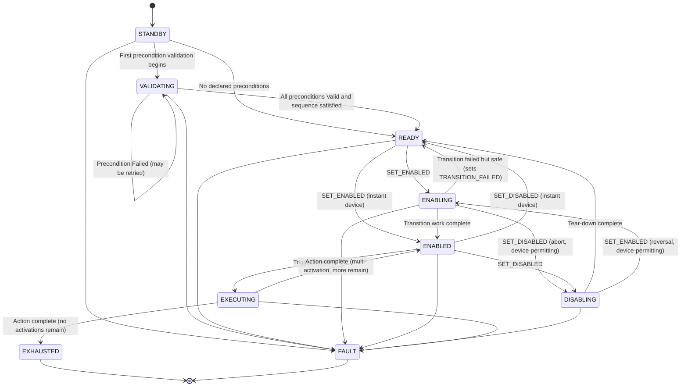
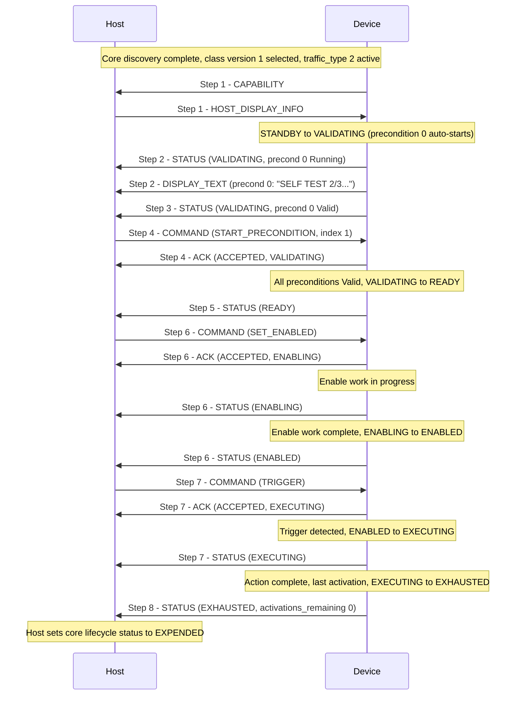

# APEX Device Class — Activation

**APEX — Adaptive Payload EXchange**

**Status:** Draft | **Scope:** Activation device class ([`traffic_type = 2`](APEX_Device_Classes.md#2--registry)) | **Class version:** 1

---

<a id="1--overview" name="1--overview"></a>
## 1.  Overview

The Activation class governs Devices that progress through an **activation lifecycle**: the device powers on inactive, validates one or more preconditions, is enabled by the host, and is then triggered to perform an action one or more times before becoming exhausted (or remaining available indefinitely).

The class is intentionally **payload-agnostic**. It defines the protocol shape — states, commands, precondition validation, trigger sources, status reporting — without prescribing what the Device actually does or what its preconditions mean. A specific Device declares its own preconditions, trigger sources, and per-payload status fields within the framework defined here.

**This class supports:**

- Single-activation Devices (one EXECUTING cycle, then EXHAUSTED).
- Multi-activation Devices (repeated ENABLED ←→ EXECUTING cycles).
- Devices whose enable or disable takes non-zero time, which surface first-class transient states (ENABLING / DISABLING — [§3](#3--device-state-machine)) so the host and OSD show truthful state rather than a stalled ACK or a lying READY.
- 0..N preconditions, optionally ordered.
- 1..N trigger sources (host command, hardware input, timer, external signal, …).
- Latched precondition validity.

**This class does not support** (out of scope for the current version; future class candidates):

- Continuous-state Devices with no discrete activation lifecycle.
- Unlatched preconditions that revert from valid → invalid without an explicit reset.

This document covers **both sides** of the class:

- **Device role** — what the Device reports, the state machine it runs, and how it responds to host commands.
- **Host role** — the commands the host issues and how it tracks the device.

Discovery, framing, and capability exchange at the bus level are out of scope and are handled by the core spec ([APEX — Core](APEX_Core.md)). All frames in this class carry `traffic_type = 2` in the APEX v1 outer header (`protocol_version = 0x01`).

This document defines the **wire protocol** of the class — the messages exchanged, the state machine, and the timing. It does **not** define what any individual payload's preconditions or triggers mean physically; that is the role of a **per-payload profile** ([§8](#8--per-payload-profiles)).

<a id="1-1--class-version" name="1-1--class-version"></a>
### 1.1.  Class version

This document defines **Activation class version 1** — the APEX v1.0-era revision of the class. Class version `0` retroactively denotes the v0-era revision that preceded it.

The class version is **negotiated once, at discovery**: a Device advertises the contiguous range it supports in DEVICE_INFO (`class_version_min` / `class_version_max`), and the host returns the selected value in CONFIG_REPLY (`selected_class_version`) (Core [§3.2](APEX_Core.md#3-2--config-traffic-traffic_type--1)). The negotiated value governs **every** Activation frame for the session and is the **single source of truth** for the class version in force. Class frames therefore carry no version byte of their own, and the CAPABILITY frame ([§6.3](#6-3--capability-frame-device--host)) **no longer carries a `class_spec_version` field** — the negotiated value replaces it.

---

<a id="2--roles" name="2--roles"></a>
## 2.  Roles

<a id="2-1--device" name="2-1--device"></a>
### 2.1.  Device

The device runs the **Activation State Machine** ([§3](#3--device-state-machine)), validates its declared preconditions ([§4](#4--preconditions-and-trigger-sources)), responds to host commands ([§5](#5--commands-host--device)), and reports its current state and per-precondition status via class-specific status frames ([§6](#6--message-format)). It detects trigger conditions from one or more declared trigger sources ([§4.2](#4-2--trigger-sources)) and transitions into EXECUTING when triggered while ENABLED.

<a id="2-2--host" name="2-2--host"></a>
### 2.2.  Host

The host issues commands to advance the device through its state machine ([§5](#5--commands-host--device)), may command individual precondition validations to begin, and acknowledges nothing — the device acknowledges the host's commands ([§6.4](#6-4--ack-frame-device--host)).

The host's high-level flight state (powered, propellers on, airborne, …) is **not** an Activation-class message. It is carried by the class-agnostic HOST_STATE message defined in the core spec ([APEX — Core §3.2.5](APEX_Core.md#3-2-5--host_state-msg_id--5)). A Device **may** consume HOST_STATE as an input to its precondition validation logic ([§4.1](#4-1--preconditions)); the host never directly drives the device's state machine.

---

<a id="3--device-state-machine" name="3--device-state-machine"></a>
## 3.  Device State Machine

The device runs the following state machine. State values are defined in `ActivationClassState_t`. The values are ordered so that lifecycle progression is monotonic — "armed or beyond" is simply `state >= ENABLED && state != FAULT`, and progress bars, range checks, and debug dumps sort naturally.

| Value | Name | Description |
| --- | --- | --- |
| `0x00` | *(reserved)* | Reserved; never sent. A receiver treats `0x00` as invalid. |
| `0x01` | **STANDBY** | Powered on and inert. No precondition validation has started. |
| `0x02` | **VALIDATING** | One or more preconditions are being validated ([§4.1](#4-1--preconditions)). The device remains here until every declared precondition is `Valid`. |
| `0x03` | **READY** | All declared preconditions ([§4](#4--preconditions-and-trigger-sources)) are `Valid`. Awaiting `SET_ENABLED`. |
| `0x04` | **ENABLING** | Host has issued a valid `SET_ENABLED` and the device is doing the work of becoming enabled (cap charging, gimbal spin-up, arming circuits, …). Triggers are **not** yet honored. A device whose enable is instant never reports this state ([§3, transition rules](#3--device-state-machine)). |
| `0x05` | **ENABLED** | Device is enabled and watching for a trigger from any of its declared trigger sources ([§4.2](#4-2--trigger-sources)). This is the **only** state in which a trigger is honored. |
| `0x06` | **DISABLING** | Host has issued a valid `SET_DISABLED` and the device is tearing down toward READY. Triggers are no longer honored (see the safety invariant below). A device whose disable is instant never reports this state. |
| `0x07` | **EXECUTING** | A valid trigger has been detected; the action is in progress. |
| `0x08` | **EXHAUSTED** | All activations complete. Device is now inert. |
| `0xFF` | **FAULT** | Critical failure, loss of communication, or other condition requiring user action. |



### State transition rules

- **STANDBY → VALIDATING** is automatic when the first precondition begins validating — whether a precondition auto-starts or the host issues `START_PRECONDITION` ([§5](#5--commands-host--device)).
- **STANDBY → READY** is automatic on power-up for a device that declares **zero** preconditions ([§4.1](#4-1--preconditions)). With nothing to validate, the device never enters VALIDATING.
- **VALIDATING → READY** is automatic when every declared precondition reaches `Valid` ([§4.1](#4-1--preconditions)). The device does not require a host command for this transition.
- **VALIDATING → VALIDATING** — a precondition entering `Failed` does not leave VALIDATING; the device remains in VALIDATING and the host may retry the precondition where the per-payload profile permits ([§4.1](#4-1--preconditions)).
- **READY → ENABLING** on an accepted `SET_ENABLED`, followed by an internal **ENABLING → ENABLED** transition when the device completes its enable work. The device **must** reject `SET_ENABLED` from any state other than READY, ENABLING, ENABLED, or DISABLING (see [§5](#5--commands-host--device) for the accepting states).
- **Instant devices may skip the transient states entirely** — a device whose enable and disable are effectively instantaneous transitions **directly** READY → ENABLED and ENABLED → READY, exactly as in class version 0, and never reports ENABLING or DISABLING. A host **must** accept both shapes: the transient states are for devices that need them, not a new mandatory hop.
- **ENABLED → DISABLING** on an accepted `SET_DISABLED`, followed by an internal **DISABLING → READY** transition when tear-down completes (or a direct ENABLED → READY on an instant device).
- **Triggers are honored only in ENABLED.** In ENABLING, a `TRIGGER` command is rejected with `REJECT_WRONG_STATE`, and the device **must not** act on hardware, timer, or external trigger sources either — a hardware line going active during ENABLING does **not** fire. Whether a line that is still active upon reaching ENABLED then fires is device-defined and documented in the per-payload profile ([§8](#8--per-payload-profiles)).
- **Mid-transition reversals are device-capability-dependent.** A command that would *reverse* an in-progress transition is the device's call, not a guarantee:
  - `SET_DISABLED` while ENABLING requests an **abort**. A device that can comply proceeds toward DISABLING as soon as it safely can; a device that physically cannot (mechanical motion in progress, capacitor dump mid-sequence) rejects with `REJECT_BUSY` ([§6.4](#6-4--ack-frame-device--host)) and completes the enable — the host waits for ENABLED and re-issues.
  - `SET_ENABLED` while DISABLING requests a **reversal** back toward ENABLED, symmetrically: accepted if the device can comply, else `REJECT_BUSY` while it completes the disable.
- **Safety invariant.** Once a `SET_DISABLED` has been **ACCEPTED** — from ENABLED or from ENABLING — **no trigger will be honored from that moment on**, even while the device is still physically winding down through DISABLING. Acceptance of the disable is the point past which no activation can occur.
- **ENABLING / DISABLING → READY on safe failure.** If a transition fails but the device is left in a safe condition, it returns to READY and sets the self-clearing `TRANSITION_FAILED` fault flag ([§6.5](#6-5--status-frame-device--host)); the flag clears on the next successful transition. A failure that leaves the device unsafe goes to FAULT.
- **Any state → FAULT** on a critical error. FAULT is terminal in the current version — see below.

Preconditions are **latched**: once a precondition reaches `Valid` it does not revert. There is therefore no transition from READY, ENABLING, ENABLED, or DISABLING back to VALIDATING or STANDBY; the downward exits from the enabled region all lead to READY (via `SET_DISABLED` / safe failure), and the only way back to STANDBY is a device reset, which restarts the machine.

### Multi-activation behavior

A multi-activation device returns to ENABLED after each EXECUTING cycle, until its last activation, after which it transitions to EXHAUSTED. The number of activations remaining is reported in every status frame as `activations_remaining` ([§6.5](#6-5--status-frame-device--host)). Whether a Device is single- or multi-activation, and its initial activation count, are payload-specific and documented in the per-payload profile ([§8](#8--per-payload-profiles)).

### FAULT

FAULT is reached on a critical error and is **terminal in the current version**: recovery requires a device reset and re-discovery (Core [§3.5](APEX_Core.md#3-5--heartbeat) gives the host a power-cycle lever via Pin 9). The conditions that caused the fault are reported in `fault_flags` ([§6.5](#6-5--status-frame-device--host)).

> **Open:** Selective, per-fault recovery (a `CLEAR_FAULT` path for transient, non-safety-critical faults) is a planned future extension. The current version treats every fault as terminal.

---

<a id="4--preconditions-and-trigger-sources" name="4--preconditions-and-trigger-sources"></a>
## 4.  Preconditions and Trigger Sources

<a id="4-1--preconditions" name="4-1--preconditions"></a>
### 4.1.  Preconditions

A **precondition** is a condition that must be validated before the device will accept `SET_ENABLED`. Preconditions are payload-specific in meaning — the spec does not enumerate them — but the protocol-level shape is uniform.

A device declares **0..16 preconditions** ([§4.3](#4-3--limits)). Each precondition has:

| Field | Description |
| --- | --- |
| Index | Stable integer identifier (`0`, `1`, `2`, …). |
| State | `NotStarted` / `Running` / `Valid` / `Failed`. |

The per-precondition state is reported in every status frame ([§6.5](#6-5--status-frame-device--host)). Any additional per-precondition detail a payload tracks — error counters, partial-progress indicators — is carried in the `payload_specific` region of the status frame ([§6.5](#6-5--status-frame-device--host)) and is not interpreted by the base class.

Any human-readable prompt or progress string a precondition wants to display is pushed to the host on the cosmetic DISPLAY_TEXT channel ([§6.8](#6-8--display_text-device--host)); it is advisory and never gates validation.

#### Validation lifecycle

| Value | State | Description |
| --- | --- | --- |
| `0` | **NotStarted** | Initial state on power-up. Some preconditions begin validation automatically; others require an explicit `START_PRECONDITION` command from the host ([§5](#5--commands-host--device)). |
| `1` | **Running** | Validation in progress. The device is gathering inputs (sensor readings, host-state observations, hardware-line transitions, timers). |
| `2` | **Valid** | The condition is met. Once latched to `Valid`, a precondition **must not** revert to a lower state without a device reset. |
| `3` | **Failed** | Validation could not be completed (e.g., maximum attempts exceeded). Depending on the precondition, the host may retry it via `START_PRECONDITION`, or the failure may be terminal — see below. |

The device transitions from **VALIDATING → READY** when every declared precondition is in state `Valid`. A device that declares **zero** preconditions skips VALIDATING entirely and is in READY immediately on power-up.

#### Auto-start vs. host-start

Some preconditions begin validation automatically on power-up; others remain `NotStarted` until the host issues `START_PRECONDITION`. Which preconditions are auto-start and which are host-start is **payload-specific** and documented in the per-payload profile ([§8](#8--per-payload-profiles)). A host-started precondition that the host should validate against a flight condition is declared on the wire as a **host-condition binding** in the CAPABILITY frame ([§6.3](#6-3--capability-frame-device--host)), which tells the host the gating `host_condition` and whether to start it autonomously (`auto_trigger`). A host that lacks the profile can also observe behavior directly: an auto-start precondition advances to `Running` on its own, whereas a precondition that remains `NotStarted` is host-start.

For a host-started precondition the host cannot evaluate autonomously (`host_condition = CUSTOM`), the pilot prompt is sourced from a **DISPLAY_TEXT push** for that precondition ([§6.8](#6-8--display_text-device--host)): the device **should** push its prompt text while the precondition is `NotStarted`, and the host presents it and waits for manual confirmation before sending `START_PRECONDITION`. If no prompt has been pushed, the host falls back to a generic prompt.

#### GPIO-backed preconditions

A precondition's validation may be backed by a discrete hardware input rather than by firmware logic or host-state observation. The APEX connector exposes two discrete-IO lines — Pin 3 and Pin 4 (Core [§2](APEX_Core.md#2--physical--electrical-interface-10-pin), the `GPIO` interface pins) — and a Device may bind a precondition to one of them: the precondition reaches `Valid` when its line holds a configured active level (active-high or active-low). A Device that requires the line to remain stable at the active level for a debounce interval before latching **may** do so; a transient excursion does not validate the precondition.

A Device **declares its GPIO-backed precondition mappings in the CAPABILITY frame** ([§6.3](#6-3--capability-frame-device--host)) — each mapping names a precondition index, the pin (Pin 3 or Pin 4) that validates it, and the line's active level (active-low or active-high) — so the host learns during discovery which preconditions are gated by hardware lines, which line gates each, and the sense of each line. Only the debounce interval, if any, remains device-internal and is documented in the per-payload profile ([§8](#8--per-payload-profiles)).

Beyond that declaration, a GPIO-backed precondition behaves like any other precondition. It is still subject to the auto-start / host-start gating above — the line is only evaluated once the precondition is `Running` — it still latches once `Valid` ([§3](#3--device-state-machine)), and it is reported in the STATUS frame ([§6.5](#6-5--status-frame-device--host)) with the same per-precondition state values. A host observes the precondition advance `Running → Valid` exactly as it would for any other validation mechanism.

#### Failed-precondition recovery

Whether a `Failed` precondition can be retried is **per-precondition** and documented in the per-payload profile. For a retriable precondition, `START_PRECONDITION` returns it to `Running`. For a terminally-failed precondition, the device rejects `START_PRECONDITION` with `REJECT_PRECONDITION` ([§6.4](#6-4--ack-frame-device--host)).

#### Validation sequencing

Every declared precondition must be `Valid` before the device will accept `SET_ENABLED`. Whether the device validates its preconditions in a particular order, in parallel, or with interdependencies is a **Device implementation choice** that this spec does not constrain — any such sequencing is internal to the device and documented in the per-payload profile ([§8](#8--per-payload-profiles)).

The protocol provides two ways for a Device that does enforce internal sequencing to report it to the host:

- The device **may** reject a `START_PRECONDITION` it is not ready to act on with `REJECT_PRECONDITION` ([§6.4](#6-4--ack-frame-device--host)).
- The device **may** set the `SEQUENCE_VIOLATION` fault flag ([§6.5](#6-5--status-frame-device--host)) if it detects that a validation occurred out of an order it requires.

#### Window timers

A device may associate a window timer with one or more preconditions or with the ENABLED state. If the device reaches a downstream state but no trigger occurs within the declared window, the device returns to a safer state and sets the `TRIGGER_WINDOW_EXPIRED` fault flag ([§6.5](#6-5--status-frame-device--host)). Window-timer semantics — which timer, what it gates, how long — are payload-specific; this spec defines only that the mechanism is supported and that its expiry is reportable via `fault_flags`. Remaining-time reporting, if a payload provides it, is carried in `payload_specific`.

<a id="4-2--trigger-sources" name="4-2--trigger-sources"></a>
### 4.2.  Trigger Sources

A device declares **1..16 trigger sources** ([§4.3](#4-3--limits)). While in ENABLED, any declared source may initiate the transition to EXECUTING. Sources are payload-specific in meaning, but each is declared as one of a small set of abstract categories:

| Value | Category | Abstract description |
| --- | --- | --- |
| `0x01` | `HOST_COMMAND` | The host issues an explicit `TRIGGER` command (see [§5](#5--commands-host--device)). |
| `0x02` | `HARDWARE_INPUT` | A discrete hardware line, switch, or impact sensor on the device. |
| `0x03` | `TIMER` | A device-internal timer expires. |
| `0x04` | `EXTERNAL_SIGNAL` | A signal from another bus member or external system. |

The categories are deliberately broad. A specific payload may map multiple physical inputs into a single category or split one category into several declared sources; the per-payload profile defines the mapping. Each declared source's category is reported in the capability frame ([§6.3](#6-3--capability-frame-device--host)), so a host can identify *what kind* of source triggered the device without knowing the payload-specific meaning. The device reports the index of the source that caused the most recent EXECUTING transition in its status frame ([§6.5](#6-5--status-frame-device--host)).

A device with `HOST_COMMAND` as its only declared trigger source is triggered solely by the host's `TRIGGER` command ([§5](#5--commands-host--device)). A device with both `HOST_COMMAND` and `HARDWARE_INPUT` supports either path. Regardless of source, a trigger is honored only in ENABLED ([§3](#3--device-state-machine)).

<a id="4-3--limits" name="4-3--limits"></a>
### 4.3.  Limits

| Quantity | Limit |
| --- | --- |
| Declared preconditions | 0..16 |
| Declared trigger sources | 1..16 |

These caps bound the worst-case size of the capability and status frames and let implementations size buffers statically. They are well within the 255-byte inner-payload limit from Core [§3.1.1](APEX_Core.md#3-1-1--outer-header-apexhdr_t), leaving ample room for the `payload_specific` region of a status frame.

---

<a id="5--commands-host--device" name="5--commands-host--device"></a>
## 5.  Commands (Host → Device)

The host advances the device through its state machine using the following commands. Command values are defined in `ActivationClassCommand_t`. `0x00` is reserved. All commands are carried in a COMMAND frame ([§6.2](#6-2--command-frame-host--device)) and acknowledged with an ACK frame ([§6.4](#6-4--ack-frame-device--host)).

| Value | Name | Valid in States | Argument | Description |
| --- | --- | --- | --- | --- |
| `1` | **START_PRECONDITION** | STANDBY, VALIDATING | `precondition_index` (`u8`) | Requests the device to begin (or retry) validating the precondition whose index is given. Rejected if the index does not refer to a declared precondition (`REJECT_BAD_INDEX`), or if the device is not ready to validate it — for example a terminally-failed precondition, or one the Device's internal sequencing is not yet ready for (`REJECT_PRECONDITION`). |
| `2` | **SET_ENABLED** | READY; ENABLING, ENABLED *(idempotent no-op)*; DISABLING *(reversal, device-permitting)* | *(none)* | Transitions READY → ENABLING (or directly → ENABLED on an instant device — [§3](#3--device-state-machine)). A repeat while already ENABLING or ENABLED is an idempotent no-op `ACCEPTED`. From DISABLING it requests a reversal back toward ENABLED: `ACCEPTED` (→ ENABLING) if the device can comply, else `REJECT_BUSY`. Rejected from any other state (`REJECT_WRONG_STATE`). |
| `3` | **SET_DISABLED** | ENABLED; DISABLING, READY *(idempotent no-op)*; ENABLING *(abort, device-permitting)* | *(none)* | Transitions ENABLED → DISABLING (or directly → READY on an instant device). A repeat while already DISABLING, or a `SET_DISABLED` while already READY, is an idempotent no-op `ACCEPTED` (READY joins the accept set for retransmit safety). From ENABLING it requests an abort back toward READY: `ACCEPTED` (→ DISABLING) if the device can comply, else `REJECT_BUSY`. Once `ACCEPTED`, no trigger is honored from that moment ([§3](#3--device-state-machine) safety invariant). Rejected from any other state (`REJECT_WRONG_STATE`). |
| `4` | **TRIGGER** | ENABLED | *(none)* | Host-driven trigger source. Causes the ENABLED → EXECUTING transition if `HOST_COMMAND` is among the declared trigger sources. Rejected with `REJECT_NOT_SUPPORTED` if `HOST_COMMAND` is not declared, or with `REJECT_WRONG_STATE` if not in ENABLED — notably in ENABLING, where no trigger source fires. |

**Idempotency and reversals.** The doctrine that keeps command handling coherent is: **retransmits are always safe; reversals are the device's call.** A command whose effect is already in place or already in progress — `SET_ENABLED` while ENABLING or ENABLED, `SET_DISABLED` while DISABLING or READY — is an idempotent no-op that is acknowledged `ACCEPTED`. This is what makes lost-ACK retransmission harmless ([§7.2](#7-2--command-acknowledgement-and-retransmission)): a duplicate caused by a dropped ACK changes nothing. A command that would *reverse* an in-flight transition (`SET_DISABLED` during ENABLING, `SET_ENABLED` during DISABLING) is device-capability-dependent: the device accepts it if it can comply, else replies `REJECT_BUSY` ([§6.4](#6-4--ack-frame-device--host)) and the host retries after the transition settles. The ACK's `current_state` reports ENABLING / DISABLING naturally, giving the host instant confirmation of what the device actually did.

---

<a id="6--message-format" name="6--message-format"></a>
## 6.  Message Format

The class follows the APEX framing model (Core [§3](APEX_Core.md#3--communication-protocol-uart)): every frame carries `traffic_type = 2`, is COBS-framed, and uses the outer header from Core [§3.1.1](APEX_Core.md#3-1-1--outer-header-apexhdr_t), with the inner payload carrying class-specific content. All multi-byte fields are little-endian (Core [§3.1](APEX_Core.md#3-1--frame-layout)).

<a id="6-1--inner-payload-sub-header" name="6-1--inner-payload-sub-header"></a>
### 6.1.  Inner payload sub-header

The Activation-class inner payload begins with a one-byte `class_msg_id` identifying the message. The remainder of the inner payload depends on the message.

| `class_msg_id` | Name | Direction | Meaning |
| --- | --- | --- | --- |
| `0` | *(reserved)* | — | Reserved; never sent. |
| `1` | **CAPABILITY** | Device → Host | Declares the device's preconditions and trigger sources ([§6.3](#6-3--capability-frame-device--host)). |
| `2` | **COMMAND** | Host → Device | A host command ([§6.2](#6-2--command-frame-host--device)). |
| `3` | **STATUS** | Device → Host | Periodic / event status frame ([§6.5](#6-5--status-frame-device--host)). |
| `4` | **ACK** | Device → Host | Acknowledgement of a host command ([§6.4](#6-4--ack-frame-device--host)). |
| `5` | **HOST_DISPLAY_INFO** | Host → Device | Declares the host's display real estate ([§6.7](#6-7--host_display_info-host--device)). |
| `6` | **DISPLAY_TEXT** | Device → Host | Advisory, pushed display string ([§6.8](#6-8--display_text-device--host)). |

A receiver **must** silently ignore any Activation-class message whose `class_msg_id` it does not recognize (the forward-compatibility rule of Core [§3.6](APEX_Core.md#3-6--versioning)).

<a id="6-2--command-frame-host--device" name="6-2--command-frame-host--device"></a>
### 6.2.  Command frame (Host → Device)

A COMMAND frame is flat: the `class_msg_id`, the command value, and the command's argument bytes (if any). COBS framing makes the frame self-delimiting and the outer-header `payload_length` gives the exact byte count, so the variable argument tail needs no length field of its own.

| Offset | Field | Width | Description |
| --- | --- | --- | --- |
| `0` | `class_msg_id` | `u8` | `2` (COMMAND). |
| `1` | `command` | `u8` | `ActivationClassCommand_t` value ([§5](#5--commands-host--device)). |
| `2…` | `argument` | variable | Command-specific argument bytes. |

Per-command arguments:

| Command | Argument bytes |
| --- | --- |
| `START_PRECONDITION` | `precondition_index` (`u8`) — 1 byte. |
| `SET_ENABLED` | *(none)* |
| `SET_DISABLED` | *(none)* |
| `TRIGGER` | *(none)* |

Example: `SET_ENABLED` is the two-byte inner payload `[02][02]`; `START_PRECONDITION` for precondition `3` is `[02][01][03]`.

<a id="6-3--capability-frame-device--host" name="6-3--capability-frame-device--host"></a>
### 6.3.  Capability frame (Device → Host)

The device sends one CAPABILITY frame, unprompted, immediately after the class becomes active — that is, immediately after the core discovery handshake reaches `ACK_OK` for `device_class_req = 2` (Core [§3.2.2](APEX_Core.md#3-2-2--config_reply-msg_id--2)). It declares the device's identity and the shape of its precondition / trigger-source set, which the host then uses to interpret every subsequent STATUS frame.

| Offset | Field | Width | Description |
| --- | --- | --- | --- |
| `0` | `class_msg_id` | `u8` | `1` (CAPABILITY). |
| `1` | `payload_type_uuid` | `u8[16]` | 128-bit identifier of the Device type ([§8.1](#8-1--device-identification)). |
| `17` | `n_preconditions` | `u8` | Number of declared preconditions (`0..16`). |
| `18` | `n_trigger_sources` | `u8` | Number of declared trigger sources (`1..16`). |
| `19…` | `trigger_source_categories[n_trigger_sources]` | `u8` each | Abstract category of each declared trigger source, in index order ([§4.2](#4-2--trigger-sources)). |
| *(after)* | `n_gpio_bindings` | `u8` | Number of GPIO-backed precondition mappings (`0..n_preconditions`) ([§4.1](#4-1--preconditions)). `0` if no precondition is GPIO-backed. |
| *(after)* | `gpio_bindings[n_gpio_bindings]` | `2×u8` each | For each mapping, two bytes: `precondition_index` (`u8`) and `pin_and_level` (`u8`). |
| *(after)* | `n_gpio_trigger_bindings` | `u8` | Number of GPIO-backed trigger source mappings (`0..n_trigger_sources`). `0` if no trigger source is GPIO-backed. Optional tail; a device that declares none may end the frame before it. |
| *(after)* | `gpio_trigger_bindings[n_gpio_trigger_bindings]` | `2×u8` each | For each mapping, two bytes: `trigger_source_index` (`u8`) and `pin_and_level` (`u8`). |
| *(after)* | `n_host_conditions` | `u8` | Number of **host-evaluated** preconditions (`0..n_preconditions`) — those the host should start autonomously (see below). Optional tail; `0` (or omitted) if no precondition has an autonomous host rule. |
| *(after)* | `host_conditions[n_host_conditions]` | `5×u8` each | One binding per autonomously host-started precondition (see below). |
| *(after)* | `enable_time_ms` | `u16` | **Optional timing tail.** Worst-case ENABLING duration in milliseconds; `0` = unspecified. |
| *(after)* | `disable_time_ms` | `u16` | Worst-case DISABLING duration in milliseconds; `0` = unspecified. |

The `class_spec_version` field that class version 0 carried at offset `1` is **removed** ([§1.1](#1-1--class-version)); every field from `payload_type_uuid` onward shifts down one byte relative to that revision. The negotiated `selected_class_version` (Core [§3.2](APEX_Core.md#3-2--config-traffic-traffic_type--1)) is the single source of truth for the class version in force.

Both GPIO binding blocks use the same `pin_and_level` encoding:

| Bits | Field | Meaning |
| --- | --- | --- |
| `0–6` | `pin` | Connector pin, `3` or `4`. |
| `7` | `active_level` | `0` = active-low, `1` = active-high. |

So `pin_and_level = pin \| (active_high ? 0x80 : 0x00)`. A precondition binding asserts "precondition `precondition_index` is validated by GPIO `pin`, satisfied when the line is at the encoded active level" ([§4.1](#4-1--preconditions)); a trigger binding asserts "trigger source `trigger_source_index` fires when GPIO `pin` reaches the encoded active level" ([§4.2](#4-2--trigger-sources)). The active level is declared here; debounce and edge-detection behaviour are device-internal ([§8](#8--per-payload-profiles)). A `pin` (low 7 bits) other than `3` or `4`, a binding count exceeding its respective limit, or an index that is not declared, makes the frame malformed.

The frame is built from a chain of **optional tails**, each governed by the v1 rule that a receiver treats an absent tail as zero (Core [§3.6](APEX_Core.md#3-6--versioning)):

- `n_gpio_trigger_bindings` — a host that has consumed all of `gpio_bindings` but finds no further bytes treats it as `0`.
- `n_host_conditions` (with its `host_conditions` entries) — same rule; absent ⇒ `0`.
- **Timing tail** (`enable_time_ms`, `disable_time_ms`) — **both-or-neither**: a device either appends both `u16` values or neither. An absent timing tail means both durations are unspecified, exactly as an explicit `0` does. The tail declares the worst-case time the device may spend in ENABLING / DISABLING, letting the host apply a timeout policy ([§7.1](#7-1--lifecycle)).

A sender may end the frame at any tail boundary — absent tails read as zero — but the tails are positional: if a **later** tail is present, every earlier tail's count byte must be present too, so an intermediate empty tail is encoded as an explicit zero count (e.g., a device with no host-condition bindings that declares the timing tail emits `n_host_conditions = 0` before it).

**Host-condition bindings.** Each `host_conditions` entry is **5 bytes** and declares *when the host should send `START_PRECONDITION` autonomously* for one precondition:

| Offset within entry | Field | Width | Description |
| --- | --- | --- | --- |
| `0` | `precondition_index` | `u8` | The precondition this binding gates (`< n_preconditions`). |
| `1` | `host_condition` | `u8` | Flight condition the host evaluates (values below). |
| `2` | `condition_param` | `u16` | Parameter for parameterised conditions (e.g., altitude threshold in metres for `ALT_ABOVE`/`ALT_BELOW`); `0` otherwise. |
| `4` | `auto_trigger` | `u8` | `1` = the host **should** send `START_PRECONDITION` autonomously when `host_condition` is met. `0` = the host presents the condition as a prompt and waits for pilot confirmation. Ignored when `host_condition` is `NONE` or `CUSTOM`. |

The binding list declares the preconditions the host should start **autonomously** — or, for `CUSTOM`, present as a structured prompt. A precondition index **not** listed here simply has no autonomous rule: the host takes no automatic action for it. It may still be host-started by other means — an operator-driven `START_PRECONDITION`, or a generic host nudging a precondition observed stuck at `NotStarted` ([§8.3](#8-3--generic-host-behavior)), remains legal for any declared precondition. A device-started precondition (validated locally, e.g. an auto-started self-test) is likewise simply omitted.

This binding is carried in CAPABILITY — **not** on the cosmetic DISPLAY_TEXT channel ([§6.8](#6-8--display_text-device--host)) — so the host's auto-start logic depends only on the reliably-delivered, always-required CAPABILITY frame plus STATUS. DISPLAY_TEXT is advisory and fire-and-forget ([§6.6](#6-6--reporting-cadence-and-timing)); making an auto-start input depend on it would let a dropped push stall validation, which [§6.6](#6-6--reporting-cadence-and-timing) forbids.

**`host_condition` values:**

| Value | Name | FC evaluates | `condition_param` |
| --- | --- | --- | --- |
| `0x00` | `NONE` | Not auto-evaluable. `auto_trigger` is ignored. (A precondition with `NONE` would not normally be listed as a host-condition binding.) | — |
| `0x01` | `HOVER` | Low horizontal velocity and low altitude rate (implementation-defined thresholds). | — |
| `0x02` | `ALT_ABOVE` | Estimated altitude above arm point > `condition_param` metres. | altitude threshold (m) |
| `0x03` | `ALT_BELOW` | Estimated altitude above arm point < `condition_param` metres. | altitude threshold (m) |
| `0x04` | `GPS_FIX` | 3D GPS fix acquired. | — |
| `0x05` | `PROPS_ON_FLYING` | Host flight state is `PROPS_ON_FLYING` ([APEX — Core §3.2.5](APEX_Core.md#3-2-5--host_state-msg_id--5)). | — |
| `0x06` | `PROPS_ON_GROUND` | Props are spinning at idle on the ground; does not require active flight. Equivalent to host state `PROPS_ON_GROUND` ([APEX — Core §3.2.5](APEX_Core.md#3-2-5--host_state-msg_id--5)). | — |
| `0x07` | `PROPS_WITH_THROTTLE` | Props are spinning **and** throttle input meets or exceeds the threshold. | minimum throttle percentage (0–100); `0` = any non-zero input |
| `0x08` | `PROPS_ON_FLYING_TIMER` | `condition_param` seconds have elapsed after the host first enters `PROPS_ON_FLYING`. The timer latches on the first `PROPS_ON_FLYING` detection and continues while props remain spinning; it resets only when props stop. | seconds to wait after `PROPS_ON_FLYING` |
| `0x09`–`0xFE` | *(reserved)* | — | — |
| `0xFF` | `CUSTOM` | Host cannot evaluate; display the precondition's pushed DISPLAY_TEXT prompt ([§6.8](#6-8--display_text-device--host)) as a pilot prompt and wait for manual confirmation before sending `START_PRECONDITION`. If no prompt has been pushed, the host shows a generic prompt. `auto_trigger` is ignored. | — |

A host that does not recognise a `host_condition` value MUST treat it as `CUSTOM`.

`n_preconditions`, `n_trigger_sources`, and the GPIO mappings are declared **once**, here. They are not repeated in the STATUS frame, which keeps every status frame a fixed size for a given device. A host that needs to re-learn a Device's capabilities power-cycles it, which re-runs discovery and re-emits CAPABILITY.

A host that has not received CAPABILITY cannot interpret STATUS frames and treats the device as not yet ready for class traffic; CAPABILITY is device-pushed, so the host waits for it rather than requesting it.

<a id="6-4--ack-frame-device--host" name="6-4--ack-frame-device--host"></a>
### 6.4.  ACK frame (Device → Host)

The device replies to every COMMAND frame with exactly one ACK frame.

| Offset | Field | Width | Description |
| --- | --- | --- | --- |
| `0` | `class_msg_id` | `u8` | `4` (ACK). |
| `1` | `acked_command` | `u8` | The `command` value being acknowledged, echoed from the COMMAND frame. |
| `2` | `result` | `u8` | Result code (see below). |
| `3` | `current_state` | `u8` | The device's `ActivationClassState_t` value at the time the ACK is sent ([§3](#3--device-state-machine)). |

**`result` values:**

| Value | Name | Meaning |
| --- | --- | --- |
| `0x00` | `ACCEPTED` | The command was valid and has been applied. |
| `0x01` | `REJECT_WRONG_STATE` | The command is **never** valid in the device's current state. |
| `0x02` | `REJECT_BAD_INDEX` | The command references a precondition (or other index) that the device has not declared. |
| `0x03` | `REJECT_PRECONDITION` | The device is not ready to act on the command for the referenced precondition — e.g. it is terminally failed, or the Device's internal sequencing is not yet ready for it ([§4.1](#4-1--preconditions)). |
| `0x04` | `REJECT_NOT_SUPPORTED` | The command is not supported by this device (e.g., `TRIGGER` when `HOST_COMMAND` is not a declared trigger source). |
| `0x05` | `REJECT_MALFORMED` | The COMMAND frame could not be parsed (bad length, unknown command value). |
| `0x06` | `REJECT_BUSY` | The command is valid and understood, but the device **temporarily** cannot comply — an irreversible transition is in progress (e.g. a mid-transition reversal it cannot honor right now, [§5](#5--commands-host--device)). Not a fault. The host **should** retry after the next state-transition STATUS frame. |

`current_state` is included so that a host whose model of the device has drifted re-synchronizes from the ACK itself, without waiting for the next periodic STATUS frame.

`REJECT_BUSY` is deliberately distinct from `REJECT_WRONG_STATE`: the former means "valid command, retry after the transition settles", the latter means "never valid from this state — give up". The distinction lets a host tell retry-later from give-up without a profile.

A rejected command is a routine protocol event, not a fault: a reject result does **not** set any `fault_flags` bit ([§6.5](#6-5--status-frame-device--host)).

<a id="6-5--status-frame-device--host" name="6-5--status-frame-device--host"></a>
### 6.5.  Status frame (Device → Host)

The STATUS frame reports the device's current state. It has a **fixed base header** that any Activation-class host can parse using only the counts from the CAPABILITY frame, followed by an opaque `payload_specific` region.

| Offset | Field | Width | Description |
| --- | --- | --- | --- |
| `0` | `class_msg_id` | `u8` | `3` (STATUS). |
| `1` | `state` | `u8` | Current `ActivationClassState_t` value ([§3](#3--device-state-machine)). |
| `2` | `activations_remaining` | `u8` | Number of EXECUTING cycles the device can still perform. Decrements as the device executes; `0` once EXHAUSTED. `0xFF` indicates an indefinite / unlimited activation count. |
| `3` | `last_trigger_source` | `u8` | Index of the trigger source that caused the most recent EXECUTING transition; `0xFF` if the device has not entered EXECUTING since power-up. |
| `4` | `fault_flags` | `u16` | Bitfield of generic fault conditions (see below). |
| `6…` | `precondition_states[n_preconditions]` | `u8` each | Per-precondition state, in index order: `0`=NotStarted, `1`=Running, `2`=Valid, `3`=Failed ([§4.1](#4-1--preconditions)). |
| *(after)* | `payload_specific[…]` | variable | Reserved for per-payload status bytes. The base class does not interpret these ([§8.2](#8-2--the-payload_specific-region)). |

`n_preconditions` is the value from the CAPABILITY frame ([§6.3](#6-3--capability-frame-device--host)). The total inner-payload length therefore depends only on `n_preconditions` and the size of the `payload_specific` region; for a device with no payload-specific bytes it is a fixed `6 + n_preconditions` bytes. Devices must respect the `payload_length` cap from Core [§3.1.1](APEX_Core.md#3-1-1--outer-header-apexhdr_t).

**`fault_flags` bit layout:**

| Bit | Name | Latched? | Meaning |
| --- | --- | --- | --- |
| `0` | `PRECONDITION_FAILED` | Latched | One or more preconditions are in the `Failed` state. |
| `1` | `SEQUENCE_VIOLATION` | Latched | An out-of-order precondition validation was detected internally. |
| `2` | `TRIGGER_WINDOW_EXPIRED` | Self-clearing | A window timer elapsed without the expected trigger ([§4.1](#4-1--preconditions)). |
| `3` | `COMMS_LOST` | Self-clearing | The Core [§3.5](APEX_Core.md#3-5--heartbeat) watchdog tripped (no host frame within the watchdog window). |
| `4` | `INTERNAL_ERROR` | Latched | A device self-check or hardware fault. |
| `5` | `TRANSITION_FAILED` | Self-clearing | An enable/disable transition failed but the device returned safely to READY ([§3](#3--device-state-machine)). Clears on the next successful transition. |
| `6–15` | *(reserved)* | — | Reserved; **must** be zero in the current version. |

A **latched** bit, once set, remains set until a device reset. A **self-clearing** bit clears automatically when the underlying condition clears (the window is re-armed; host communication is restored; the next enable/disable succeeds). A device that sets any latched fault bit transitions to FAULT ([§3](#3--device-state-machine)); `TRANSITION_FAILED` is not a latched bit and does not by itself force FAULT — a transition that fails safely returns the device to READY.

<a id="6-6--reporting-cadence-and-timing" name="6-6--reporting-cadence-and-timing"></a>
### 6.6.  Reporting cadence and timing

- **Event-driven.** The device **must** emit a STATUS frame within **100 ms** of every state transition, so the host observes transitions promptly — including entering and leaving the transient ENABLING / DISABLING states ([§3](#3--device-state-machine)) and the terminal EXECUTING → EXHAUSTED.
- **Periodic.** In the absence of a transition, the device **must** still emit a STATUS frame at least once per second. The periodic STATUS frame satisfies the device's Core [§3.5](APEX_Core.md#3-5--heartbeat) 1 Hz transmit floor — a separate implicit heartbeat is not required while the class is active. A device that remains in a transient state (ENABLING or DISABLING) longer than 1 s keeps emitting periodic STATUS frames; the host tracks progress via the `state` byte. The base class defines **no** progress field — a payload that wants to report percent-complete carries it in `payload_specific`.
- **Command ACK latency.** The device **must** emit the ACK frame for a received COMMAND within **200 ms**. This bounds only the acknowledgement. How long the device subsequently spends in ENABLING, DISABLING, or EXECUTING is payload-specific and is documented in the per-payload profile ([§8](#8--per-payload-profiles)).
- **DISPLAY_TEXT rate cap.** A device **must not** exceed **5 Hz sustained per target** on the DISPLAY_TEXT channel ([§6.8](#6-8--display_text-device--host)), and **should** coalesce (send the current truth, not a backlog). DISPLAY_TEXT is advisory and **must never** displace the STATUS or ACK timing obligations above.

<a id="6-7--precond_info_request-host--device" name="6-7--precond_info_request-host--device"></a>
<a id="6-7--precond_info_request-frame-host--device" name="6-7--precond_info_request-frame-host--device"></a>
<a id="6-7--host_display_info-host--device" name="6-7--host_display_info-host--device"></a>
### 6.7.  HOST_DISPLAY_INFO frame (Host → Device)

Tells the device what display real estate the host has, so it can size its DISPLAY_TEXT pushes ([§6.8](#6-8--display_text-device--host)). The host **should** send one HOST_DISPLAY_INFO frame once, immediately after receiving CAPABILITY ([§6.3](#6-3--capability-frame-device--host)), and **may** resend it if its display configuration changes. This replaces the per-precondition `PRECOND_INFO_REQUEST` sweep of class version 0.

| Offset | Field | Width | Description |
| --- | --- | --- | --- |
| `0` | `class_msg_id` | `u8` | `5` (HOST_DISPLAY_INFO). |
| `1` | `char_limit` | `u8` | Maximum characters the host renders per display line. `0` = `32`. |
| `2` | `n_banner_lines` | `u8` | Number of free banner lines available to this device. `0` = banner text unsupported (per-precondition lines only). |

A device that has received **no** HOST_DISPLAY_INFO assumes `char_limit = 32` and `n_banner_lines = 1`. Hosts **truncate** over-limit strings rather than drop them — a truncated hint beats nothing.

<a id="6-8--precond_info_reply-device--host" name="6-8--precond_info_reply-device--host"></a>
<a id="6-8--precond_info_reply-frame-device--host" name="6-8--precond_info_reply-frame-device--host"></a>
<a id="6-8--display_text-device--host" name="6-8--display_text-device--host"></a>
### 6.8.  DISPLAY_TEXT frame (Device → Host)

Pushed by the device at any time while the class is active to annotate the host's display with live, vendor-authored text ("Point camera at horizon", "Calibrating 3/5…", "Spinning up 40%"). It is **purely advisory** and **fire-and-forget**: there is no host reply and no ACK. This replaces class version 0's static four-string `PRECOND_INFO_REPLY`; a device is free to push each precondition's string once at startup and again on each state change to approximate the old static behaviour.

| Offset | Field | Width | Description |
| --- | --- | --- | --- |
| `0` | `class_msg_id` | `u8` | `6` (DISPLAY_TEXT). |
| `1` | `target` | `u8` | What the string annotates (below). |
| `2` | `text_len` | `u8` | Length of the following string, `0`…`char_limit`. `0` **clears** the target. |
| `3…` | `text[…]` | variable | ASCII string, **not** null-terminated. |

**`target` values:**

| Value | Meaning |
| --- | --- |
| `0x00`–`0x0F` | Precondition index line — the string becomes that precondition's current display line, replacing the generic label the host would otherwise derive from its STATUS state. |
| `0x10`–`0xEF` | *(reserved)* |
| `0xF0`–`0xFE` | Banner line `0`–`14` — device-level text not tied to a precondition (index `<` `n_banner_lines`). |
| `0xFF` | *(reserved)* |

**Semantics:**

- **Latest-wins per target.** A new DISPLAY_TEXT replaces the previous string for that target; `text_len = 0` clears it.
- **Advisory only.** Nothing functional may depend on a DISPLAY_TEXT arriving — string delivery never gates validation (which is why auto-start lives in CAPABILITY, [§6.3](#6-3--capability-frame-device--host)). A host **may** drop intermediate updates; latest-wins makes that safe.
- **Legal in any class state.** The primary use is during VALIDATING, but ENABLING / DISABLING progress text and EXECUTING status lines are equally valid.
- **Rate cap.** Subject to the ≤ 5 Hz-per-target cap of [§6.6](#6-6--reporting-cadence-and-timing); it never preempts STATUS / ACK timing.
- **Fallback labels.** For a target with **no** live string — a device that never pushed one, or a push that was dropped — the host renders its own generic label derived from the STATUS state (e.g. `"PRECONDITION <n>"` style, [§8.3](#8-3--generic-host-behavior)).
- **Session-scoped.** The host's text table clears on device reset / re-discovery, like all other session state.

**Host-side model.** The host keeps a small per-device text table — one string per banner line and one per precondition, each up to `char_limit` bytes. Its render loop shows, for each precondition, the live string if present else the generic label; banner lines are shown verbatim. Worst case (16 preconditions plus a banner, 32 chars, 5 Hz) is roughly 3 KB/s — negligible against the 115 200 baud floor and irrelevant at negotiated higher rates; in practice devices push on change only.

---

<a id="7--operational-flow" name="7--operational-flow"></a>
## 7.  Operational Flow

<a id="7-1--lifecycle" name="7-1--lifecycle"></a>
### 7.1.  Lifecycle

1. **Discovery.** The Device completes the core discovery handshake (Core [§3.3](APEX_Core.md#3-3--startup-discovery-handshake)) requesting `device_class_req = 2` and advertising its supported Activation class-version range. On `ACK_OK` — which carries the negotiated `selected_class_version` ([§1.1](#1-1--class-version)) — class traffic on `traffic_type = 2` becomes valid.
2. **Capability.** The device immediately sends one CAPABILITY frame ([§6.3](#6-3--capability-frame-device--host)). The host records `n_preconditions`, `n_trigger_sources`, the trigger-source categories, the `payload_type_uuid`, and any declared `enable_time_ms` / `disable_time_ms`.
3. **Display info.** The host sends one HOST_DISPLAY_INFO frame ([§6.7](#6-7--host_display_info-host--device)) declaring its display real estate. Thereafter the device **may** push DISPLAY_TEXT ([§6.8](#6-8--display_text-device--host)) at any time to annotate the display. This channel is **advisory** and does not block precondition validation — the host-start hint it needs to drive validation already arrived in CAPABILITY ([§6.3](#6-3--capability-frame-device--host)). A device that surfaces no operator-facing text simply pushes none, and the host uses generic labels.
4. **Validation.** Auto-start preconditions begin validating; the device enters VALIDATING. For host-start preconditions (those declared in the CAPABILITY host-condition bindings — [§6.3](#6-3--capability-frame-device--host)), the host either sends `START_PRECONDITION` autonomously when the declared `host_condition` is met (if `auto_trigger = 1`) or presents the precondition's pushed DISPLAY_TEXT prompt — or a generic prompt if none was pushed — to the operator and waits for manual confirmation ([§4.1](#4-1--preconditions)). The device reports progress in periodic STATUS frames.
5. **Ready.** When all preconditions are `Valid`, the device enters READY.
6. **Enable.** The host issues `SET_ENABLED`. A device with a non-instant enable ACKs with `current_state = ENABLING`, emits a STATUS frame on entering ENABLING, and emits another on reaching ENABLED; an instant device ACKs `current_state = ENABLED` directly and reports ENABLED in one STATUS. The host may issue `SET_DISABLED` to return toward READY (via DISABLING on a non-instant device). If the device declared `enable_time_ms` and the device is still in ENABLING after roughly **2×** that bound, the host **should** surface a warning and **may** treat the condition as a device fault per its own policy.
7. **Trigger.** A declared trigger source triggers the device (a `TRIGGER` command, a hardware input, …) while in ENABLED; the device enters EXECUTING and performs its action. Triggers are honored only in ENABLED ([§3](#3--device-state-machine)).
8. **Completion.** On action completion the device returns to ENABLED (multi-activation, `activations_remaining > 0`) or transitions to EXHAUSTED (`activations_remaining = 0`).

<a id="7-2--command-acknowledgement-and-retransmission" name="7-2--command-acknowledgement-and-retransmission"></a>
### 7.2.  Command acknowledgement and retransmission

Every COMMAND is answered by exactly one ACK ([§6.4](#6-4--ack-frame-device--host)). If the host does not receive an ACK within the command-ACK latency bound ([§6.6](#6-6--reporting-cadence-and-timing)), it **should** retransmit the command. Because a retransmit is an idempotent no-op whenever the command's effect is already in place or in progress ([§5](#5--commands-host--device)), a duplicate caused by a lost ACK is harmless. A retransmit is never mistaken for a reversal: reversals are distinguished by the device's *current* state, not by whether the host has sent the command before.

A recommended default is to retransmit after **200–500 ms** with no ACK, up to **3** attempts, and to surface the failure to the operator if no ACK is received thereafter. A `REJECT_BUSY` result is **not** a lost ACK — it is a delivered answer meaning "retry after the next state-transition STATUS", so the host waits for that STATUS rather than immediately re-sending. These figures are non-normative; a per-payload profile **may** tighten them for a safety-critical payload.

<a id="7-3--relationship-to-core-device-lifecycle-status" name="7-3--relationship-to-core-device-lifecycle-status"></a>
### 7.3.  Relationship to core device lifecycle status

The class state machine ([§3](#3--device-state-machine)) is **independent of** the core device lifecycle status (Core [§4](APEX_Core.md#4--device-lifecycle-status): UNKNOWN / PROVISIONAL / CONNECTED / EXPENDED / FAULT). The two operate at different layers:

- **Core lifecycle status** tracks the device's presence and configuration on the bus. It is managed by the host.
- **Activation state** tracks the activation lifecycle. It is managed by the device and reported via STATUS frames.

A device in core status **CONNECTED** may be in any activation state. When a device reports activation state **EXHAUSTED**, the host **must** transition the device's core lifecycle status to **EXPENDED**. No separate signal is sent for this; observing the EXHAUSTED STATUS frame is what drives the change. The distinct names are intentional — *EXHAUSTED* is the activation-class state, *EXPENDED* is the core-lifecycle status.

<a id="7-4--re-enumeration-reset_request" name="7-4--re-enumeration-reset_request"></a>
### 7.4.  Re-enumeration (RESET_REQUEST)

RESET_REQUEST (Core [§3.2.13](APEX_Core.md#3-2-13--reset_request-msg_id--13)) commands a **session-state** reset — the device discards its assigned id and negotiated versions and re-enters discovery. It does not imply a device reboot, and it carries no class-level command. What the class *does* define is a single, self-issued reaction to losing its session, specified below.

**Safety deferral.** A device in **EXECUTING** defers honoring RESET_REQUEST until the action completes — EXECUTING runs to completion ([§3](#3--device-state-machine)) and is never aborted by re-enumeration. The device honors the deferred reset at its next state transition. A device in any other state honors RESET_REQUEST immediately.

**Self-disarm on session loss.** When a device loses its session — on an honored RESET_REQUEST, and equally on any other return to discovery, such as a heartbeat-watchdog timeout (Core [§3.5](APEX_Core.md#3-5--heartbeat)) — it **self-issues `SET_DISABLED`** ([§5](#5--commands-host--device)) against its own state machine. This is the ordinary downward transition, not a new mechanism: an ENABLED device begins DISABLING (or reaches READY directly on an instant device), and an ENABLING device aborts toward READY where its capabilities allow ([§5](#5--commands-host--device)). An ENABLING device that cannot abort completes the enable and self-disarms from ENABLED at the following session boundary; an EXECUTING device (whose reset was deferred) runs to completion first, then self-disarms from the state it lands in. The armed region therefore does **not** survive re-enumeration — a successor host never inherits a payload it did not itself arm.

**Neither side assumes the resulting state.** A self-issued `SET_DISABLED` obeys the same timing as a host-issued one: a non-instant device may still be DISABLING when it re-enters discovery and reconnects. Neither the payload nor any host may **assume** the device's state after re-enumeration. The device reports the state it actually holds in the first STATUS frame of the new session ([§6.5](#6-5--status-frame-device--host)); the host reads that state rather than presuming READY, and re-issues `SET_ENABLED` if it wants the payload armed again.

**What survives.** Re-enumeration stands down the armed region only; the rest of the device-internal state is untouched:

- Latched preconditions stay latched ([§4.1](#4-1--preconditions)).
- `activations_remaining` persists.
- An EXHAUSTED device remains EXHAUSTED — the self-issued `SET_DISABLED` is a no-op there ([§5](#5--commands-host--device)), as there is nothing armed to stand down.

After re-discovery the device re-emits CAPABILITY as usual ([§6.3](#6-3--capability-frame-device--host)), and its first STATUS frame reports the state it actually holds — a device that self-disarmed reports DISABLING or READY, while an EXHAUSTED device reports EXHAUSTED again and the host re-marks its core lifecycle status EXPENDED per [§7.3](#7-3--relationship-to-core-device-lifecycle-status), keeping the two layers self-consistent.

**What resets.** Host-session artifacts do not survive: the device's display capabilities revert to the defaults (`char_limit = 32`, `n_banner_lines = 1`) until a new HOST_DISPLAY_INFO arrives ([§6.7](#6-7--host_display_info-host--device)), and the host's DISPLAY_TEXT table clears on re-discovery as for any other session state ([§6.8](#6-8--display_text-device--host)).

---

<a id="8--per-payload-profiles" name="8--per-payload-profiles"></a>
## 8.  Per-Payload Profiles

This document defines the **wire protocol** of the Activation class — the messages, the state machine, the timing. It deliberately does not define what any individual payload's preconditions and trigger sources *mean* in the physical world. That is the role of a **per-payload profile**.

A per-payload profile is a document, authored by the payload vendor, that describes a specific payload type in terms of this class. It is **not** registered with or governed by the APEX specification; there is no central registry. A profile is simply the documentation a host integrator needs in order to operate a particular payload.

A per-payload profile **should** cover, at minimum:

1. **Identity** — the `payload_type_uuid` the payload reports in its CAPABILITY frame ([§6.3](#6-3--capability-frame-device--host)).
2. **Preconditions** — for each declared precondition index: what it represents, the physical criteria for it to reach `Valid`, whether it is auto-start or host-start ([§4.1](#4-1--preconditions)), and whether a `Failed` result is retriable or terminal. For a GPIO-backed precondition ([§4.1](#4-1--preconditions)), any debounce interval — the pin mapping and active level are declared on the wire in the CAPABILITY frame ([§6.3](#6-3--capability-frame-device--host)).
3. **Validation sequencing** — any order or interdependency the Device enforces among its preconditions, and the conditions under which it rejects `START_PRECONDITION` or raises `SEQUENCE_VIOLATION` ([§4.1](#4-1--preconditions)).
4. **Trigger sources** — for each declared trigger source index: its abstract category and its payload-specific meaning ([§4.2](#4-2--trigger-sources)).
5. **Window timers** — any window timers, what they gate, and their durations ([§4.1](#4-1--preconditions)).
6. **Activation count** — whether the Device is single- or multi-activation and its initial `activations_remaining`.
7. **Enable / disable transitions** — the expected ENABLING and DISABLING durations (and how they relate to any declared `enable_time_ms` / `disable_time_ms`), what the device physically does during each, and **which mid-transition reversals the device supports** — i.e. whether `SET_DISABLED` during ENABLING aborts or returns `REJECT_BUSY`, and symmetrically for `SET_ENABLED` during DISABLING ([§3](#3--device-state-machine), [§5](#5--commands-host--device)). Whether a still-active trigger line fires upon reaching ENABLED ([§3](#3--device-state-machine)) belongs here too.
8. **Display text** — what the device pushes on the DISPLAY_TEXT channel ([§6.8](#6-8--display_text-device--host)) and when: which precondition lines and banner lines it drives, the prompts it emits for `CUSTOM` host-conditions, and any progress text during ENABLING / DISABLING / EXECUTING.
9. **`payload_specific` layout** — the byte layout of the `payload_specific` region of the STATUS frame, if the payload uses it ([§8.2](#8-2--the-payload_specific-region)).
10. **Faults** — payload-specific conditions that cause each `fault_flags` bit, and the EXECUTING duration to expect.

<a id="8-1--device-identification" name="8-1--device-identification"></a>
### 8.1.  Device identification

A device identifies itself in its CAPABILITY frame ([§6.3](#6-3--capability-frame-device--host)) with a `payload_type_uuid` — a 128-bit (16-byte) identifier of the **Device type**. The vendor generates it once per type ([RFC 4122](https://www.rfc-editor.org/rfc/rfc4122) version 4 recommended); every unit of that type then reports the same value. No central registry is required.

The host uses `payload_type_uuid` as the key to look up a payload's profile ([§8](#8--per-payload-profiles)). A host that does not recognize the UUID has no profile for that Device and falls back to generic handling ([§8.3](#8-3--generic-host-behavior)).

The UUID identifies a **type**, not a unit or a configuration: two Devices that need different host handling are different types and **must** carry different UUIDs, even if they are the same physical product in different modes.

The all-zero UUID is reserved for an unidentified Device — a Device with no assigned UUID reports sixteen `0x00` bytes, and the host treats it as having no profile.

<a id="8-2--the-payload_specific-region" name="8-2--the-payload_specific-region"></a>
### 8.2.  The `payload_specific` region

The STATUS frame ends with an optional, variable-length `payload_specific` region ([§6.5](#6-5--status-frame-device--host)). It is an extension point for telemetry the base class does not define — for example a charge level, a temperature, a partial-validation progress value, or an ENABLING / DISABLING percent-complete.

The base class assigns **no meaning** to these bytes. Their layout is defined entirely by the per-payload profile. A device that has no payload-specific telemetry to report omits the region (the STATUS frame is then exactly `6 + n_preconditions` bytes).

<a id="8-3--generic-host-behavior" name="8-3--generic-host-behavior"></a>
### 8.3.  Generic host behavior

A **generic** Host — one with no profile for the attached Device — can still operate any Activation-class Device using only the base protocol:

- It learns `n_preconditions` and `n_trigger_sources` from the CAPABILITY frame.
- It can drive the state machine: issue `START_PRECONDITION` for any precondition observed stuck at `NotStarted`, then `SET_ENABLED` (accepting either a direct → ENABLED or a → ENABLING → ENABLED shape), then `TRIGGER`.
- It can parse the entire STATUS base header — state, `activations_remaining`, `last_trigger_source`, `fault_flags`, and per-precondition states.
- It renders any DISPLAY_TEXT the device pushes and falls back to generic labels (`"PRECONDITION <n>"` style, derived from the STATUS state) for any line with no live string ([§6.8](#6-8--display_text-device--host)).
- It treats the `payload_specific` region as opaque: it does not interpret those bytes and is not required to. It may forward them verbatim to payload-aware tooling (e.g., a ground station that does hold the profile).

A generic host therefore needs a profile only to attach physical *meaning* to precondition and trigger indices and to interpret `payload_specific` — never to maintain the connection or run the lifecycle.

---

<a id="9--worked-example" name="9--worked-example"></a>
## 9.  Worked Example

This section walks one Activation-class device through a complete lifecycle, showing the bytes on the wire. It is illustrative, not normative — where it and the sections above disagree, the sections above govern.

<a id="9-1--the-example-device" name="9-1--the-example-device"></a>
### 9.1.  The example Device

A hypothetical **single-activation marker** Device, running **Activation class version 1** (negotiated at discovery — [§1.1](#1-1--class-version)):

- **`payload_type_uuid` = `7d9a2c14-3e6b-4f08-9a51-c2e07b18d4f6`.**
- **2 preconditions:**
  - Precondition `0` — *self-test*. Auto-start.
  - Precondition `1` — *airborne confirmation*. Host-start. This Device only accepts `START_PRECONDITION` for precondition `1` once precondition `0` is `Valid`; an earlier request is rejected with `REJECT_PRECONDITION`.
- **2 trigger sources:**
  - Source `0` — `HOST_COMMAND` (`0x01`).
  - Source `1` — `HARDWARE_INPUT` (`0x02`).
- **Single activation:** initial `activations_remaining = 1`.
- **Non-instant enable:** the arming circuit takes a moment to charge, so the device passes through ENABLING before reaching ENABLED. It does **not** declare `enable_time_ms` (the CAPABILITY timing tail is absent, so the worst-case duration is unspecified — [§6.3](#6-3--capability-frame-device--host)); the host applies its default watchdog policy.
- No `payload_specific` telemetry, so STATUS frames are `6 + n_preconditions = 8` bytes of inner payload.

The device has completed core discovery and been assigned `device_id = 0x02` (the first address in the assignable pool `0x02–0xFE`).

<a id="9-2--frame-notation" name="9-2--frame-notation"></a>
### 9.2.  Frame notation

Frames below use the common notation defined in Core [§3.1.5](APEX_Core.md#3-1-5--frame-notation): each is shown as the bytes before CRC and COBS, with the outer header separated from the inner payload. For every frame in this example `PV = 01` (v1 session), `TT = 02` (Activation), and the device's assigned `ID = 02`.

<a id="9-3--sequence-overview" name="9-3--sequence-overview"></a>
### 9.3.  Sequence overview

The diagram below shows the full single-activation exchange between host and device. Each message is prefixed with the step number of the [§9.4](#9-4--single-activation-walkthrough) walkthrough, which gives that step's byte-level frame contents and intent.



Periodic STATUS frames (the ≥ 1 Hz cadence of [§6.6](#6-6--reporting-cadence-and-timing)) are omitted from the diagram for clarity; only the event-driven, transition-marking frames are shown.

<a id="9-4--single-activation-walkthrough" name="9-4--single-activation-walkthrough"></a>
### 9.4.  Single-activation walkthrough

#### ▸ Step 1 — Device emits CAPABILITY, host answers with HOST_DISPLAY_INFO

Immediately after discovery reaches `ACK_OK`, the device sends one CAPABILITY frame ([§6.3](#6-3--capability-frame-device--host)). With no `class_spec_version` field, no GPIO bindings, no host-condition bindings, and no timing tail, the inner payload is 22 bytes (`LN = 16`).

```
01 02 02 16    01 7D 9A 2C 14 3E 6B 4F 08 9A 51 C2 E0 7B 18 D4 F6 02 02 01 02 00
```

| Byte(s) | Hex | Field | Value |
| --- | --- | --- | --- |
| 0–3 | `01 02 02 16` | outer header | `PV=01`, `TT=02`, `ID=02`, `LN=16` (22) |
| 4 | `01` | `class_msg_id` | `1` (CAPABILITY) |
| 5–20 | `7D 9A 2C 14 3E 6B 4F 08 9A 51 C2 E0 7B 18 D4 F6` | `payload_type_uuid` | `7d9a2c14-3e6b-4f08-9a51-c2e07b18d4f6` |
| 21 | `02` | `n_preconditions` | `2` |
| 22 | `02` | `n_trigger_sources` | `2` |
| 23 | `01` | `trigger_source_categories[0]` | `HOST_COMMAND` |
| 24 | `02` | `trigger_source_categories[1]` | `HARDWARE_INPUT` |
| 25 | `00` | `n_gpio_bindings` | `0` (no GPIO-backed preconditions) |

The frame ends at `n_gpio_bindings = 0`: with no trigger GPIO bindings, no host-condition bindings, and no timing tail, all subsequent optional tails are absent and read as zero / unspecified ([§6.3](#6-3--capability-frame-device--host)). The host records: 2 preconditions, 2 trigger sources (categories `HOST_COMMAND`, `HARDWARE_INPUT`), no GPIO-backed preconditions, unspecified enable/disable durations, and the Device type UUID `7d9a2c14-3e6b-4f08-9a51-c2e07b18d4f6`. With `n_preconditions = 2`, every STATUS frame from this device will be a fixed `8` bytes of inner payload (`6 + n_preconditions`).

The host then declares its display real estate with one HOST_DISPLAY_INFO frame ([§6.7](#6-7--host_display_info-host--device)) — here a 20-character line limit and one banner line. Inner payload 3 bytes (`LN = 03`):

```
01 02 02 03    05 14 01
```

| Byte(s) | Hex | Field | Value |
| --- | --- | --- | --- |
| 0–3 | `01 02 02 03` | outer header | `LN=03` (3) |
| 4 | `05` | `class_msg_id` | `5` (HOST_DISPLAY_INFO) |
| 5 | `14` | `char_limit` | `20` |
| 6 | `01` | `n_banner_lines` | `1` |

> **GPIO-mapping variation.** Had this Device instead validated precondition `1` from a discrete, active-high line on Pin 3 ([§4.1](#4-1--preconditions)), it would declare one mapping: `n_gpio_bindings = 1` followed by the two bytes `01 83` (`precondition_index = 1`, `pin_and_level = 0x83` = Pin 3 with bit 7 set for active-high). The CAPABILITY inner payload would then be 24 bytes (`LN = 18`), ending `… 02 02 01 02 01 01 83` (`n_preconditions=2`, `n_trigger_sources=2`, categories `01 02`, then `n_gpio_bindings=1` and the mapping `01 83`), and the host would know during discovery that precondition `1` advances to `Valid` when Pin 3 is driven high. Nothing else in the walkthrough changes — precondition `1` is still host-start and still reported the same way in every STATUS frame.

#### ▸ Step 2 — Device validates precondition 0 (auto-start)

Precondition `0` auto-starts; the device enters VALIDATING and emits a STATUS frame ([§6.5](#6-5--status-frame-device--host)). The inner payload is 8 bytes (`LN = 08`).

```
01 02 02 08    03 02 01 FF 00 00 01 00
```

| Byte(s) | Hex | Field | Value |
| --- | --- | --- | --- |
| 0–3 | `01 02 02 08` | outer header | `LN=08` (8) |
| 4 | `03` | `class_msg_id` | `3` (STATUS) |
| 5 | `02` | `state` | `0x02` (VALIDATING) |
| 6 | `01` | `activations_remaining` | `1` |
| 7 | `FF` | `last_trigger_source` | `0xFF` (none yet) |
| 8–9 | `00 00` | `fault_flags` | `0x0000` |
| 10 | `01` | `precondition_states[0]` | `1` (Running) |
| 11 | `00` | `precondition_states[1]` | `0` (NotStarted) |

While the self-test runs, the device pushes a DISPLAY_TEXT line for precondition `0` ([§6.8](#6-8--display_text-device--host)) — `target = 0x00`, the string `"SELF TEST 2/3..."` (16 characters, within the host's 20-char limit). It is advisory and unacknowledged. Inner payload `3 + 16 = 19` bytes (`LN = 13`):

```
01 02 02 13    06 00 10 53 45 4C 46 20 54 45 53 54 20 32 2F 33 2E 2E 2E
```

| Byte(s) | Hex | Field | Value |
| --- | --- | --- | --- |
| 0–3 | `01 02 02 13` | outer header | `LN=13` (19) |
| 4 | `06` | `class_msg_id` | `6` (DISPLAY_TEXT) |
| 5 | `00` | `target` | `0x00` (precondition `0` line) |
| 6 | `10` | `text_len` | `16` |
| 7–22 | `53 45 4C 46 20 54 45 53 54 20 32 2F 33 2E 2E 2E` | `text[]` | `"SELF TEST 2/3..."` |

If this push is lost, or the device never emits one, the host simply renders a generic label for precondition `0` (`"PRECONDITION 0"` style) — validation is unaffected either way ([§6.8](#6-8--display_text-device--host)).

#### ▸ Step 3 — Precondition 0 reaches Valid

The self-test passes. The device emits a STATUS frame on the transition. It stays in VALIDATING because precondition `1` is still `NotStarted`.

```
01 02 02 08    03 02 01 FF 00 00 02 00
                                 ^^
```

**One byte changes** from Step 2: byte 10, `precondition_states[0]`, goes `01` → `02` (Running → Valid). Byte 5 (`state`) stays `02` (VALIDATING) and byte 11 (`precondition_states[1]`) stays `00` — precondition `1` has not started.

#### ▸ Step 4 — Host starts precondition 1

Precondition `1` is host-start, so the host issues `START_PRECONDITION` for index `1` ([§6.2](#6-2--command-frame-host--device)). Precondition `0` is already `Valid`, so this Device accepts the command (had it arrived earlier, the device would have replied `REJECT_PRECONDITION` — see [§9.1](#9-1--the-example-device)).

COMMAND (host → device), inner payload 3 bytes:

```
01 02 02 03    02 01 01
```

| Byte(s) | Hex | Field | Value |
| --- | --- | --- | --- |
| 0–3 | `01 02 02 03` | outer header | `LN=03` (3) |
| 4 | `02` | `class_msg_id` | `2` (COMMAND) |
| 5 | `01` | `command` | `1` (START_PRECONDITION) |
| 6 | `01` | `precondition_index` | `1` |

ACK (device → host), inner payload 4 bytes:

```
01 02 02 04    04 01 00 02
```

| Byte(s) | Hex | Field | Value |
| --- | --- | --- | --- |
| 0–3 | `01 02 02 04` | outer header | `LN=04` (4) |
| 4 | `04` | `class_msg_id` | `4` (ACK) |
| 5 | `01` | `acked_command` | `1` (START_PRECONDITION) — echoes the command |
| 6 | `00` | `result` | `0x00` (ACCEPTED) |
| 7 | `02` | `current_state` | `0x02` (VALIDATING) |

The device begins validating precondition `1`; subsequent STATUS frames show byte 11 (`precondition_states[1]`) as `01` (Running).

#### ▸ Step 5 — All preconditions Valid; device enters READY

Precondition `1` reaches `Valid`. Both preconditions are now `Valid`, so the device transitions VALIDATING → READY and emits a STATUS frame.

```
01 02 02 08    03 03 01 FF 00 00 02 02
                  ^^                ^^
```

**Two bytes change** from the Step 3 STATUS frame: byte 5 (`state`) goes `02` → `03` (VALIDATING → READY), and byte 11 (`precondition_states[1]`) goes `00` → `02` (NotStarted → Valid, having passed through Running in the interim). All preconditions now read `02`.

#### ▸ Step 6 — Host enables the device (READY → ENABLING → ENABLED)

The host issues `SET_ENABLED`. This device's enable is not instant, so it accepts the command and transitions READY → **ENABLING**; the ACK reports `current_state = 0x04` (ENABLING).

COMMAND (host → device), inner payload 2 bytes (no argument):

```
01 02 02 02    02 02
```

| Byte(s) | Hex | Field | Value |
| --- | --- | --- | --- |
| 0–3 | `01 02 02 02` | outer header | `LN=02` (2) |
| 4 | `02` | `class_msg_id` | `2` (COMMAND) |
| 5 | `02` | `command` | `2` (SET_ENABLED) |

ACK (device → host), inner payload 4 bytes:

```
01 02 02 04    04 02 00 04
```

| Byte(s) | Hex | Field | Value |
| --- | --- | --- | --- |
| 4 | `04` | `class_msg_id` | `4` (ACK) |
| 5 | `02` | `acked_command` | `2` (SET_ENABLED) |
| 6 | `00` | `result` | `0x00` (ACCEPTED) |
| 7 | `04` | `current_state` | `0x04` (ENABLING) |

The device emits a STATUS frame on entering ENABLING (byte 5 = `04`):

```
01 02 02 08    03 04 01 FF 00 00 02 02
                  ^^
```

When the arming circuit finishes charging, the device transitions ENABLING → ENABLED internally and emits another STATUS frame (byte 5 = `05`):

```
01 02 02 08    03 05 01 FF 00 00 02 02
                  ^^
```

An **instant** device would skip ENABLING entirely: it would ACK `current_state = 0x05` (ENABLED) directly and emit a single ENABLED STATUS frame ([§3](#3--device-state-machine)). A host must accept both shapes.

#### ▸ Step 7 — Host triggers the device

The host issues `TRIGGER`. `HOST_COMMAND` is a declared trigger source (source `0`) and the device is in ENABLED, so the command is accepted; the device transitions ENABLED → EXECUTING.

COMMAND (host → device), inner payload 2 bytes (no argument):

```
01 02 02 02    02 04
```

| Byte(s) | Hex | Field | Value |
| --- | --- | --- | --- |
| 4 | `02` | `class_msg_id` | `2` (COMMAND) |
| 5 | `04` | `command` | `4` (TRIGGER) |

ACK (device → host), inner payload 4 bytes:

```
01 02 02 04    04 04 00 07
```

| Byte(s) | Hex | Field | Value |
| --- | --- | --- | --- |
| 4 | `04` | `class_msg_id` | `4` (ACK) |
| 5 | `04` | `acked_command` | `4` (TRIGGER) |
| 6 | `00` | `result` | `0x00` (ACCEPTED) |
| 7 | `07` | `current_state` | `0x07` (EXECUTING) |

The device emits a STATUS frame reporting EXECUTING:

```
01 02 02 08    03 07 01 00 00 00 02 02
                  ^^    ^^
```

**Two bytes change** from the Step 6 ENABLED STATUS frame: byte 5 (`state`) goes `05` → `07` (ENABLED → EXECUTING), and byte 7 (`last_trigger_source`) goes `FF` → `00` — the trigger came from source `0`, the `HOST_COMMAND` source. Byte 6 (`activations_remaining`) is still `01`: it is not decremented until the action completes.

#### ▸ Step 8 — Action completes; device is EXHAUSTED

The marker action finishes. This was the device's only activation, so it transitions EXECUTING → EXHAUSTED, decrements `activations_remaining` to `0`, and emits a STATUS frame.

```
01 02 02 08    03 08 00 00 00 00 02 02
                  ^^ ^^
```

**Two bytes change** from the Step 7 STATUS frame: byte 5 (`state`) goes `07` → `08` (EXECUTING → EXHAUSTED), and byte 6 (`activations_remaining`) goes `01` → `00`. On receiving this EXHAUSTED STATUS frame the host sets the device's **core** lifecycle status to EXPENDED ([§7.3](#7-3--relationship-to-core-device-lifecycle-status)).

<a id="9-5--multi-activation-variation" name="9-5--multi-activation-variation"></a>
### 9.5.  Multi-activation variation

A multi-activation Device differs only at **Step 8**. Suppose the same Device instead reported `activations_remaining = 3` (byte 6 = `03`) in its STATUS frames. After the first EXECUTING cycle completes, the device returns to **ENABLED** rather than EXHAUSTED, with `activations_remaining` decremented to `2`:

```
01 02 02 08    03 05 02 00 00 00 02 02
                  ^^ ^^
```

Compared with the single-activation Step 8 frame: byte 5 (`state`) is `05` (ENABLED) instead of `08` (EXHAUSTED), and byte 6 (`activations_remaining`) is `02` instead of `00` — two activations remain.

The device is immediately ready for the next trigger. Steps 7–8 repeat until the final activation, after which `activations_remaining` reaches `00` and the device transitions EXECUTING → EXHAUSTED exactly as in [§9.4](#9-4--single-activation-walkthrough). The host issues no additional commands between activations — each EXECUTING → ENABLED return is device-internal.

---
