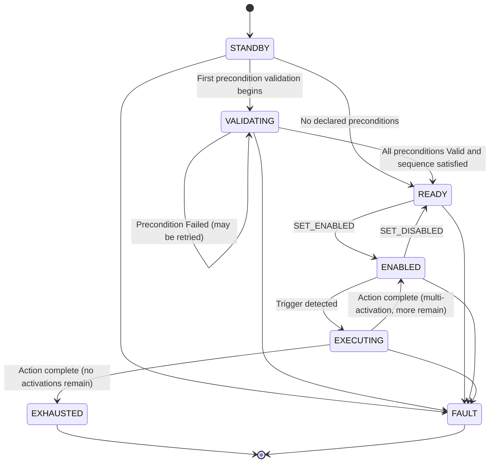
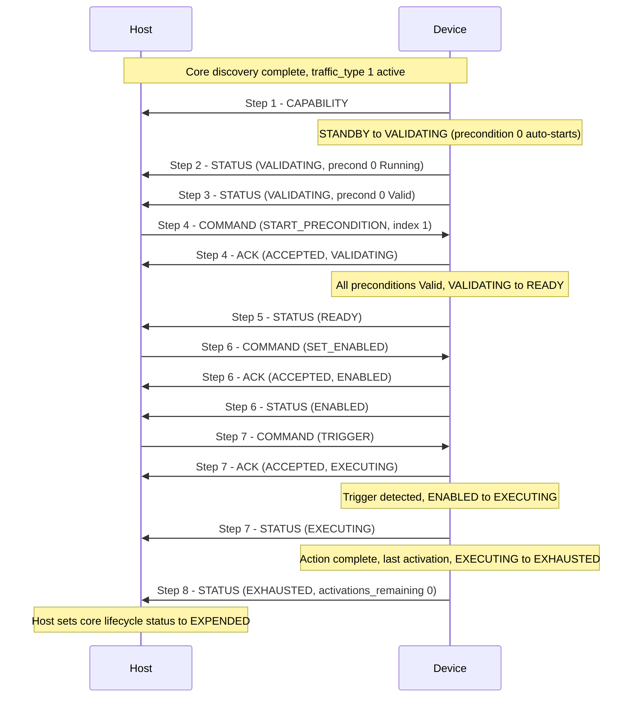

# APEX Device Class — Activation

**APEX — Adaptive Payload EXchange**

**Status:** Draft | **Scope:** Activation device class ([`traffic_type = 1`](APEX_Device_Classes.md#2--registry))

---

<a id="1--overview" name="1--overview"></a>
## 1.  Overview

The Activation class governs Devices that progress through an **activation lifecycle**: the device powers on inactive, validates one or more preconditions, is enabled by the host, and is then triggered to perform an action one or more times before becoming exhausted (or remaining available indefinitely).

The class is intentionally **payload-agnostic**. It defines the protocol shape — states, commands, precondition validation, trigger sources, status reporting — without prescribing what the Device actually does or what its preconditions mean. A specific Device declares its own preconditions, trigger sources, and per-payload status fields within the framework defined here.

**This class supports:**

- Single-activation Devices (one EXECUTING cycle, then EXHAUSTED).
- Multi-activation Devices (repeated ENABLED ↔ EXECUTING cycles).
- 0..N preconditions, optionally ordered.
- 1..N trigger sources (host command, hardware input, timer, external signal, …).
- Latched precondition validity.

**This class does not support** (out of scope for the current version; future class candidates):

- Continuous-state Devices with no discrete activation lifecycle.
- Unlatched preconditions that revert from valid → invalid without an explicit reset.

This document covers **both sides** of the class:

- **Device role** — what the Device reports, the state machine it runs, and how it responds to host commands.
- **Host role** — the commands the host issues and how it tracks the device.

Discovery, framing, and capability exchange at the bus level are out of scope and are handled by the core spec ([APEX — Core](APEX_Core.md)). All frames in this class carry `traffic_type = 1` in the APEX V0 outer header.

This document defines the **wire protocol** of the class — the messages exchanged, the state machine, and the timing. It does **not** define what any individual payload's preconditions or triggers mean physically; that is the role of a **per-payload profile** ([§8](#8--per-payload-profiles)).

---

<a id="2--roles" name="2--roles"></a>
## 2.  Roles

<a id="2-1--device" name="2-1--device"></a>
### 2.1.  Device

The device runs the **Activation State Machine** ([§3](#3--device-state-machine)), validates its declared preconditions ([§4](#4--preconditions-and-trigger-sources)), responds to host commands ([§5](#5--commands-host--device)), and reports its current state and per-precondition status via class-specific status frames ([§6](#6--message-format)). It detects trigger conditions from one or more declared trigger sources ([§4.2](#4-2--trigger-sources)) and transitions into EXECUTING when triggered while ENABLED.

<a id="2-2--host" name="2-2--host"></a>
### 2.2.  Host

The host issues commands to advance the device through its state machine ([§5](#5--commands-host--device)), may command individual precondition validations to begin, and acknowledges nothing — the device acknowledges the host's commands ([§6.4](#6-4--ack-frame-device--host)).

The host's high-level flight state (powered, propellers on, airborne, …) is **not** an Activation-class message. It is carried by the class-agnostic HOST_STATE message defined in the core spec ([APEX — Core §3.2.5](APEX_Core.md#3-2-5--host_state-msg_id--5)). A Device **may** consume HOST_STATE as an input to its precondition validation logic ([§4.1](#4-1--preconditions)); the host never directly drives the device's state machine.

---

<a id="3--device-state-machine" name="3--device-state-machine"></a>
## 3.  Device State Machine

The device runs the following state machine. State values are defined in `ActivationClassState_t`.

| Value | Name | Description |
| --- | --- | --- |
| `0x00` | *(reserved)* | Reserved; never sent. A receiver treats `0x00` as invalid. |
| `0x01` | **STANDBY** | Powered on and inert. No precondition validation has started. |
| `0x02` | **VALIDATING** | One or more preconditions are being validated ([§4.1](#4-1--preconditions)). The device remains here until every declared precondition is `Valid`. |
| `0x03` | **READY** | All declared preconditions ([§4](#4--preconditions-and-trigger-sources)) are `Valid`. Awaiting `SET_ENABLED`. |
| `0x04` | **ENABLED** | Host has issued a valid `SET_ENABLED`. Device is enabled and watching for a trigger from any of its declared trigger sources ([§4.2](#4-2--trigger-sources)). |
| `0x05` | **EXECUTING** | A valid trigger has been detected; the action is in progress. |
| `0x06` | **EXHAUSTED** | All activations complete. Device is now inert. |
| `0xFF` | **FAULT** | Critical failure, loss of communication, or other condition requiring user action. |



### State transition rules

- **STANDBY → VALIDATING** is automatic when the first precondition begins validating — whether a precondition auto-starts or the host issues `START_PRECONDITION` ([§5](#5--commands-host--device)).
- **STANDBY → READY** is automatic on power-up for a device that declares **zero** preconditions ([§4.1](#4-1--preconditions)). With nothing to validate, the device never enters VALIDATING.
- **VALIDATING → READY** is automatic when every declared precondition reaches `Valid` ([§4.1](#4-1--preconditions)). The device does not require a host command for this transition.
- **VALIDATING → VALIDATING** — a precondition entering `Failed` does not leave VALIDATING; the device remains in VALIDATING and the host may retry the precondition where the per-payload profile permits ([§4.1](#4-1--preconditions)).
- **READY → ENABLED** requires `SET_ENABLED` from the host. The device **must** reject `SET_ENABLED` from any state other than READY.
- **ENABLED → READY** via `SET_DISABLED` is always permitted from ENABLED. The device **must** reject `SET_DISABLED` from any state other than ENABLED.
- **ENABLED → EXECUTING** is internal to the device, caused by any of the declared trigger sources ([§4.2](#4-2--trigger-sources)). The device reports the source of the trigger in its status frame ([§6.5](#6-5--status-frame-device--host)).
- **EXECUTING → ENABLED** (multi-activation, more remain) or **EXECUTING → EXHAUSTED** (single-activation or last activation) is internal to the device on action completion. EXECUTING runs to completion; it cannot be aborted by the host.
- **Any state → FAULT** on a critical error. FAULT is terminal in the current version — see below.

Preconditions are **latched**: once a precondition reaches `Valid` it does not revert. There is therefore no transition out of READY or ENABLED back to VALIDATING or STANDBY; the only downward exit is a device reset, which restarts the machine at STANDBY.

### Multi-activation behavior

A multi-activation device returns to ENABLED after each EXECUTING cycle, until its last activation, after which it transitions to EXHAUSTED. The number of activations remaining is reported in every status frame as `activations_remaining` ([§6.5](#6-5--status-frame-device--host)). Whether a Device is single- or multi-activation, and its initial activation count, are payload-specific and documented in the per-payload profile ([§8](#8--per-payload-profiles)).

### FAULT

FAULT is reached on a critical error and is **terminal in the current version**: recovery requires a device reset and re-discovery (Core [§3.5](APEX_Core.md#3-5--heartbeat) gives the host a power-cycle lever via Pin 9). The conditions that caused the fault are reported in `fault_flags` ([§6.5](#6-5--status-frame-device--host)).

> **Open:** Selective, per-fault recovery (a `CLEAR_FAULT` path for transient, non-safety-critical faults) is a planned future extension. The current version treats every fault as terminal.

---

<a id="4--preconditions-and-trigger-sources" name="4--preconditions-and-trigger-sources"></a>
## 4.  Preconditions and Trigger Sources

<a id="4-1--preconditions" name="4-1--preconditions"></a>
### 4.1.  Preconditions

A **precondition** is a condition that must be validated before the device will accept `SET_ENABLED`. Preconditions are payload-specific in meaning — the spec does not enumerate them — but the protocol-level shape is uniform.

A device declares **0..16 preconditions** ([§4.3](#4-3--limits)). Each precondition has:

| Field | Description |
| --- | --- |
| Index | Stable integer identifier (`0`, `1`, `2`, …). |
| State | `NotStarted` / `Running` / `Valid` / `Failed`. |

The per-precondition state is reported in every status frame ([§6.5](#6-5--status-frame-device--host)). Any additional per-precondition detail a payload tracks — error counters, partial-progress indicators — is carried in the `payload_specific` region of the status frame ([§6.5](#6-5--status-frame-device--host)) and is not interpreted by the base class.

#### Validation lifecycle

| Value | State | Description |
| --- | --- | --- |
| `0` | **NotStarted** | Initial state on power-up. Some preconditions begin validation automatically; others require an explicit `START_PRECONDITION` command from the host ([§5](#5--commands-host--device)). |
| `1` | **Running** | Validation in progress. The device is gathering inputs (sensor readings, host-state observations, hardware-line transitions, timers). |
| `2` | **Valid** | The condition is met. Once latched to `Valid`, a precondition **must not** revert to a lower state without a device reset. |
| `3` | **Failed** | Validation could not be completed (e.g., maximum attempts exceeded). Depending on the precondition, the host may retry it via `START_PRECONDITION`, or the failure may be terminal — see below. |

The device transitions from **VALIDATING → READY** when every declared precondition is in state `Valid`. A device that declares **zero** preconditions skips VALIDATING entirely and is in READY immediately on power-up.

#### Auto-start vs. host-start

Some preconditions begin validation automatically on power-up; others remain `NotStarted` until the host issues `START_PRECONDITION`. Which preconditions are auto-start and which are host-start is **payload-specific** and documented in the per-payload profile ([§8](#8--per-payload-profiles)). A host-started precondition that the host should validate against a flight condition is declared on the wire as a **host-condition binding** in the CAPABILITY frame ([§6.3](#6-3--capability-frame-device--host)), which tells the host the gating `host_condition` and whether to start it autonomously (`auto_trigger`). A host that lacks the profile can also observe behavior directly: an auto-start precondition advances to `Running` on its own, whereas a precondition that remains `NotStarted` is host-start.

#### GPIO-backed preconditions

A precondition's validation may be backed by a discrete hardware input rather than by firmware logic or host-state observation. The APEX connector exposes two discrete-IO lines — Pin 3 and Pin 4 (Core [§2](APEX_Core.md#2--physical--electrical-interface-10-pin), the `GPIO` interface pins) — and a Device may bind a precondition to one of them: the precondition reaches `Valid` when its line holds a configured active level (active-high or active-low). A Device that requires the line to remain stable at the active level for a debounce interval before latching **may** do so; a transient excursion does not validate the precondition.

A Device **declares its GPIO-backed precondition mappings in the CAPABILITY frame** ([§6.3](#6-3--capability-frame-device--host)) — each mapping names a precondition index, the pin (Pin 3 or Pin 4) that validates it, and the line's active level (active-low or active-high) — so the host learns during discovery which preconditions are gated by hardware lines, which line gates each, and the sense of each line. Only the debounce interval, if any, remains device-internal and is documented in the per-payload profile ([§8](#8--per-payload-profiles)).

Beyond that declaration, a GPIO-backed precondition behaves like any other precondition. It is still subject to the auto-start / host-start gating above — the line is only evaluated once the precondition is `Running` — it still latches once `Valid` ([§3](#3--device-state-machine)), and it is reported in the STATUS frame ([§6.5](#6-5--status-frame-device--host)) with the same per-precondition state values. A host observes the precondition advance `Running → Valid` exactly as it would for any other validation mechanism.

#### Failed-precondition recovery

Whether a `Failed` precondition can be retried is **per-precondition** and documented in the per-payload profile. For a retriable precondition, `START_PRECONDITION` returns it to `Running`. For a terminally-failed precondition, the device rejects `START_PRECONDITION` with `REJECT_PRECONDITION` ([§6.4](#6-4--ack-frame-device--host)).

#### Validation sequencing

Every declared precondition must be `Valid` before the device will accept `SET_ENABLED`. Whether the device validates its preconditions in a particular order, in parallel, or with interdependencies is a **Device implementation choice** that this spec does not constrain — any such sequencing is internal to the device and documented in the per-payload profile ([§8](#8--per-payload-profiles)).

The protocol provides two ways for a Device that does enforce internal sequencing to report it to the host:

- The device **may** reject a `START_PRECONDITION` it is not ready to act on with `REJECT_PRECONDITION` ([§6.4](#6-4--ack-frame-device--host)).
- The device **may** set the `SEQUENCE_VIOLATION` fault flag ([§6.5](#6-5--status-frame-device--host)) if it detects that a validation occurred out of an order it requires.

#### Window timers

A device may associate a window timer with one or more preconditions or with the ENABLED state. If the device reaches a downstream state but no trigger occurs within the declared window, the device returns to a safer state and sets the `TRIGGER_WINDOW_EXPIRED` fault flag ([§6.5](#6-5--status-frame-device--host)). Window-timer semantics — which timer, what it gates, how long — are payload-specific; this spec defines only that the mechanism is supported and that its expiry is reportable via `fault_flags`. Remaining-time reporting, if a payload provides it, is carried in `payload_specific`.

<a id="4-2--trigger-sources" name="4-2--trigger-sources"></a>
### 4.2.  Trigger Sources

A device declares **1..16 trigger sources** ([§4.3](#4-3--limits)). While in ENABLED, any declared source may initiate the transition to EXECUTING. Sources are payload-specific in meaning, but each is declared as one of a small set of abstract categories:

| Value | Category | Abstract description |
| --- | --- | --- |
| `0x01` | `HOST_COMMAND` | The host issues an explicit `TRIGGER` command (see [§5](#5--commands-host--device)). |
| `0x02` | `HARDWARE_INPUT` | A discrete hardware line, switch, or impact sensor on the device. |
| `0x03` | `TIMER` | A device-internal timer expires. |
| `0x04` | `EXTERNAL_SIGNAL` | A signal from another bus member or external system. |

The categories are deliberately broad. A specific payload may map multiple physical inputs into a single category or split one category into several declared sources; the per-payload profile defines the mapping. Each declared source's category is reported in the capability frame ([§6.3](#6-3--capability-frame-device--host)), so a host can identify *what kind* of source triggered the device without knowing the payload-specific meaning. The device reports the index of the source that caused the most recent EXECUTING transition in its status frame ([§6.5](#6-5--status-frame-device--host)).

A device with `HOST_COMMAND` as its only declared trigger source is triggered solely by the host's `TRIGGER` command ([§5](#5--commands-host--device)). A device with both `HOST_COMMAND` and `HARDWARE_INPUT` supports either path.

<a id="4-3--limits" name="4-3--limits"></a>
### 4.3.  Limits

| Quantity | Limit |
| --- | --- |
| Declared preconditions | 0..16 |
| Declared trigger sources | 1..16 |

These caps bound the worst-case size of the capability and status frames and let implementations size buffers statically. They are well within the 255-byte inner-payload limit from Core [§3.1.1](APEX_Core.md#3-1-1--outer-header-apexv0hdr_t), leaving ample room for the `payload_specific` region of a status frame.

---

<a id="5--commands-host--device" name="5--commands-host--device"></a>
## 5.  Commands (Host → Device)

The host advances the device through its state machine using the following commands. Command values are defined in `ActivationClassCommand_t`. `0x00` is reserved. All commands are carried in a COMMAND frame ([§6.2](#6-2--command-frame-host--device)) and acknowledged with an ACK frame ([§6.4](#6-4--ack-frame-device--host)).

| Value | Name | Valid in States | Argument | Description |
| --- | --- | --- | --- | --- |
| `1` | **START_PRECONDITION** | STANDBY, VALIDATING | `precondition_index` (`u8`) | Requests the device to begin (or retry) validating the precondition whose index is given. Rejected if the index does not refer to a declared precondition (`REJECT_BAD_INDEX`), or if the device is not ready to validate it — for example a terminally-failed precondition, or one the Device's internal sequencing is not yet ready for (`REJECT_PRECONDITION`). |
| `2` | **SET_ENABLED** | READY | *(none)* | Transitions the device to ENABLED. Rejected from any other state (`REJECT_WRONG_STATE`). |
| `3` | **SET_DISABLED** | ENABLED | *(none)* | Transitions the device back to READY. Rejected from any other state (`REJECT_WRONG_STATE`). |
| `4` | **TRIGGER** | ENABLED | *(none)* | Host-driven trigger source. Causes the ENABLED → EXECUTING transition if `HOST_COMMAND` is among the declared trigger sources. Rejected with `REJECT_NOT_SUPPORTED` if `HOST_COMMAND` is not declared, or with `REJECT_WRONG_STATE` if not in ENABLED. |

**Idempotency.** Commands are idempotent: re-issuing a command whose effect has already taken place is harmless and is acknowledged normally. Re-sending `SET_ENABLED` to a device already in ENABLED returns `ACCEPTED`; this lets a host retransmit safely after a lost ACK ([§7.2](#7-2--command-acknowledgement-and-retransmission)).

---

<a id="6--message-format" name="6--message-format"></a>
## 6.  Message Format

The class follows the APEX framing model (Core [§3](APEX_Core.md#3--communication-protocol-uart)): every frame carries `traffic_type = 1`, is COBS-framed, and uses the outer header from Core [§3.1.1](APEX_Core.md#3-1-1--outer-header-apexv0hdr_t), with the inner payload carrying class-specific content. All multi-byte fields are little-endian (Core [§3.1](APEX_Core.md#3-1--frame-layout)).

<a id="6-1--inner-payload-sub-header" name="6-1--inner-payload-sub-header"></a>
### 6.1.  Inner payload sub-header

The Activation-class inner payload begins with a one-byte `class_msg_id` identifying the message. The remainder of the inner payload depends on the message.

| `class_msg_id` | Name | Direction | Meaning |
| --- | --- | --- | --- |
| `0` | *(reserved)* | — | Reserved; never sent. |
| `1` | **CAPABILITY** | Device → Host | Declares the device's preconditions and trigger sources ([§6.3](#6-3--capability-frame-device--host)). |
| `2` | **COMMAND** | Host → Device | A host command ([§6.2](#6-2--command-frame-host--device)). |
| `3` | **STATUS** | Device → Host | Periodic / event status frame ([§6.5](#6-5--status-frame-device--host)). |
| `4` | **ACK** | Device → Host | Acknowledgement of a host command ([§6.4](#6-4--ack-frame-device--host)). |
| `5` | **PRECOND_INFO_REQUEST** | Host → Device | Optional request for per-precondition display strings ([§6.7](#6-7--precond_info_request-host--device)). |
| `6` | **PRECOND_INFO_REPLY** | Device → Host | Per-precondition display strings ([§6.8](#6-8--precond_info_reply-device--host)). The host-start hint is in CAPABILITY ([§6.3](#6-3--capability-frame-device--host)), not here. |

<a id="6-2--command-frame-host--device" name="6-2--command-frame-host--device"></a>
### 6.2.  Command frame (Host → Device)

A COMMAND frame is flat: the `class_msg_id`, the command value, and the command's argument bytes (if any). COBS framing makes the frame self-delimiting and the outer-header `payload_length` gives the exact byte count, so the variable argument tail needs no length field of its own.

| Offset | Field | Width | Description |
| --- | --- | --- | --- |
| `0` | `class_msg_id` | `u8` | `2` (COMMAND). |
| `1` | `command` | `u8` | `ActivationClassCommand_t` value ([§5](#5--commands-host--device)). |
| `2…` | `argument` | variable | Command-specific argument bytes. |

Per-command arguments:

| Command | Argument bytes |
| --- | --- |
| `START_PRECONDITION` | `precondition_index` (`u8`) — 1 byte. |
| `SET_ENABLED` | *(none)* |
| `SET_DISABLED` | *(none)* |
| `TRIGGER` | *(none)* |

Example: `SET_ENABLED` is the two-byte inner payload `[02][02]`; `START_PRECONDITION` for precondition `3` is `[02][01][03]`.

<a id="6-3--capability-frame-device--host" name="6-3--capability-frame-device--host"></a>
### 6.3.  Capability frame (Device → Host)

The device sends one CAPABILITY frame, unprompted, immediately after the class becomes active — that is, immediately after the core discovery handshake reaches `ACK_OK` for `device_class_req = 1` (Core [§3.2.2](APEX_Core.md#3-2-2--config_reply-msg_id--2)). It declares the device's identity and the shape of its precondition / trigger-source set, which the host then uses to interpret every subsequent STATUS frame.

| Offset | Field | Width | Description |
| --- | --- | --- | --- |
| `0` | `class_msg_id` | `u8` | `1` (CAPABILITY). |
| `1` | `class_spec_version` | `u8` | Activation-class spec revision the device implements. `0` = the revision defined by this document. |
| `2` | `payload_type_uuid` | `u8[16]` | 128-bit identifier of the Device type ([§8.1](#8-1--device-identification)). |
| `18` | `n_preconditions` | `u8` | Number of declared preconditions (`0..16`). |
| `19` | `n_trigger_sources` | `u8` | Number of declared trigger sources (`1..16`). |
| `20…` | `trigger_source_categories[n_trigger_sources]` | `u8` each | Abstract category of each declared trigger source, in index order ([§4.2](#4-2--trigger-sources)). |
| *(after)* | `n_gpio_bindings` | `u8` | Number of GPIO-backed precondition mappings (`0..n_preconditions`) ([§4.1](#4-1--preconditions)). `0` if no precondition is GPIO-backed. |
| *(after)* | `gpio_bindings[n_gpio_bindings]` | `2×u8` each | For each mapping, two bytes: `precondition_index` (`u8`) and `pin_and_level` (`u8`). |
| *(after)* | `n_gpio_trigger_bindings` | `u8` | Number of GPIO-backed trigger source mappings (`0..n_trigger_sources`). `0` if no trigger source is GPIO-backed. Omitted by a device that declares none (older or simpler devices end the frame here). |
| *(after)* | `gpio_trigger_bindings[n_gpio_trigger_bindings]` | `2×u8` each | For each mapping, two bytes: `trigger_source_index` (`u8`) and `pin_and_level` (`u8`). |
| *(after)* | `n_host_conditions` | `u8` | Number of **host-evaluated** preconditions (`0..n_preconditions`) — those the host is responsible for starting. Optional tail; `0` (or omitted) if every precondition is device-started. |
| *(after)* | `host_conditions[n_host_conditions]` | `5×u8` each | One binding per host-started precondition (see below). |

Both GPIO binding blocks use the same `pin_and_level` encoding:

| Bits | Field | Meaning |
| --- | --- | --- |
| `0–6` | `pin` | Connector pin, `3` or `4`. |
| `7` | `active_level` | `0` = active-low, `1` = active-high. |

So `pin_and_level = pin \| (active_high ? 0x80 : 0x00)`. A precondition binding asserts "precondition `precondition_index` is validated by GPIO `pin`, satisfied when the line is at the encoded active level" ([§4.1](#4-1--preconditions)); a trigger binding asserts "trigger source `trigger_source_index` fires when GPIO `pin` reaches the encoded active level" ([§4.2](#4-2--trigger-sources)). The active level is declared here; debounce and edge-detection behaviour are device-internal ([§8](#8--per-payload-profiles)). A `pin` (low 7 bits) other than `3` or `4`, a binding count exceeding its respective limit, or an index that is not declared, makes the frame malformed.

The `n_gpio_trigger_bindings` block is an **optional tail**: a host that has already consumed all of `gpio_bindings` but finds no further bytes treats `n_gpio_trigger_bindings` as `0`. This preserves wire compatibility with devices that do not declare trigger GPIO bindings.

**Host-condition bindings.** The `n_host_conditions` block is a further **optional tail** (same rule: absent ⇒ `0`). Each `host_conditions` entry is **5 bytes** and declares *when the host should send `START_PRECONDITION`* for a host-started precondition:

| Offset within entry | Field | Width | Description |
| --- | --- | --- | --- |
| `0` | `precondition_index` | `u8` | The precondition this binding gates (`< n_preconditions`). |
| `1` | `host_condition` | `u8` | Flight condition the host evaluates (values below). |
| `2` | `condition_param` | `u16` | Parameter for parameterised conditions (e.g., altitude threshold in metres for `ALT_ABOVE`/`ALT_BELOW`); `0` otherwise. |
| `4` | `auto_trigger` | `u8` | `1` = the host **should** send `START_PRECONDITION` autonomously when `host_condition` is met. `0` = the host presents the condition as a prompt and waits for pilot confirmation. Ignored when `host_condition` is `NONE` or `CUSTOM`. |

Only **host-started** preconditions appear here — those whose validation the host drives. A device-started precondition (validated locally, e.g. an auto-started self-test) is simply omitted; the host then knows it must take no action for it. A precondition index not listed here is device-started by definition.

This binding is carried in CAPABILITY — **not** in PRECOND_INFO_REPLY ([§6.8](#6-8--precond_info_reply-device--host)) — so the host's auto-start logic depends only on the reliably-delivered, always-required CAPABILITY frame plus STATUS. PRECOND_INFO is optional and non-blocking ([§6.6](#6-6--reporting-cadence-and-timing)); putting an auto-start input there would let a dropped reply stall validation, which [§6.6](#6-6--reporting-cadence-and-timing) forbids.

**`host_condition` values:**

| Value | Name | FC evaluates | `condition_param` |
| --- | --- | --- | --- |
| `0x00` | `NONE` | Not auto-evaluable. `auto_trigger` is ignored. (A precondition with `NONE` would not normally be listed as a host-condition binding.) | — |
| `0x01` | `HOVER` | Low horizontal velocity and low altitude rate (implementation-defined thresholds). | — |
| `0x02` | `ALT_ABOVE` | Estimated altitude above arm point > `condition_param` metres. | altitude threshold (m) |
| `0x03` | `ALT_BELOW` | Estimated altitude above arm point < `condition_param` metres. | altitude threshold (m) |
| `0x04` | `GPS_FIX` | 3D GPS fix acquired. | — |
| `0x05` | `PROPS_ON_FLYING` | Host flight state is `PROPS_ON_FLYING` ([APEX — Core §3.2.5](APEX_Core.md#3-2-5--host_state-msg_id--5)). | — |
| `0x06` | `PROPS_ON_GROUND` | Props are spinning at idle on the ground; does not require active flight. Equivalent to host state `PROPS_ON_GROUND` ([APEX — Core §3.2.5](APEX_Core.md#3-2-5--host_state-msg_id--5)). | — |
| `0x07` | `PROPS_WITH_THROTTLE` | Props are spinning **and** throttle input meets or exceeds the threshold. | minimum throttle percentage (0–100); `0` = any non-zero input |
| `0x08` | `PROPS_ON_FLYING_TIMER` | `condition_param` seconds have elapsed after the host first enters `PROPS_ON_FLYING`. The timer latches on the first `PROPS_ON_FLYING` detection and continues while props remain spinning; it resets only when props stop. | seconds to wait after `PROPS_ON_FLYING` |
| `0x09`–`0xFE` | *(reserved)* | — | — |
| `0xFF` | `CUSTOM` | Host cannot evaluate; display the precondition's `str_not_started` string ([§6.8](#6-8--precond_info_reply-device--host)) as a pilot prompt and wait for manual confirmation before sending `START_PRECONDITION`. `auto_trigger` is ignored. | — |

A host that does not recognise a `host_condition` value MUST treat it as `CUSTOM`.

`n_preconditions`, `n_trigger_sources`, and the GPIO mappings are declared **once**, here. They are not repeated in the STATUS frame, which keeps every status frame a fixed size for a given device. A host that needs to re-learn a Device's capabilities power-cycles it, which re-runs discovery and re-emits CAPABILITY.

A host **should** retransmit nothing in response to a missing CAPABILITY frame — it is device-pushed. A host that has not received CAPABILITY cannot interpret STATUS frames and treats the device as not yet ready for class traffic.

<a id="6-4--ack-frame-device--host" name="6-4--ack-frame-device--host"></a>
### 6.4.  ACK frame (Device → Host)

The device replies to every COMMAND frame with exactly one ACK frame.

| Offset | Field | Width | Description |
| --- | --- | --- | --- |
| `0` | `class_msg_id` | `u8` | `4` (ACK). |
| `1` | `acked_command` | `u8` | The `command` value being acknowledged, echoed from the COMMAND frame. |
| `2` | `result` | `u8` | Result code (see below). |
| `3` | `current_state` | `u8` | The device's `ActivationClassState_t` value at the time the ACK is sent ([§3](#3--device-state-machine)). |

**`result` values:**

| Value | Name | Meaning |
| --- | --- | --- |
| `0x00` | `ACCEPTED` | The command was valid and has been applied. |
| `0x01` | `REJECT_WRONG_STATE` | The command is not valid in the device's current state. |
| `0x02` | `REJECT_BAD_INDEX` | The command references a precondition (or other index) that the device has not declared. |
| `0x03` | `REJECT_PRECONDITION` | The device is not ready to act on the command for the referenced precondition — e.g. it is terminally failed, or the Device's internal sequencing is not yet ready for it ([§4.1](#4-1--preconditions)). |
| `0x04` | `REJECT_NOT_SUPPORTED` | The command is not supported by this device (e.g., `TRIGGER` when `HOST_COMMAND` is not a declared trigger source). |
| `0x05` | `REJECT_MALFORMED` | The COMMAND frame could not be parsed (bad length, unknown command value). |

`current_state` is included so that a host whose model of the device has drifted re-synchronizes from the ACK itself, without waiting for the next periodic STATUS frame.

A rejected command is a routine protocol event, not a fault: a reject result does **not** set any `fault_flags` bit ([§6.5](#6-5--status-frame-device--host)).

<a id="6-5--status-frame-device--host" name="6-5--status-frame-device--host"></a>
### 6.5.  Status frame (Device → Host)

The STATUS frame reports the device's current state. It has a **fixed base header** that any Activation-class host can parse using only the counts from the CAPABILITY frame, followed by an opaque `payload_specific` region.

| Offset | Field | Width | Description |
| --- | --- | --- | --- |
| `0` | `class_msg_id` | `u8` | `3` (STATUS). |
| `1` | `state` | `u8` | Current `ActivationClassState_t` value ([§3](#3--device-state-machine)). |
| `2` | `activations_remaining` | `u8` | Number of EXECUTING cycles the device can still perform. Decrements as the device executes; `0` once EXHAUSTED. `0xFF` indicates an indefinite / unlimited activation count. |
| `3` | `last_trigger_source` | `u8` | Index of the trigger source that caused the most recent EXECUTING transition; `0xFF` if the device has not entered EXECUTING since power-up. |
| `4` | `fault_flags` | `u16` | Bitfield of generic fault conditions (see below). |
| `6…` | `precondition_states[n_preconditions]` | `u8` each | Per-precondition state, in index order: `0`=NotStarted, `1`=Running, `2`=Valid, `3`=Failed ([§4.1](#4-1--preconditions)). |
| *(after)* | `payload_specific[…]` | variable | Reserved for per-payload status bytes. The base class does not interpret these ([§8.2](#8-2--the-payload_specific-region)). |

`n_preconditions` is the value from the CAPABILITY frame ([§6.3](#6-3--capability-frame-device--host)). The total inner-payload length therefore depends only on `n_preconditions` and the size of the `payload_specific` region; for a device with no payload-specific bytes it is a fixed `6 + n_preconditions` bytes. Devices must respect the `payload_length` cap from Core [§3.1.1](APEX_Core.md#3-1-1--outer-header-apexv0hdr_t).

**`fault_flags` bit layout:**

| Bit | Name | Latched? | Meaning |
| --- | --- | --- | --- |
| `0` | `PRECONDITION_FAILED` | Latched | One or more preconditions are in the `Failed` state. |
| `1` | `SEQUENCE_VIOLATION` | Latched | An out-of-order precondition validation was detected internally. |
| `2` | `TRIGGER_WINDOW_EXPIRED` | Self-clearing | A window timer elapsed without the expected trigger ([§4.1](#4-1--preconditions)). |
| `3` | `COMMS_LOST` | Self-clearing | The Core [§3.5](APEX_Core.md#3-5--heartbeat) watchdog tripped (no host frame within the watchdog window). |
| `4` | `INTERNAL_ERROR` | Latched | A device self-check or hardware fault. |
| `5–15` | *(reserved)* | — | Reserved; **must** be zero in the current version. |

A **latched** bit, once set, remains set until a device reset. A **self-clearing** bit clears automatically when the underlying condition clears (the window is re-armed; host communication is restored). A device that sets any latched fault bit transitions to FAULT ([§3](#3--device-state-machine)).

<a id="6-6--reporting-cadence-and-timing" name="6-6--reporting-cadence-and-timing"></a>
### 6.6.  Reporting cadence and timing

- **Event-driven.** The device **must** emit a STATUS frame within **100 ms** of every state transition, so the host observes transitions (notably EXECUTING → EXHAUSTED) promptly.
- **Periodic.** In the absence of a transition, the device **must** still emit a STATUS frame at least once per second. The periodic STATUS frame satisfies the device's Core [§3.5](APEX_Core.md#3-5--heartbeat) 1 Hz transmit floor — a separate implicit heartbeat is not required while the class is active.
- **Command ACK latency.** The device **must** emit the ACK frame for a received COMMAND within **200 ms**. This bounds only the acknowledgement. How long the device subsequently spends in EXECUTING is payload-specific and is documented in the per-payload profile ([§8](#8--per-payload-profiles)).
- **PRECOND_INFO_REPLY latency.** If the device supports PRECOND_INFO ([§6.7](#6-7--precond_info_request-host--device)), it **must** reply within **500 ms** of each request. A host that receives no reply within 500 ms **should** fall back to generic labels for that precondition and **must not** block precondition validation waiting for a reply.

<a id="6-7--precond_info_request-host--device" name="6-7--precond_info_request-host--device"></a>
<a id="6-7--precond_info_request-frame-host--device" name="6-7--precond_info_request-frame-host--device"></a>
### 6.7.  PRECOND_INFO_REQUEST frame (Host → Device)

An optional request for the human-readable display strings of one precondition. The host sends one request per precondition index after receiving CAPABILITY ([§6.3](#6-3--capability-frame-device--host)). The device **may** silently ignore all PRECOND_INFO_REQUEST frames — a device whose preconditions require no operator-facing display is not required to implement this exchange. The host-start hint that tells the host *when* to validate a precondition is declared separately, in CAPABILITY ([§6.3](#6-3--capability-frame-device--host)); these strings are display-only.

| Offset | Field | Width | Description |
| --- | --- | --- | --- |
| `0` | `class_msg_id` | `u8` | `5` (PRECOND_INFO_REQUEST). |
| `1` | `precondition_idx` | `u8` | The precondition index being queried (`0` … `n_preconditions − 1`). |
| `2` | `display_char_limit` | `u8` | Maximum number of characters the host can render per string on its display. The device MUST truncate each reply string to this length. `0` = no limit imposed (device sends up to 32 characters). |

The host SHOULD send requests for all precondition indices immediately after receiving CAPABILITY. Requests for indices not declared in CAPABILITY (`index ≥ n_preconditions`) MUST be silently ignored by the device.

<a id="6-8--precond_info_reply-device--host" name="6-8--precond_info_reply-device--host"></a>
<a id="6-8--precond_info_reply-frame-device--host" name="6-8--precond_info_reply-frame-device--host"></a>
### 6.8.  PRECOND_INFO_REPLY frame (Device → Host)

Sent by the device in response to a PRECOND_INFO_REQUEST. Carries four display strings — one for each precondition state. It is **purely cosmetic**: the host-start hint (`host_condition` / `auto_trigger`) is declared in the CAPABILITY frame ([§6.3](#6-3--capability-frame-device--host)), not here, so the host never has to receive a PRECOND_INFO_REPLY to drive validation ([§6.6](#6-6--reporting-cadence-and-timing)).

| Offset | Field | Width | Description |
| --- | --- | --- | --- |
| `0` | `class_msg_id` | `u8` | `6` (PRECOND_INFO_REPLY). |
| `1` | `precondition_idx` | `u8` | Echoed from the request. |
| `2` | `str_not_started_len` | `u8` | Length of the following string in bytes (0–32). |
| `3…` | `str_not_started[…]` | variable | ASCII string displayed when the precondition is `NotStarted`. E.g., `"Maintain hover to begin"`. |
| *(after)* | `str_running_len` | `u8` | |
| *(after)* | `str_running[…]` | variable | ASCII string displayed when the precondition is `Running`. E.g., `"Validating hover..."`. |
| *(after)* | `str_valid_len` | `u8` | |
| *(after)* | `str_valid[…]` | variable | ASCII string displayed when the precondition is `Valid`. E.g., `"Hover confirmed"`. |
| *(after)* | `str_failed_len` | `u8` | |
| *(after)* | `str_failed[…]` | variable | ASCII string displayed when the precondition is `Failed`. Should include a recovery instruction. E.g., `"Hover lost — reposition and retry"`. |

All strings are ASCII, not null-terminated; length is given by the preceding `*_len` byte. Each string MUST be ≤ `display_char_limit` characters (or ≤ 32 if `display_char_limit` was `0`). An empty string (`len = 0`) is valid and indicates the host should display nothing for that state.

**Host display behaviour.** The host uses the precondition state reported in each STATUS frame ([§6.5](#6-5--status-frame-device--host)) to select which string to render:

| Precondition state | String displayed |
| --- | --- |
| `NotStarted` | `str_not_started` |
| `Running` | `str_running` |
| `Valid` | `str_valid` |
| `Failed` | `str_failed` |

If no PRECOND_INFO_REPLY was received for a precondition (device opted out or reply timed out), the host SHOULD display a generic label such as `"PRECONDITION <n>"` and MUST NOT block validation.

---

<a id="7--operational-flow" name="7--operational-flow"></a>
## 7.  Operational Flow

<a id="7-1--lifecycle" name="7-1--lifecycle"></a>
### 7.1.  Lifecycle

1. **Discovery.** The Device completes the core discovery handshake (Core [§3.3](APEX_Core.md#3-3--startup-discovery-handshake)) requesting `device_class_req = 1`. On `ACK_OK`, class traffic on `traffic_type = 1` becomes valid.
2. **Capability.** The device immediately sends one CAPABILITY frame ([§6.3](#6-3--capability-frame-device--host)). The host records `n_preconditions`, `n_trigger_sources`, the trigger-source categories, and the `payload_type_uuid`.
3. **Precondition info (optional).** The host sends one PRECOND_INFO_REQUEST ([§6.7](#6-7--precond_info_request-host--device)) per precondition index. The device replies with the four display strings for each ([§6.8](#6-8--precond_info_reply-device--host)). The host caches replies for OSD rendering only. Devices that do not support this exchange silently ignore the requests; the host falls back to generic labels after a 500 ms timeout per index. This exchange is **display-only** and does not block precondition validation — the host-start hint it needs to drive validation already arrived in CAPABILITY ([§6.3](#6-3--capability-frame-device--host)).
4. **Validation.** Auto-start preconditions begin validating; the device enters VALIDATING. For host-start preconditions (those declared in the CAPABILITY host-condition bindings — [§6.3](#6-3--capability-frame-device--host)), the host either sends `START_PRECONDITION` autonomously when the declared `host_condition` is met (if `auto_trigger = 1`) or presents the `str_not_started` string to the operator and waits for manual confirmation ([§4.1](#4-1--preconditions)). The device reports progress in periodic STATUS frames.
5. **Ready.** When all preconditions are `Valid`, the device enters READY.
6. **Enable.** The host issues `SET_ENABLED`; the device ACKs `ACCEPTED` and enters ENABLED. The host may issue `SET_DISABLED` to return to READY.
7. **Trigger.** A declared trigger source triggers the device (a `TRIGGER` command, a hardware input, …); the device enters EXECUTING and performs its action.
8. **Completion.** On action completion the device returns to ENABLED (multi-activation, `activations_remaining > 0`) or transitions to EXHAUSTED (`activations_remaining = 0`).

<a id="7-2--command-acknowledgement-and-retransmission" name="7-2--command-acknowledgement-and-retransmission"></a>
### 7.2.  Command acknowledgement and retransmission

Every COMMAND is answered by exactly one ACK ([§6.4](#6-4--ack-frame-device--host)). If the host does not receive an ACK within the command-ACK latency bound ([§6.6](#6-6--reporting-cadence-and-timing)), it **should** retransmit the command. Because commands are idempotent ([§5](#5--commands-host--device)), a duplicate caused by a lost ACK is harmless.

A recommended default is to retransmit after **200–500 ms** with no ACK, up to **3** attempts, and to surface the failure to the operator if no ACK is received thereafter. These figures are non-normative; a per-payload profile **may** tighten them for a safety-critical payload.

<a id="7-3--relationship-to-core-device-lifecycle-status" name="7-3--relationship-to-core-device-lifecycle-status"></a>
### 7.3.  Relationship to core device lifecycle status

The class state machine ([§3](#3--device-state-machine)) is **independent of** the core device lifecycle status (Core [§4](APEX_Core.md#4--device-lifecycle-status): UNKNOWN / NEW / CONNECTED / EXPENDED / FAULT). The two operate at different layers:

- **Core lifecycle status** tracks the device's presence and configuration on the bus. It is managed by the host.
- **Activation state** tracks the activation lifecycle. It is managed by the device and reported via STATUS frames.

A device in core status **CONNECTED** may be in any activation state. When a device reports activation state **EXHAUSTED**, the host **must** transition the device's core lifecycle status to **EXPENDED**. No separate signal is sent for this; observing the EXHAUSTED STATUS frame is what drives the change. The distinct names are intentional — *EXHAUSTED* is the activation-class state, *EXPENDED* is the core-lifecycle status.

---

<a id="8--per-payload-profiles" name="8--per-payload-profiles"></a>
## 8.  Per-Payload Profiles

This document defines the **wire protocol** of the Activation class — the messages, the state machine, the timing. It deliberately does not define what any individual payload's preconditions and trigger sources *mean* in the physical world. That is the role of a **per-payload profile**.

A per-payload profile is a document, authored by the payload vendor, that describes a specific payload type in terms of this class. It is **not** registered with or governed by the APEX specification; there is no central registry. A profile is simply the documentation a host integrator needs in order to operate a particular payload.

A per-payload profile **should** cover, at minimum:

1. **Identity** — the `payload_type_uuid` the payload reports in its CAPABILITY frame ([§6.3](#6-3--capability-frame-device--host)).
2. **Preconditions** — for each declared precondition index: what it represents, the physical criteria for it to reach `Valid`, whether it is auto-start or host-start ([§4.1](#4-1--preconditions)), and whether a `Failed` result is retriable or terminal. For a GPIO-backed precondition ([§4.1](#4-1--preconditions)), any debounce interval — the pin mapping and active level are declared on the wire in the CAPABILITY frame ([§6.3](#6-3--capability-frame-device--host)).
3. **Validation sequencing** — any order or interdependency the Device enforces among its preconditions, and the conditions under which it rejects `START_PRECONDITION` or raises `SEQUENCE_VIOLATION` ([§4.1](#4-1--preconditions)).
4. **Trigger sources** — for each declared trigger source index: its abstract category and its payload-specific meaning ([§4.2](#4-2--trigger-sources)).
5. **Window timers** — any window timers, what they gate, and their durations ([§4.1](#4-1--preconditions)).
6. **Activation count** — whether the Device is single- or multi-activation and its initial `activations_remaining`.
7. **`payload_specific` layout** — the byte layout of the `payload_specific` region of the STATUS frame, if the payload uses it ([§8.2](#8-2--the-payload_specific-region)).
8. **Faults** — payload-specific conditions that cause each `fault_flags` bit, and the EXECUTING duration to expect.

<a id="8-1--device-identification" name="8-1--device-identification"></a>
### 8.1.  Device identification

A device identifies itself in its CAPABILITY frame ([§6.3](#6-3--capability-frame-device--host)) with a `payload_type_uuid` — a 128-bit (16-byte) identifier of the **Device type**. The vendor generates it once per type ([RFC 4122](https://www.rfc-editor.org/rfc/rfc4122) version 4 recommended); every unit of that type then reports the same value. No central registry is required.

The host uses `payload_type_uuid` as the key to look up a payload's profile ([§8](#8--per-payload-profiles)). A host that does not recognize the UUID has no profile for that Device and falls back to generic handling ([§8.3](#8-3--generic-host-behavior)).

The UUID identifies a **type**, not a unit or a configuration: two Devices that need different host handling are different types and **must** carry different UUIDs, even if they are the same physical product in different modes.

The all-zero UUID is reserved for an unidentified Device — a Device with no assigned UUID reports sixteen `0x00` bytes, and the host treats it as having no profile.

<a id="8-2--the-payload_specific-region" name="8-2--the-payload_specific-region"></a>
### 8.2.  The `payload_specific` region

The STATUS frame ends with an optional, variable-length `payload_specific` region ([§6.5](#6-5--status-frame-device--host)). It is an extension point for telemetry the base class does not define — for example a charge level, a temperature, or a partial-validation progress value.

The base class assigns **no meaning** to these bytes. Their layout is defined entirely by the per-payload profile. A device that has no payload-specific telemetry to report omits the region (the STATUS frame is then exactly `6 + n_preconditions` bytes).

<a id="8-3--generic-host-behavior" name="8-3--generic-host-behavior"></a>
### 8.3.  Generic host behavior

A **generic** Host — one with no profile for the attached Device — can still operate any Activation-class Device using only the base protocol:

- It learns `n_preconditions` and `n_trigger_sources` from the CAPABILITY frame.
- It can drive the state machine: issue `START_PRECONDITION` for any precondition observed stuck at `NotStarted`, then `SET_ENABLED`, then `TRIGGER`.
- It can parse the entire STATUS base header — state, `activations_remaining`, `last_trigger_source`, `fault_flags`, and per-precondition states.
- It treats the `payload_specific` region as opaque: it does not interpret those bytes and is not required to. It may forward them verbatim to payload-aware tooling (e.g., a ground station that does hold the profile).

A generic host therefore needs a profile only to attach physical *meaning* to precondition and trigger indices and to interpret `payload_specific` — never to maintain the connection or run the lifecycle.

---

<a id="9--worked-example" name="9--worked-example"></a>
## 9.  Worked Example

This section walks one Activation-class device through a complete lifecycle, showing the bytes on the wire. It is illustrative, not normative — where it and the sections above disagree, the sections above govern.

<a id="9-1--the-example-device" name="9-1--the-example-device"></a>
### 9.1.  The example Device

A hypothetical **single-activation marker** Device:

- **`payload_type_uuid` = `7d9a2c14-3e6b-4f08-9a51-c2e07b18d4f6`.** Implements `class_spec_version = 0`.
- **2 preconditions:**
  - Precondition `0` — *self-test*. Auto-start.
  - Precondition `1` — *airborne confirmation*. Host-start. This Device only accepts `START_PRECONDITION` for precondition `1` once precondition `0` is `Valid`; an earlier request is rejected with `REJECT_PRECONDITION`.
- **2 trigger sources:**
  - Source `0` — `HOST_COMMAND` (`0x01`).
  - Source `1` — `HARDWARE_INPUT` (`0x02`).
- **Single activation:** initial `activations_remaining = 1`.
- No `payload_specific` telemetry, so STATUS frames are `6 + n_preconditions = 8` bytes of inner payload.

The device has completed core discovery and been assigned `device_id = 0x01`.

<a id="9-2--frame-notation" name="9-2--frame-notation"></a>
### 9.2.  Frame notation

Frames below use the common notation defined in Core [§3.1.5](APEX_Core.md#3-1-5--frame-notation): each is shown as the bytes before CRC and COBS, with the outer header separated from the inner payload. For every frame in this example `PV = 00`, `TT = 01`, and the device's assigned `ID = 01`.

<a id="9-3--sequence-overview" name="9-3--sequence-overview"></a>
### 9.3.  Sequence overview

The diagram below shows the full single-activation exchange between host and device. Each message is prefixed with the step number of the [§9.4](#9-4--single-activation-walkthrough) walkthrough, which gives that step's byte-level frame contents and intent.



Periodic STATUS frames (the ≥ 1 Hz cadence of [§6.6](#6-6--reporting-cadence-and-timing)) are omitted from the diagram for clarity; only the event-driven, transition-marking frames are shown.

<a id="9-4--single-activation-walkthrough" name="9-4--single-activation-walkthrough"></a>
### 9.4.  Single-activation walkthrough

#### ▸ Step 1 — Device emits CAPABILITY

Immediately after discovery reaches `ACK_OK`, the device sends one CAPABILITY frame ([§6.3](#6-3--capability-frame-device--host)). The inner payload is 23 bytes (`LN = 17`).

```
00 01 01 17    01 00 7D 9A 2C 14 3E 6B 4F 08 9A 51 C2 E0 7B 18 D4 F6 02 02 01 02 00
```

| Byte(s) | Hex | Field | Value |
| --- | --- | --- | --- |
| 0–3 | `00 01 01 17` | outer header | `PV=00`, `TT=01`, `ID=01`, `LN=17` (23) |
| 4 | `01` | `class_msg_id` | `1` (CAPABILITY) |
| 5 | `00` | `class_spec_version` | `0` |
| 6–21 | `7D 9A 2C 14 3E 6B 4F 08 9A 51 C2 E0 7B 18 D4 F6` | `payload_type_uuid` | `7d9a2c14-3e6b-4f08-9a51-c2e07b18d4f6` |
| 22 | `02` | `n_preconditions` | `2` |
| 23 | `02` | `n_trigger_sources` | `2` |
| 24 | `01` | `trigger_source_categories[0]` | `HOST_COMMAND` |
| 25 | `02` | `trigger_source_categories[1]` | `HARDWARE_INPUT` |
| 26 | `00` | `n_gpio_bindings` | `0` (no GPIO-backed preconditions) |

The host records: 2 preconditions, 2 trigger sources (categories `HOST_COMMAND`, `HARDWARE_INPUT`), no GPIO-backed preconditions, and the Device type UUID `7d9a2c14-3e6b-4f08-9a51-c2e07b18d4f6`. With `n_preconditions = 2`, every STATUS frame from this device will be a fixed `8` bytes of inner payload (`6 + n_preconditions`).

> **GPIO-mapping variation.** Had this Device instead validated precondition `1` from a discrete, active-high line on Pin 3 ([§4.1](#4-1--preconditions)), it would declare one mapping: `n_gpio_bindings = 1` followed by the two bytes `01 83` (`precondition_index = 1`, `pin_and_level = 0x83` = Pin 3 with bit 7 set for active-high). The CAPABILITY inner payload would then be 25 bytes (`LN = 19`), ending `… 02 02 01 02 01 01 83` (`n_preconditions=2`, `n_trigger_sources=2`, categories `01 02`, then `n_gpio_bindings=1` and the mapping `01 83`), and the host would know during discovery that precondition `1` advances to `Valid` when Pin 3 is driven high. Nothing else in the walkthrough changes — precondition `1` is still host-start and still reported the same way in every STATUS frame.

#### ▸ Step 2 — Device validates precondition 0 (auto-start)

Precondition `0` auto-starts; the device enters VALIDATING and emits a STATUS frame ([§6.5](#6-5--status-frame-device--host)). The inner payload is 8 bytes (`LN = 08`).

```
00 01 01 08    03 02 01 FF 00 00 01 00
```

| Byte(s) | Hex | Field | Value |
| --- | --- | --- | --- |
| 0–3 | `00 01 01 08` | outer header | `LN=08` (8) |
| 4 | `03` | `class_msg_id` | `3` (STATUS) |
| 5 | `02` | `state` | `0x02` (VALIDATING) |
| 6 | `01` | `activations_remaining` | `1` |
| 7 | `FF` | `last_trigger_source` | `0xFF` (none yet) |
| 8–9 | `00 00` | `fault_flags` | `0x0000` |
| 10 | `01` | `precondition_states[0]` | `1` (Running) |
| 11 | `00` | `precondition_states[1]` | `0` (NotStarted) |

#### ▸ Step 3 — Precondition 0 reaches Valid

The self-test passes. The device emits a STATUS frame on the transition. It stays in VALIDATING because precondition `1` is still `NotStarted`.

```
00 01 01 08    03 02 01 FF 00 00 02 00
                                 ^^
```

**One byte changes** from Step 2: byte 10, `precondition_states[0]`, goes `01` → `02` (Running → Valid). Byte 5 (`state`) stays `02` (VALIDATING) and byte 11 (`precondition_states[1]`) stays `00` — precondition `1` has not started.

#### ▸ Step 4 — Host starts precondition 1

Precondition `1` is host-start, so the host issues `START_PRECONDITION` for index `1` ([§6.2](#6-2--command-frame-host--device)). Precondition `0` is already `Valid`, so this Device accepts the command (had it arrived earlier, the device would have replied `REJECT_PRECONDITION` — see [§9.1](#9-1--the-example-device)).

COMMAND (host → device), inner payload 3 bytes:

```
00 01 01 03    02 01 01
```

| Byte(s) | Hex | Field | Value |
| --- | --- | --- | --- |
| 0–3 | `00 01 01 03` | outer header | `LN=03` (3) |
| 4 | `02` | `class_msg_id` | `2` (COMMAND) |
| 5 | `01` | `command` | `1` (START_PRECONDITION) |
| 6 | `01` | `precondition_index` | `1` |

ACK (device → host), inner payload 4 bytes:

```
00 01 01 04    04 01 00 02
```

| Byte(s) | Hex | Field | Value |
| --- | --- | --- | --- |
| 0–3 | `00 01 01 04` | outer header | `LN=04` (4) |
| 4 | `04` | `class_msg_id` | `4` (ACK) |
| 5 | `01` | `acked_command` | `1` (START_PRECONDITION) — echoes the command |
| 6 | `00` | `result` | `0x00` (ACCEPTED) |
| 7 | `02` | `current_state` | `0x02` (VALIDATING) |

The device begins validating precondition `1`; subsequent STATUS frames show byte 11 (`precondition_states[1]`) as `01` (Running).

#### ▸ Step 5 — All preconditions Valid; device enters READY

Precondition `1` reaches `Valid`. Both preconditions are now `Valid`, so the device transitions VALIDATING → READY and emits a STATUS frame.

```
00 01 01 08    03 03 01 FF 00 00 02 02
                  ^^                ^^
```

**Two bytes change** from the Step 3 STATUS frame: byte 5 (`state`) goes `02` → `03` (VALIDATING → READY), and byte 11 (`precondition_states[1]`) goes `00` → `02` (NotStarted → Valid, having passed through Running in the interim). All preconditions now read `02`.

#### ▸ Step 6 — Host enables the device

The host issues `SET_ENABLED`; the device transitions READY → ENABLED and ACKs.

COMMAND (host → device), inner payload 2 bytes (no argument):

```
00 01 01 02    02 02
```

| Byte(s) | Hex | Field | Value |
| --- | --- | --- | --- |
| 0–3 | `00 01 01 02` | outer header | `LN=02` (2) |
| 4 | `02` | `class_msg_id` | `2` (COMMAND) |
| 5 | `02` | `command` | `2` (SET_ENABLED) |

ACK (device → host), inner payload 4 bytes:

```
00 01 01 04    04 02 00 04
```

| Byte(s) | Hex | Field | Value |
| --- | --- | --- | --- |
| 4 | `04` | `class_msg_id` | `4` (ACK) |
| 5 | `02` | `acked_command` | `2` (SET_ENABLED) |
| 6 | `00` | `result` | `0x00` (ACCEPTED) |
| 7 | `04` | `current_state` | `0x04` (ENABLED) |

The device then emits a STATUS frame with byte 5 (`state`) = `04` (ENABLED).

#### ▸ Step 7 — Host triggers the device

The host issues `TRIGGER`. `HOST_COMMAND` is a declared trigger source (source `0`), so the command is accepted; the device transitions ENABLED → EXECUTING.

COMMAND (host → device), inner payload 2 bytes (no argument):

```
00 01 01 02    02 04
```

| Byte(s) | Hex | Field | Value |
| --- | --- | --- | --- |
| 4 | `02` | `class_msg_id` | `2` (COMMAND) |
| 5 | `04` | `command` | `4` (TRIGGER) |

ACK (device → host), inner payload 4 bytes:

```
00 01 01 04    04 04 00 05
```

| Byte(s) | Hex | Field | Value |
| --- | --- | --- | --- |
| 4 | `04` | `class_msg_id` | `4` (ACK) |
| 5 | `04` | `acked_command` | `4` (TRIGGER) |
| 6 | `00` | `result` | `0x00` (ACCEPTED) |
| 7 | `05` | `current_state` | `0x05` (EXECUTING) |

The device emits a STATUS frame reporting EXECUTING:

```
00 01 01 08    03 05 01 00 00 00 02 02
                  ^^    ^^
```

**Two bytes change** from the Step 6 ENABLED STATUS frame: byte 5 (`state`) goes `04` → `05` (ENABLED → EXECUTING), and byte 7 (`last_trigger_source`) goes `FF` → `00` — the trigger came from source `0`, the `HOST_COMMAND` source. Byte 6 (`activations_remaining`) is still `01`: it is not decremented until the action completes.

#### ▸ Step 8 — Action completes; device is EXHAUSTED

The marker action finishes. This was the device's only activation, so it transitions EXECUTING → EXHAUSTED, decrements `activations_remaining` to `0`, and emits a STATUS frame.

```
00 01 01 08    03 06 00 00 00 00 02 02
                  ^^ ^^
```

**Two bytes change** from the Step 7 STATUS frame: byte 5 (`state`) goes `05` → `06` (EXECUTING → EXHAUSTED), and byte 6 (`activations_remaining`) goes `01` → `00`. On receiving this EXHAUSTED STATUS frame the host sets the device's **core** lifecycle status to EXPENDED ([§7.3](#7-3--relationship-to-core-device-lifecycle-status)).

<a id="9-5--multi-activation-variation" name="9-5--multi-activation-variation"></a>
### 9.5.  Multi-activation variation

A multi-activation Device differs only at **Step 8**. Suppose the same Device instead reported `activations_remaining = 3` (byte 6 = `03`) in its STATUS frames. After the first EXECUTING cycle completes, the device returns to **ENABLED** rather than EXHAUSTED, with `activations_remaining` decremented to `2`:

```
00 01 01 08    03 04 02 00 00 00 02 02
                  ^^ ^^
```

Compared with the single-activation Step 8 frame: byte 5 (`state`) is `04` (ENABLED) instead of `06` (EXHAUSTED), and byte 6 (`activations_remaining`) is `02` instead of `00` — two activations remain.

The device is immediately ready for the next trigger. Steps 7–8 repeat until the final activation, after which `activations_remaining` reaches `00` and the device transitions EXECUTING → EXHAUSTED exactly as in [§9.4](#9-4--single-activation-walkthrough). The host issues no additional commands between activations — each EXECUTING → ENABLED return is device-internal.

---