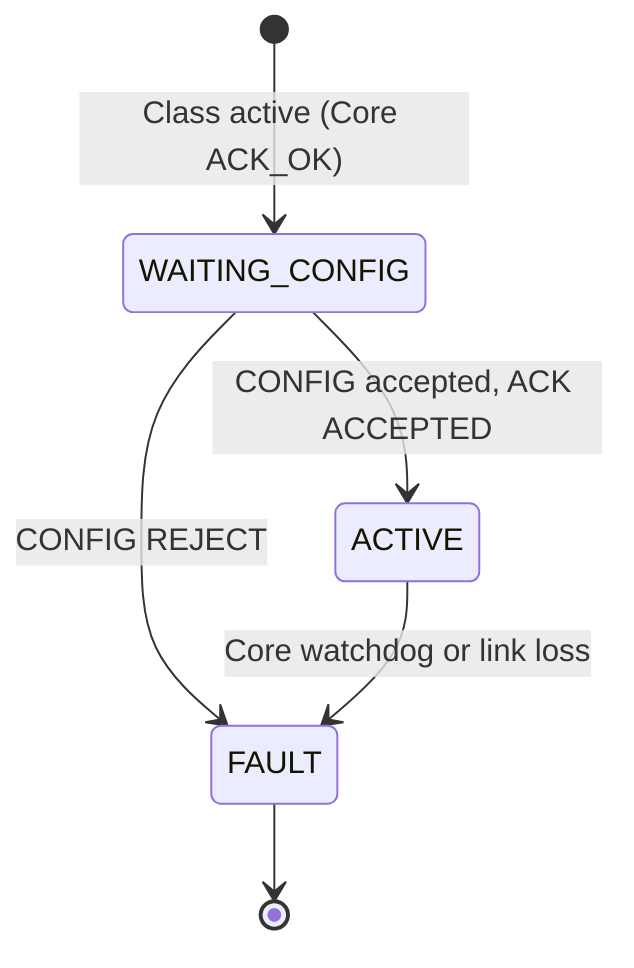
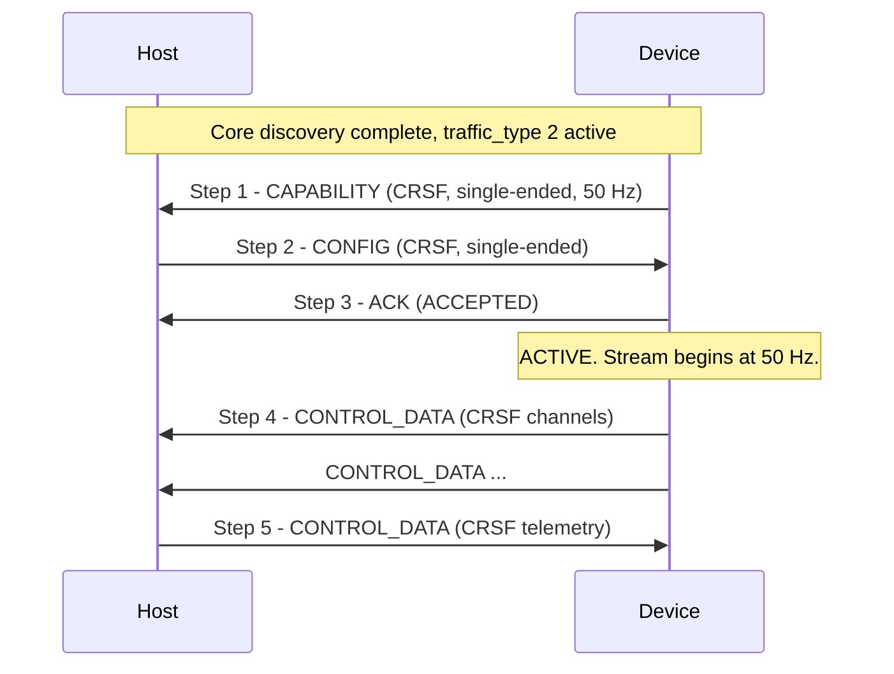

# APEX Device Class — Analog HMI

**APEX — Adaptive Payload EXchange**

**Status:** Draft | **Scope:** Analog HMI device class ([`traffic_type = 2`](APEX_Device_Classes.md#2--registry))

---

<a id="1--overview" name="1--overview"></a>
## 1.  Overview

The Analog HMI class covers Devices that present a **human-machine interface**
to the operator and exchange **control packets** with the Host over the APEX
UART, while the Host drives **CVBS analog video** out to the Device for
display. The canonical example is an HMI module embedded in a handset or
inspection grip: it streams the operator's stick / button state to the Host as
RC traffic and renders the Host's live video feed on its own screen.

The class is intentionally **payload-agnostic with respect to the control
content**. APEX does not parse CRSF or MAVLink frames — those bytes are
forwarded verbatim between the operator-side stack and the Host's RX
subsystem. What this class **does** define is:

- The set of supported **control packet formats**, and how Host and Device
  agree on one.
- The set of supported **CVBS pin modes** (single-ended vs differential pair
  on Pins 7/8), and how Host and Device agree on one.
- The unprompted, free-running stream that carries control packets in steady
  state.

**This class supports:**

- Multiple wire formats for the control content (CRSF, MAVLink 2; the registry
  is open for additions).
- Single-ended and differential CVBS, selected once at startup.
- Bidirectional control traffic (the Host may send back at a lower rate —
  e.g. for CRSF telemetry or MAVLink replies).

**This class does not support** (out of scope for v1):

- Mid-session reconfiguration of the format or CVBS mode. The session locks
  both at config time; changing either requires a Device reset.
- Class-layer fragmentation. Inner payloads carry one complete control frame
  per APEX frame. MAVLink 2 frames longer than `APEX_V0_MAX_PAYLOAD_LENGTH − 1`
  bytes (~252 bytes after the `class_msg_id`) cannot be transported in v1.

This document covers **both sides** of the class — Device role and Host role.
Discovery, framing, and capability exchange at the bus level are out of scope
and are handled by Core. All frames in this class carry `traffic_type = 2` in
the APEX V0 outer header.

CVBS itself is electrical; the bytes that select CVBS mode flow through this
spec, but no video bytes do.

---

<a id="2--roles" name="2--roles"></a>
## 2.  Roles

<a id="2-1--device" name="2-1--device"></a>
### 2.1.  Device

The Device declares its supported control formats, supported CVBS modes, and
intended transmit rate via the CAPABILITY frame ([§4.3](#4-3--capability-frame-device--host)),
accepts or rejects the Host's CONFIG frame via ACK ([§4.5](#4-5--ack-frame-device--host)),
and once ACTIVE, streams CONTROL_DATA frames ([§4.6](#4-6--control_data-frame-bidirectional))
at its declared rate. The Device decides when to send; the Host does not poll.

<a id="2-2--host" name="2-2--host"></a>
### 2.2.  Host

The Host receives CAPABILITY, intersects the Device's supported sets against
its own, selects exactly one format and one mode, and replies with CONFIG
([§4.4](#4-4--config-frame-host--device)). Once the Device's ACK confirms
acceptance, the Host configures the physical CVBS path on Pins 7/8 according
to the selected mode and consumes incoming CONTROL_DATA frames. The Host may
also send CONTROL_DATA back, typically at a lower rate.

The Host MUST have been granted the CVBS interface flag during Core discovery
([APEX — Core §3.2.1](APEX_Core.md#3-2-1--device_info-msg_id--1)) before
emitting CONFIG with a non-zero CVBS mode. A Device that did not request CVBS
during Core discovery MUST declare `supported_cvbs_modes = 0` here.

---

<a id="3--negotiated-parameters" name="3--negotiated-parameters"></a>
## 3.  Negotiated Parameters

Two parameters are negotiated, independently, at the start of every session.

<a id="3-1--control-packet-format" name="3-1--control-packet-format"></a>
### 3.1.  Control packet format

The format of the bytes carried inside CONTROL_DATA frames. Each side
publishes a bitmask of supported formats; the Host picks one.

| Value | Name | Description |
| --- | --- | --- |
| `0` | `CRSF` | TBS Crossfire. Frames up to 64 bytes; common for RC link traffic. |
| `1` | `MAVLINK2` | MAVLink 2.0. Frames up to 280 bytes — see [§5](#5--limitations) for the payload-size caveat. |
| `2`–`255` | *(reserved)* | Reserved for future formats (SBUS, Spektrum, etc.). |

Selected format applies in **both directions** of CONTROL_DATA traffic
([§4.6](#4-6--control_data-frame-bidirectional)). The Host may send back a
different *type* of message (e.g. CRSF telemetry rather than CRSF RC channels)
but the wire encoding is the same.

<a id="3-2--cvbs-pin-mode" name="3-2--cvbs-pin-mode"></a>
### 3.2.  CVBS pin mode

How the Host drives Pins 7 and 8 to carry the video signal to the Device.

| Value | Name | Description |
| --- | --- | --- |
| `0` | `SINGLE_ENDED` | Pin 7 carries CVBS video; Pin 8 is the signal return / common with GND. |
| `1` | `DIFFERENTIAL` | Pins 7 and 8 carry a balanced (CVBS+, CVBS−) signal. |
| `2`–`255` | *(reserved)* | — |

The mode selection is electrical only; this spec does not define video
content, format, line standard, or resolution. The Device is responsible for
receiving and decoding whatever CVBS waveform the Host drives.

---

<a id="4--message-format" name="4--message-format"></a>
## 4.  Message Format

The class follows the APEX framing model ([APEX — Core §3](APEX_Core.md#3--communication-protocol-uart)):
every frame carries `traffic_type = 2`, is COBS-framed, and uses the outer
header from [APEX — Core §3.1.1](APEX_Core.md#3-1-1--outer-header-apexv0hdr_t),
with the inner payload carrying class-specific content. All multi-byte fields
are little-endian ([APEX — Core §3.1](APEX_Core.md#3-1--frame-layout)).

<a id="4-1--inner-payload-sub-header" name="4-1--inner-payload-sub-header"></a>
### 4.1.  Inner payload sub-header

| `class_msg_id` | Name | Direction | Meaning |
| --- | --- | --- | --- |
| `0` | *(reserved)* | — | Reserved; never sent. |
| `1` | **CAPABILITY** | Device → Host | Declares supported formats and CVBS modes ([§4.3](#4-3--capability-frame-device--host)). |
| `2` | **CONFIG** | Host → Device | Selects one format and one CVBS mode ([§4.4](#4-4--config-frame-host--device)). |
| `3` | **ACK** | Device → Host | Acknowledges CONFIG ([§4.5](#4-5--ack-frame-device--host)). |
| `4` | **CONTROL_DATA** | Bidirectional | Streamed control packet payload ([§4.6](#4-6--control_data-frame-bidirectional)). |

<a id="4-2--lifecycle-overview" name="4-2--lifecycle-overview"></a>
### 4.2.  Lifecycle overview

1. Core discovery completes for `device_class_req = 2` ([APEX — Core §3.3](APEX_Core.md#3-3--startup-discovery-handshake)). Class traffic on `traffic_type = 2` becomes valid.
2. Device immediately emits **CAPABILITY** ([§4.3](#4-3--capability-frame-device--host)) — unprompted, exactly once.
3. Host emits **CONFIG** ([§4.4](#4-4--config-frame-host--device)) with the chosen format and CVBS mode.
4. Device replies **ACK** ([§4.5](#4-5--ack-frame-device--host)). On `ACCEPTED`, the session enters ACTIVE.
5. Either side may now emit **CONTROL_DATA** ([§4.6](#4-6--control_data-frame-bidirectional)) frames at its preferred cadence.

<a id="4-3--capability-frame-device--host" name="4-3--capability-frame-device--host"></a>
### 4.3.  CAPABILITY frame (Device → Host)

| Offset | Field | Width | Description |
| --- | --- | --- | --- |
| `0` | `class_msg_id` | `u8` | `1` (CAPABILITY). |
| `1` | `class_spec_version` | `u8` | Analog-HMI-class revision the Device implements. `0` = the revision defined by this document. |
| `2` | `supported_control_formats` | `u8` | Bitmask of supported control formats. Bit `n` set ⇒ format value `n` ([§3.1](#3-1--control-packet-format)) is supported. At least one bit MUST be set. |
| `3` | `supported_cvbs_modes` | `u8` | Bitmask of supported CVBS modes. Bit `n` set ⇒ CVBS mode value `n` ([§3.2](#3-2--cvbs-pin-mode)) is supported. May be `0x00` if the Device does not consume CVBS (e.g. headless HMI). |
| `4` | `intended_rate_hz` | `u8` | The Device's intended CONTROL_DATA transmit rate, in Hz. Informational; the Host MAY use it to size buffers but MUST NOT enforce it. `0` = unspecified / event-driven. |

`supported_control_formats == 0` is malformed; the Host MUST reject with
`REJECT_MALFORMED` ([§4.5](#4-5--ack-frame-device--host)).

A `class_spec_version` value the Host does not understand should be treated
as `0` — the Host parses the fields it knows. Future revisions of this spec
will extend CAPABILITY only by appending fields, never by repurposing
existing ones.

<a id="4-4--config-frame-host--device" name="4-4--config-frame-host--device"></a>
### 4.4.  CONFIG frame (Host → Device)

| Offset | Field | Width | Description |
| --- | --- | --- | --- |
| `0` | `class_msg_id` | `u8` | `2` (CONFIG). |
| `1` | `selected_control_format` | `u8` | Exactly one value from [§3.1](#3-1--control-packet-format). MUST be a value the Device declared as supported. |
| `2` | `selected_cvbs_mode` | `u8` | Exactly one value from [§3.2](#3-2--cvbs-pin-mode). MUST be a value the Device declared as supported. `0xFF` is reserved to mean "no CVBS configured" for headless HMIs where the Device declared `supported_cvbs_modes = 0`. |

The Host MUST send exactly one CONFIG in response to each CAPABILITY. If the
Device sees a second CONFIG with different parameters, it MUST reply
`REJECT_MALFORMED` and remain in its current state.

<a id="4-5--ack-frame-device--host" name="4-5--ack-frame-device--host"></a>
### 4.5.  ACK frame (Device → Host)

| Offset | Field | Width | Description |
| --- | --- | --- | --- |
| `0` | `class_msg_id` | `u8` | `3` (ACK). |
| `1` | `result` | `u8` | Result code (see below). |

**`result` values:**

| Value | Name | Meaning |
| --- | --- | --- |
| `0x00` | `ACCEPTED` | The Device has adopted the selected format and CVBS mode; CONTROL_DATA streaming may begin. |
| `0x01` | `REJECT_FORMAT` | `selected_control_format` is not a value the Device declared as supported. |
| `0x02` | `REJECT_CVBS` | `selected_cvbs_mode` is not a value the Device declared as supported. |
| `0x03` | `REJECT_MALFORMED` | CONFIG could not be parsed, or CAPABILITY was malformed (e.g. `supported_control_formats == 0`). |

A rejecting ACK is **terminal in v1**: the Device transitions to FAULT
([§4.7](#4-7--state-machine-device)) and the operator must intervene. A Host
that cannot satisfy a Device's CAPABILITY SHOULD surface the specific reject
code to the operator; that's the only signal a passive operator has.

<a id="4-6--control_data-frame-bidirectional" name="4-6--control_data-frame-bidirectional"></a>
### 4.6.  CONTROL_DATA frame (bidirectional)

| Offset | Field | Width | Description |
| --- | --- | --- | --- |
| `0` | `class_msg_id` | `u8` | `4` (CONTROL_DATA). |
| `1…` | `frame` | variable | One complete control frame in the selected format ([§3.1](#3-1--control-packet-format)), verbatim. |

The control frame is **not** length-prefixed by the class layer — the outer
header's `payload_length` already bounds it, so the inner `frame` is exactly
`payload_length − 1` bytes.

CONTROL_DATA frames are sent **unprompted** in both directions. The Device's
typical cadence is its declared `intended_rate_hz` (25–100 Hz is normal). The
Host typically sends at a much lower rate, only when it has telemetry or
replies to send.

There is no per-frame ACK. CRC at the outer layer ([APEX — Core §3.1.2](APEX_Core.md#3-1-2--crc))
catches corruption; a dropped CONTROL_DATA frame is harmless given the
high-cadence retransmit nature of the underlying RC stream.

<a id="4-7--state-machine-device" name="4-7--state-machine-device"></a>
### 4.7.  State machine (Device)

The Device runs the following minimal state machine.

| Value | Name | Description |
| --- | --- | --- |
| `0x01` | **WAITING_CONFIG** | CAPABILITY has been sent; awaiting CONFIG. |
| `0x02` | **ACTIVE** | CONFIG accepted; CONTROL_DATA streaming. |
| `0xFF` | **FAULT** | CONFIG rejected, malformed traffic, or core-layer fault. Terminal in v1. |



The Host does not run an explicit state machine for this class beyond
"pre-CONFIG" / "ACTIVE" per device — the device's Core lifecycle status
([APEX — Core §4](APEX_Core.md#4--device-lifecycle-status)) tells it
everything else it needs.

<a id="4-8--reporting-cadence-and-timing" name="4-8--reporting-cadence-and-timing"></a>
### 4.8.  Reporting cadence and timing

- **CAPABILITY.** Emitted within **100 ms** of the class becoming active.
- **CONFIG.** The Host SHOULD emit CONFIG within **500 ms** of receiving
  CAPABILITY. A Device that has not received CONFIG within **5 s** transitions
  to FAULT.
- **ACK.** The Device MUST emit ACK within **200 ms** of receiving CONFIG.
- **CONTROL_DATA.** Streaming begins immediately after the Device sends
  `ACCEPTED`. The Device's CONTROL_DATA traffic satisfies the Core [§3.5](APEX_Core.md#3-5--heartbeat)
  1 Hz transmit floor on its side; the Host's HOST_STATE broadcast satisfies
  the same on the Host side.

---

<a id="5--limitations" name="5--limitations"></a>
## 5.  Limitations

<a id="5-1--mavlink-2-frame-size" name="5-1--mavlink-2-frame-size"></a>
### 5.1.  MAVLink 2 frame size

A MAVLink 2 frame can be up to 280 bytes (12 B header + 255 B payload + 2 B
CRC + 13 B signature). The APEX V0 inner-payload cap is **255** bytes, of
which the CONTROL_DATA `class_msg_id` consumes one — leaving **254** bytes
for the wrapped MAVLink frame.

A Device that declares `MAVLINK2` support implicitly agrees to constrain its
MAVLink 2 frames to ≤ 254 bytes. Frames that would exceed this cap MUST be
dropped at the sender. A v2 revision of this class may add a class-layer
fragmentation scheme; that is out of scope here.

CRSF frames (≤ 64 bytes) are unaffected.

<a id="5-2--no-mid-session-reconfiguration" name="5-2--no-mid-session-reconfiguration"></a>
### 5.2.  No mid-session reconfiguration

Once the Device has emitted `ACCEPTED`, both the selected format and the
selected CVBS mode are locked for the remainder of the session. To change
either, the operator triggers a Device reset (cycle Pin 9, or
power-cycle the connector) and Core discovery re-runs.

---

<a id="6--worked-example" name="6--worked-example"></a>
## 6.  Worked Example

A handset HMI Device that supports CRSF over a single-ended CVBS path,
streaming at 50 Hz.

<a id="6-1--the-example-device" name="6-1--the-example-device"></a>
### 6.1.  The example Device

- Supports **CRSF only** (`supported_control_formats = 0x01`).
- Supports **single-ended CVBS only** (`supported_cvbs_modes = 0x01`).
- Streams at **50 Hz** (`intended_rate_hz = 50`, `0x32`).
- Has completed Core discovery and been assigned `device_id = 0x01`.

<a id="6-2--frame-notation" name="6-2--frame-notation"></a>
### 6.2.  Frame notation

Frames below use the common notation defined in Core [§3.1.5](APEX_Core.md#3-1-5--frame-notation):
each is shown as the bytes before CRC and COBS. `PV = 00`, `TT = 02`,
`ID = 01` throughout.

<a id="6-3--sequence" name="6-3--sequence"></a>
### 6.3.  Sequence



#### ▸ Step 1 — Device emits CAPABILITY

Inner payload 5 bytes (`LN = 05`).

```
00 02 01 05    01 00 01 01 32
```

| Byte(s) | Hex | Field | Value |
| --- | --- | --- | --- |
| 0–3 | `00 02 01 05` | outer header | `LN=05` (5) |
| 4 | `01` | `class_msg_id` | `1` (CAPABILITY) |
| 5 | `00` | `class_spec_version` | `0` |
| 6 | `01` | `supported_control_formats` | bit 0 = CRSF |
| 7 | `01` | `supported_cvbs_modes` | bit 0 = SINGLE_ENDED |
| 8 | `32` | `intended_rate_hz` | `50` |

#### ▸ Step 2 — Host emits CONFIG

Inner payload 3 bytes (`LN = 03`).

```
00 02 01 03    02 00 00
```

| Byte(s) | Hex | Field | Value |
| --- | --- | --- | --- |
| 4 | `02` | `class_msg_id` | `2` (CONFIG) |
| 5 | `00` | `selected_control_format` | `0` (CRSF) |
| 6 | `00` | `selected_cvbs_mode` | `0` (SINGLE_ENDED) |

#### ▸ Step 3 — Device acknowledges

Inner payload 2 bytes (`LN = 02`).

```
00 02 01 02    03 00
```

| Byte(s) | Hex | Field | Value |
| --- | --- | --- | --- |
| 4 | `03` | `class_msg_id` | `3` (ACK) |
| 5 | `00` | `result` | `ACCEPTED` |

The Device transitions WAITING_CONFIG → ACTIVE and begins streaming.

#### ▸ Step 4 — Device streams CONTROL_DATA

A CRSF channels-packed frame (26 bytes). Inner payload 27 bytes (`LN = 1B`).

```
00 02 01 1B    04 <26 bytes of CRSF frame ...>
```

| Byte(s) | Hex | Field | Value |
| --- | --- | --- | --- |
| 4 | `04` | `class_msg_id` | `4` (CONTROL_DATA) |
| 5–30 | … | CRSF frame | one full CRSF frame, verbatim |

#### ▸ Step 5 — Host returns CRSF telemetry

A CRSF battery-telemetry frame (10 bytes). Inner payload 11 bytes (`LN = 0B`).

```
00 02 01 0B    04 <10 bytes of CRSF telemetry frame ...>
```

Identical structure to Step 4; only the direction and content differ.

---
