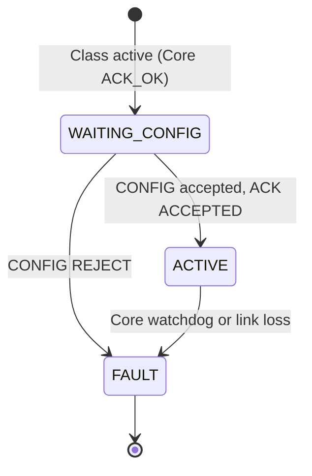
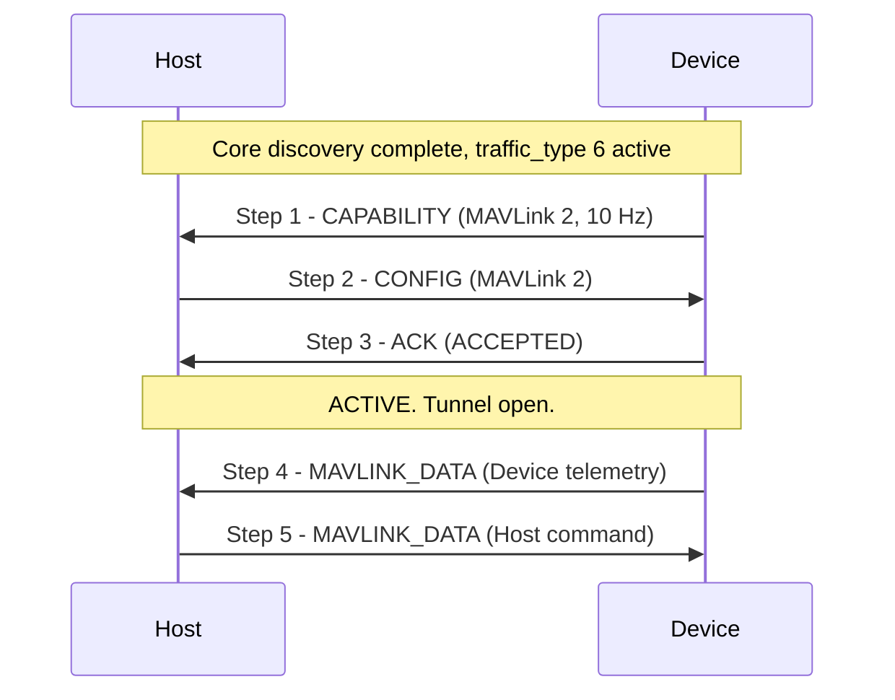

# APEX Device Class — MAVLink

**APEX — Adaptive Payload EXchange**

**Status:** Draft | **Scope:** MAVLink device class ([`traffic_type = 6`](APEX_Device_Classes.md#2--registry))

---

<a id="1--overview" name="1--overview"></a>
## 1.  Overview

The MAVLink class covers Devices that are **MAVLink endpoints** — a payload
that talks MAVLink to the flight controller — connected to the Host across the
APEX bus. The canonical topology is a flight controller acting as the APEX
**Host**, an APEX connector pair, and a microcontroller on the payload acting
as the APEX **Device**. Both ends run their own MAVLink stack; APEX carries
their MAVLink traffic between them and gets out of the way.

APEX's role is to **negotiate the link on the endpoints' behalf** and then
**transparently tunnel MAVLink bytes in both directions**. The Host and Device
each declare which MAVLink wire version they speak; APEX confirms a common
version during class setup, then becomes a byte pipe. After that, every MAVLink
message — heartbeats, parameters, commands, telemetry — flows end to end
exactly as it would over a direct UART.

The class is intentionally **opaque with respect to MAVLink content**. APEX
does not parse MAVLink frames, does not inspect or rewrite `sysid` / `compid`,
and does not implement MAVLink routing. Those are the endpoints'
responsibility and ride inside the tunnel untouched. What this class **does**
define is:

- The set of supported **MAVLink wire versions**, and how Host and Device
  agree on one.
- A **transparent, bidirectional byte tunnel** (MAVLINK_DATA) that carries the
  MAVLink stream in steady state.
- The lifecycle that brings the tunnel up and the conditions that tear it
  down.

**This class supports:**

- MAVLink 1 and MAVLink 2 (the registry is open for additions).
- Full-duplex traffic the moment the session is ACTIVE — the Host streams
  toward the Device and the Device streams toward the Host independently, at
  whatever cadence each endpoint's MAVLink stack produces.
- MAVLink frames of any size, including signed MAVLink 2 frames up to 280
  bytes — the tunnel is a **byte stream**, not frame-aligned, so no MAVLink
  frame is ever too large to transport ([§5.1](#5-1--mavlink-frame-size)).

**This class does not support** (out of scope for v1):

- MAVLink-level routing, filtering, or `sysid` / `compid` translation. The
  Host is a transparent endpoint; if it bridges the tunnel onto a wider
  MAVLink network, that bridging is the Host application's job, outside this
  spec.
- Mid-session change of the negotiated MAVLink version. The version is locked
  at config time; changing it requires a Device reset.

This document covers **both sides** of the class — Device role and Host role.
Discovery, framing, and capability exchange at the bus level are out of scope
and are handled by Core. All frames in this class carry `traffic_type = 6` in
the APEX V0 outer header.

---

<a id="2--roles" name="2--roles"></a>
## 2.  Roles

<a id="2-1--device" name="2-1--device"></a>
### 2.1.  Device

The Device declares its supported MAVLink versions and an intended
steady-state rate via the CAPABILITY frame ([§4.3](#4-3--capability-frame-device--host)),
accepts or rejects the Host's CONFIG frame via ACK ([§4.5](#4-5--ack-frame-device--host)),
and once ACTIVE, exchanges MAVLINK_DATA frames ([§4.6](#4-6--mavlink_data-frame-bidirectional))
carrying its endpoint's MAVLink byte stream. The Device sends whenever its
MAVLink stack has bytes to send; the Host does not poll.

<a id="2-2--host" name="2-2--host"></a>
### 2.2.  Host

The Host receives CAPABILITY, intersects the Device's supported versions
against its own, selects exactly one version, and replies with CONFIG
([§4.4](#4-4--config-frame-host--device)). Once the Device's ACK confirms
acceptance, the Host feeds its endpoint's MAVLink byte stream into
MAVLINK_DATA frames toward the Device and reassembles the Device's stream from
inbound MAVLINK_DATA frames.

The Host MUST treat the tunnelled bytes as opaque. It MUST NOT require a
MAVLink frame boundary to fall on an APEX frame boundary, and it MUST NOT
assume one MAVLINK_DATA frame contains exactly one MAVLink message
([§4.6](#4-6--mavlink_data-frame-bidirectional), [§5.1](#5-1--mavlink-frame-size)).

---

<a id="3--negotiated-parameters" name="3--negotiated-parameters"></a>
## 3.  Negotiated Parameters

One parameter is negotiated at the start of every session.

<a id="3-1--mavlink-version" name="3-1--mavlink-version"></a>
### 3.1.  MAVLink version

The wire version of the MAVLink stream carried inside MAVLINK_DATA frames.
Each side publishes a bitmask of supported versions; the Host picks one.

| Value | Name | Description |
| --- | --- | --- |
| `0` | `MAVLINK1` | MAVLink 1.0 framing (`0xFE` start byte). Frames up to 263 bytes. |
| `1` | `MAVLINK2` | MAVLink 2.0 framing (`0xFD` start byte). Frames up to 280 bytes, including optional signature. |
| `2`–`7` | *(reserved)* | Reserved for future MAVLink wire revisions. |

The selected version applies in **both directions** of MAVLINK_DATA traffic
([§4.6](#4-6--mavlink_data-frame-bidirectional)). A Device that declares both
versions MUST be prepared to run at whichever one the Host selects, in both
directions, for the life of the session.

The version selection governs framing only. This spec does not define which
MAVLink dialect, messages, or microservices the endpoints exchange — that is
an endpoint concern carried transparently inside the tunnel.

---

<a id="4--message-format" name="4--message-format"></a>
## 4.  Message Format

The class follows the APEX framing model ([APEX — Core §3](APEX_Core.md#3--communication-protocol-uart)):
every frame carries `traffic_type = 6`, is COBS-framed, and uses the outer
header from [APEX — Core §3.1.1](APEX_Core.md#3-1-1--outer-header-apexv0hdr_t),
with the inner payload carrying class-specific content. All multi-byte fields
are little-endian ([APEX — Core §3.1](APEX_Core.md#3-1--frame-layout)).

<a id="4-1--inner-payload-sub-header" name="4-1--inner-payload-sub-header"></a>
### 4.1.  Inner payload sub-header

| `class_msg_id` | Name | Direction | Meaning |
| --- | --- | --- | --- |
| `0` | *(reserved)* | — | Reserved; never sent. |
| `1` | **CAPABILITY** | Device → Host | Declares supported MAVLink versions ([§4.3](#4-3--capability-frame-device--host)). |
| `2` | **CONFIG** | Host → Device | Selects one version ([§4.4](#4-4--config-frame-host--device)). |
| `3` | **ACK** | Device → Host | Acknowledges CONFIG ([§4.5](#4-5--ack-frame-device--host)). |
| `4` | **MAVLINK_DATA** | Bidirectional | Tunnelled MAVLink byte stream ([§4.6](#4-6--mavlink_data-frame-bidirectional)). |

<a id="4-2--lifecycle-overview" name="4-2--lifecycle-overview"></a>
### 4.2.  Lifecycle overview

1. Core discovery completes for `device_class_req = 6` ([APEX — Core §3.3](APEX_Core.md#3-3--startup-discovery-handshake)). Class traffic on `traffic_type = 6` becomes valid.
2. Device immediately emits **CAPABILITY** ([§4.3](#4-3--capability-frame-device--host)) — unprompted, exactly once.
3. Host emits **CONFIG** ([§4.4](#4-4--config-frame-host--device)) with the chosen MAVLink version.
4. Device replies **ACK** ([§4.5](#4-5--ack-frame-device--host)). On `ACCEPTED`, the session enters ACTIVE.
5. Either side may now emit **MAVLINK_DATA** ([§4.6](#4-6--mavlink_data-frame-bidirectional)) frames as its endpoint produces MAVLink bytes.

<a id="4-3--capability-frame-device--host" name="4-3--capability-frame-device--host"></a>
### 4.3.  CAPABILITY frame (Device → Host)

| Offset | Field | Width | Description |
| --- | --- | --- | --- |
| `0` | `class_msg_id` | `u8` | `1` (CAPABILITY). |
| `1` | `class_spec_version` | `u8` | MAVLink-class revision the Device implements. `0` = the revision defined by this document. |
| `2` | `supported_versions` | `u8` | Bitmask of supported MAVLink versions. Bit `n` set ⇒ version value `n` ([§3.1](#3-1--mavlink-version)) is supported. At least one bit MUST be set. |
| `3` | `intended_rate_hz` | `u8` | The Device's intended steady-state MAVLINK_DATA frame rate, in Hz. Informational; the Host MAY use it to size buffers but MUST NOT enforce it. `0` = unspecified / event-driven. |

`supported_versions == 0` is malformed; the Host MUST reject with
`REJECT_MALFORMED` ([§4.5](#4-5--ack-frame-device--host)).

A `class_spec_version` value the Host does not understand should be treated as
`0` — the Host parses the fields it knows. Future revisions of this spec will
extend CAPABILITY only by appending fields, never by repurposing existing
ones.

<a id="4-4--config-frame-host--device" name="4-4--config-frame-host--device"></a>
### 4.4.  CONFIG frame (Host → Device)

| Offset | Field | Width | Description |
| --- | --- | --- | --- |
| `0` | `class_msg_id` | `u8` | `2` (CONFIG). |
| `1` | `selected_version` | `u8` | Exactly one value from [§3.1](#3-1--mavlink-version). MUST be a value the Device declared as supported. |

The Host MUST send exactly one CONFIG in response to each CAPABILITY. If the
Device sees a second CONFIG with a different parameter, it MUST reply
`REJECT_MALFORMED` and remain in its current state.

<a id="4-5--ack-frame-device--host" name="4-5--ack-frame-device--host"></a>
### 4.5.  ACK frame (Device → Host)

| Offset | Field | Width | Description |
| --- | --- | --- | --- |
| `0` | `class_msg_id` | `u8` | `3` (ACK). |
| `1` | `result` | `u8` | Result code (see below). |

**`result` values:**

| Value | Name | Meaning |
| --- | --- | --- |
| `0x00` | `ACCEPTED` | The Device has adopted the selected MAVLink version; MAVLINK_DATA exchange may begin. |
| `0x01` | `REJECT_VERSION` | `selected_version` is not a value the Device declared as supported. |
| `0x02` | `REJECT_MALFORMED` | CONFIG could not be parsed, or CAPABILITY was malformed (e.g. `supported_versions == 0`). |

A rejecting ACK is **terminal in v1**: the Device transitions to FAULT
([§4.7](#4-7--state-machine-device)) and the operator must intervene. A Host
that cannot satisfy a Device's CAPABILITY SHOULD surface the specific reject
code to the operator; that's the only signal a passive operator has.

<a id="4-6--mavlink_data-frame-bidirectional" name="4-6--mavlink_data-frame-bidirectional"></a>
### 4.6.  MAVLINK_DATA frame (bidirectional)

| Offset | Field | Width | Description |
| --- | --- | --- | --- |
| `0` | `class_msg_id` | `u8` | `4` (MAVLINK_DATA). |
| `1…` | `stream` | variable | A run of bytes from the endpoint's MAVLink output stream, in the selected version's framing. |

The `stream` field is **not** length-prefixed by the class layer — the outer
header's `payload_length` already bounds it, so `stream` is exactly
`payload_length − 1` bytes.

MAVLINK_DATA is a **byte stream, not a frame-delimited channel**. The sender
MAY pack any number of whole or partial MAVLink frames into one MAVLINK_DATA
frame, and a single MAVLink frame MAY span multiple consecutive MAVLINK_DATA
frames. The receiver MUST feed `stream` bytes, in arrival order, into a
MAVLink parser that recovers frame boundaries from the MAVLink start byte and
length field. The receiver MUST NOT assume a MAVLINK_DATA boundary coincides
with a MAVLink frame boundary.

Per-direction byte order is preserved: bytes within a direction are delivered
in the same order they were submitted, with no reordering, duplication, or
insertion. APEX's outer-layer CRC ([APEX — Core §3.1.2](APEX_Core.md#3-1-2--crc))
protects each frame; a MAVLINK_DATA frame that fails CRC is dropped whole,
which appears to the MAVLink parser as a gap. MAVLink's own per-message CRC
then discards the truncated message and resynchronizes on the next start byte.
The class layer does **not** retransmit; reliability for messages that need it
is a MAVLink-level concern (e.g. command/ack, param retry) handled by the
endpoints.

MAVLINK_DATA frames are sent **unprompted** in both directions. Each side's
cadence is whatever its MAVLink stack produces; there is no per-frame ACK.

<a id="4-7--state-machine-device" name="4-7--state-machine-device"></a>
### 4.7.  State machine (Device)

The Device runs the following minimal state machine.

| Value | Name | Description |
| --- | --- | --- |
| `0x01` | **WAITING_CONFIG** | CAPABILITY has been sent; awaiting CONFIG. |
| `0x02` | **ACTIVE** | CONFIG accepted; MAVLINK_DATA flowing. |
| `0xFF` | **FAULT** | CONFIG rejected, malformed traffic, or core-layer fault. Terminal in v1. |



The Host does not run an explicit state machine for this class beyond
"pre-CONFIG" / "ACTIVE" per device — the device's Core lifecycle status
([APEX — Core §4](APEX_Core.md#4--device-lifecycle-status)) tells it
everything else it needs.

<a id="4-8--reporting-cadence-and-timing" name="4-8--reporting-cadence-and-timing"></a>
### 4.8.  Reporting cadence and timing

- **CAPABILITY.** Emitted within **100 ms** of the class becoming active.
- **CONFIG.** The Host SHOULD emit CONFIG within **500 ms** of receiving
  CAPABILITY. A Device that has not received CONFIG within **5 s** transitions
  to FAULT.
- **ACK.** The Device MUST emit ACK within **200 ms** of receiving CONFIG.
- **MAVLINK_DATA.** Exchange begins immediately after the Device sends
  `ACCEPTED`. MAVLINK_DATA traffic in each direction satisfies the Core
  [§3.5](APEX_Core.md#3-5--heartbeat) 1 Hz transmit floor on that side. If an
  endpoint's MAVLink stack falls silent, the side MUST still meet the Core
  transmit floor — a MAVLink HEARTBEAT (emitted by every conformant MAVLink
  endpoint at ≥ 1 Hz) naturally satisfies this; the class layer adds no
  keep-alive of its own.

---

<a id="5--limitations" name="5--limitations"></a>
## 5.  Limitations

<a id="5-1--mavlink-frame-size" name="5-1--mavlink-frame-size"></a>
### 5.1.  MAVLink frame size

A MAVLink 2 frame can be up to 280 bytes (12 B header + 255 B payload + 2 B
CRC + 13 B signature); MAVLink 1 up to 263 bytes. The APEX V0 inner-payload
cap is **255** bytes, of which the MAVLINK_DATA `class_msg_id` consumes one —
leaving **254** bytes of `stream` per APEX frame.

Because MAVLINK_DATA is a **byte stream and not frame-aligned**
([§4.6](#4-6--mavlink_data-frame-bidirectional)), this cap is **not** a
constraint on MAVLink frame size. A 280-byte signed MAVLink 2 frame is simply
split across two consecutive MAVLINK_DATA frames and reassembled by the
receiver's MAVLink parser. No MAVLink frame is ever undeliverable, and no
class-layer fragmentation header is needed — the MAVLink length field already
tells the receiver where each frame ends.

This is the key design difference from a frame-aligned class such as Analog
HMI ([Analog HMI §5.1](APEX_Device_Class_Analog_HMI.md#5-1--mavlink-2-frame-size)):
by tunnelling bytes rather than whole frames, the MAVLink class transports
arbitrarily large MAVLink frames without a fragmentation scheme.

<a id="5-2--no-mid-session-reconfiguration" name="5-2--no-mid-session-reconfiguration"></a>
### 5.2.  No mid-session reconfiguration

Once the Device has emitted `ACCEPTED`, the selected MAVLink version is locked
for the remainder of the session. To change it, the operator triggers a Device
reset (cycle Pin 9, or power-cycle the connector) and Core discovery re-runs.

<a id="5-3--no-mavlink-level-routing" name="5-3--no-mavlink-level-routing"></a>
### 5.3.  No MAVLink-level routing

The Host is a transparent MAVLink endpoint, not a router. `sysid` / `compid`
addressing, message filtering, and forwarding onto a wider MAVLink network are
out of scope for this class. A Host that bridges the tunnel onto an
autopilot's MAVLink network does so in application code, above this spec.

---

<a id="6--worked-example" name="6--worked-example"></a>
## 6.  Worked Example

A camera payload whose MCU speaks MAVLink 2 only, exchanging telemetry and
commands with a flight-controller Host.

<a id="6-1--the-example-device" name="6-1--the-example-device"></a>
### 6.1.  The example Device

- Supports **MAVLink 2 only** (`supported_versions = 0x02`).
- Streams at roughly **10 Hz** in steady state (`intended_rate_hz = 10`,
  `0x0A`).
- Has completed Core discovery and been assigned `device_id = 0x01`.

<a id="6-2--frame-notation" name="6-2--frame-notation"></a>
### 6.2.  Frame notation

Frames below use the common notation defined in Core [§3.1.5](APEX_Core.md#3-1-5--frame-notation):
each is shown as the bytes before CRC and COBS. `PV = 00`, `TT = 06`,
`ID = 01` throughout.

<a id="6-3--sequence" name="6-3--sequence"></a>
### 6.3.  Sequence



#### ▸ Step 1 — Device emits CAPABILITY

Inner payload 4 bytes (`LN = 04`).

```
00 06 01 04    01 00 02 0A
```

| Byte(s) | Hex | Field | Value |
| --- | --- | --- | --- |
| 0–3 | `00 06 01 04` | outer header | `LN=04` (4) |
| 4 | `01` | `class_msg_id` | `1` (CAPABILITY) |
| 5 | `00` | `class_spec_version` | `0` |
| 6 | `02` | `supported_versions` | bit 1 = MAVLINK2 |
| 7 | `0A` | `intended_rate_hz` | `10` |

#### ▸ Step 2 — Host emits CONFIG

Inner payload 2 bytes (`LN = 02`).

```
00 06 01 02    02 01
```

| Byte(s) | Hex | Field | Value |
| --- | --- | --- | --- |
| 4 | `02` | `class_msg_id` | `2` (CONFIG) |
| 5 | `01` | `selected_version` | `1` (MAVLINK2) |

#### ▸ Step 3 — Device acknowledges

Inner payload 2 bytes (`LN = 02`).

```
00 06 01 02    03 00
```

| Byte(s) | Hex | Field | Value |
| --- | --- | --- | --- |
| 4 | `03` | `class_msg_id` | `3` (ACK) |
| 5 | `00` | `result` | `ACCEPTED` |

The Device transitions WAITING_CONFIG → ACTIVE and the tunnel opens.

#### ▸ Step 4 — Device streams MAVLINK_DATA (telemetry)

A MAVLink 2 ATTITUDE message (one full frame, 37 bytes on the wire). Inner
payload 38 bytes (`LN = 26`).

```
00 06 01 26    04 FD 1C 00 00 ... <37 bytes of MAVLink 2 frame> ...
```

| Byte(s) | Hex | Field | Value |
| --- | --- | --- | --- |
| 4 | `04` | `class_msg_id` | `4` (MAVLINK_DATA) |
| 5 | `FD` | MAVLink 2 STX | start of a MAVLink 2 frame |
| 6–41 | `…` | MAVLink frame | remainder of the ATTITUDE frame, verbatim |

#### ▸ Step 5 — Host sends MAVLINK_DATA (command)

A MAVLink 2 COMMAND_LONG (one full frame). Identical structure to Step 4; only
the direction and content differ. If the Host had a 280-byte signed frame to
send, it would split across two MAVLINK_DATA frames — the Device's MAVLink
parser reassembles it transparently ([§5.1](#5-1--mavlink-frame-size)).

---
