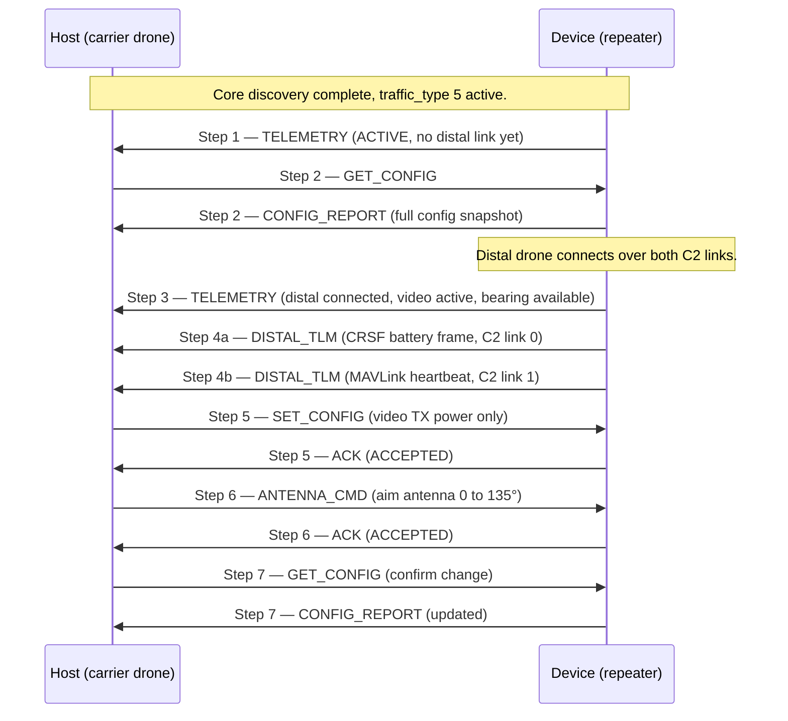

# APEX Device Class — Repeater

**APEX — Adaptive Payload EXchange**

**Status:** Draft | **Scope:** Repeater device class ([`traffic_type = 5`](APEX_Device_Classes.md#2--registry))

---

<a id="1--overview" name="1--overview"></a>
## 1.  Overview

The Repeater class covers Devices that act as **radio frequency relay nodes**: they extend the effective C2 (command-and-control) and video links between a ground controller and a distal drone, using the carrier drone's altitude and position as an RF vantage point.

A Repeater-class Device typically carries:

- **One or more C2 links** — each a bidirectional command-and-control channel that receives commands from the ground and relays them to the distal drone, and receives telemetry from the distal drone and relays it back. A C2 link is **radio-agnostic**: the underlying link technology (ELRS, a custom FSK/LoRa radio, a serial modem, etc.) is an implementation detail the APEX layer does not model. Each link carries a single C2 **protocol** end-to-end — **CRSF** or **MAVLink** — declared per link ([§3.1](#3-1--c2-link-protocol)). Up to four C2 links are supported per Device; a typical dual-band implementation carries two, and the two need not use the same protocol.
- **One video link** (optional) — receive-only from the distal drone; the repeater re-broadcasts the received video toward the ground.
- **Antenna list with per-antenna pointing** (optional) — the device may expose a lightweight, positionally-indexed inventory of its physical antennas ([§3.2](#3-2--antenna-list)). Each RF link (C2 or video) names the antenna it uses, so different links can be on different antennas — or share one. When an antenna is directional, the device reports per-antenna RF-derived bearing and distance to the distal drone; when an antenna is physically aimable, the Host can aim that specific antenna with `ANTENNA_CMD`. The earlier "single shared assembly" device is simply the degenerate case of an antenna list of length one with every link mapped to antenna `0`.

**The repeater manages its own RF configuration.** Frequencies, bind phrases, packet rates, link protocol, and other radio parameters are provisioned through a separate interface outside of APEX. The APEX channel between the Host (carrier drone) and the Device (repeater) serves two purposes: the Host observes the repeater's current configuration and live RF metrics, and the Host can update selected parameters at runtime.

This document defines **class version 1** of the Repeater class; the class version in force for a session is negotiated at discovery — see [APEX — Core](APEX_Core.md).

---

<a id="2--roles" name="2--roles"></a>
## 2.  Roles

<a id="2-1--device" name="2-1--device"></a>
### 2.1.  Device

After the APEX session is established the Device begins sending `TELEMETRY` frames at ≥ 1 Hz. Each `TELEMETRY` frame is self-describing — it carries a `capability_flags` field so the Host can parse it without having previously received a `CONFIG_REPORT`. When distal-drone telemetry arrives over a C2 link the Device forwards it to the Host as `DISTAL_TLM` frames, rate-limited as described in [§7](#7--distal-tlm-forwarding-policy). The Device responds to a `GET_CONFIG` request with a `CONFIG_REPORT` and acknowledges any `SET_CONFIG` or `ANTENNA_CMD` with an `ACK`.

<a id="2-2--host" name="2-2--host"></a>
### 2.2.  Host

The Host receives and caches `TELEMETRY`, `DISTAL_TLM`, and `CONFIG_REPORT` frames. It may forward `DISTAL_TLM` bytes into its own telemetry stack (e.g., injecting into the CRSF parser). The Host sends `GET_CONFIG` once after the session is established to obtain the full configuration snapshot. It sends `SET_CONFIG` when runtime parameter updates are needed, then follows up with `GET_CONFIG` to verify the change ([§8.1](#8-1--operational-flow)).

---

<a id="3--rf-link-model" name="3--rf-link-model"></a>
## 3.  RF Link Model

The Device declares which RF interfaces it has via `capability_flags`, a bitmask present in every `TELEMETRY` frame and in `CONFIG_REPORT`.

| Bit | Interface | Description |
| --- | --- | --- |
| `0` | **C2 link 0** | First C2 channel. Bidirectional: receives commands from ground, relays to distal drone; receives distal telemetry, relays to ground. Protocol (CRSF or MAVLink) declared per link — see [§3.1](#3-1--c2-link-protocol). |
| `1` | **C2 link 1** | Second C2 channel. Same role; dual-band coverage when both are present. May use a different protocol than link 0. |
| `2` | **C2 link 2** | Third C2 channel (reserved for future use; declared by setting this bit). |
| `3` | **C2 link 3** | Fourth C2 channel (reserved for future use). |
| `4` | **Video** | Video receive from distal drone; re-broadcast toward ground. Receive-only on the distal side. |
| `5` | **Antenna list** | Device exposes an antenna list ([§3.2](#3-2--antenna-list)): a positionally-indexed inventory of its physical antennas, the per-link antenna assignment in `CONFIG_REPORT`, and a per-antenna pointing block in `TELEMETRY`. When clear, the Device declares no antenna inventory and `ANTENNA_CMD` is not applicable. |
| `6`–`7` | *(reserved)* | Must be zero. |

C2 links are indexed by bit position (0 = first, 1 = second, …). Their radio parameters (frequency, bind phrase, packet rate) and protocol are carried in the C2 link config sections of `CONFIG_REPORT` — the bit index is not a band label, nor a protocol label. A single-band Device sets only bit 0. A dual-band Device sets bits 0 and 1.

Each declared C2 link (bits 0–3) and the video link (bit 4) is described by a **link block** ([§6.1](#6-1--link-block)) in `TELEMETRY` frames. Link blocks appear in bit-index order (bit 0 first, then 1, 2, 3, 4 if set); the Host counts set bits 0–4 to determine how many link blocks precede the antenna-list region. When bit 5 is set, the link blocks are followed by a `u8` antenna count and one **per-antenna directionality block** ([§6.2](#6-2--telemetry-device--host)) per listed antenna.

<a id="3-2--antenna-list" name="3-2--antenna-list"></a>
### 3.2.  Antenna list

When capability bit 5 is set, the Device exposes an **antenna list** — a positionally-indexed inventory of the physical antennas it carries. The list is small: an antenna is identified by a single `u8` **`antenna_id`** equal to its position in the list (`0..antenna_count − 1`). The Device owns the list and its ordering.

The antenna list ties three things together:

- **Inventory.** `CONFIG_REPORT` ([§6.3](#6-3--config_report-device--host)) carries an antenna-list section: an `antenna_count` followed by one entry per antenna giving its `antenna_type` (omni / passive-directional / aimable) and `antenna_bearing_ref`.
- **Per-link assignment.** Each C2 link config section and the video section in `CONFIG_REPORT` carries the `antenna_id` of the antenna that link uses. Several links may name the same antenna, or each may name a different one. The assignment is a hardware/provisioning fact and is **read-only** over APEX (like `c2_protocol`).
- **Per-antenna pointing.** `TELEMETRY` ([§6.2](#6-2--telemetry-device--host)) carries one directionality block per listed antenna, in `antenna_id` order. `ANTENNA_CMD` ([§6.8](#6-8--antenna_cmd-host--device)) names the `antenna_id` to aim. An omni antenna emits an all-`0xFFFF` directionality block and rejects `ANTENNA_CMD`.

The per-antenna directionality blocks make `TELEMETRY` self-describing: the Host parses them from the in-frame `antenna_count` without needing `CONFIG_REPORT` first. To correlate a *link* with its pointing state the Host joins on `antenna_id` using the cached `CONFIG_REPORT`.

**Maximum antenna count — guaranteed 8.** `antenna_count` is capped at **8**, and support for eight antennas is *guaranteed*: every conformant receiver MUST be able to parse and store eight, and eight always fits the wire. The `antenna_id` field is a full `u8`, but the APEX outer payload is at most 255 bytes ([APEX — Core §3.1](APEX_Core.md#3-1--frame-layout)) and every antenna costs **7 bytes** in each `TELEMETRY` frame (its directionality block) plus **2 bytes** in `CONFIG_REPORT` (its list entry), so a frame cannot hold anywhere near 256.

The guarantee holds against the worst-case frame layout:

- **`TELEMETRY`** — unconditional: with all four C2 links, video, and eight antennas the frame is `3 + 5×5 + 1 + 8×7 = 85` bytes, well within budget. This is the high-rate path that carries the per-antenna pointing data.
- **`CONFIG_REPORT`** — eight antennas coexist with all four C2 links and the video link as long as each C2 radio-config blob stays within the **48-byte working bound** the class assumes: `2 + 4×(3+48+1) + 12 + (1+8×2) + 2 = 241` bytes ≤ 255 (the video section is 12 bytes: center + bandwidth per direction, plus its `antenna_id`).

A Device MUST NOT declare `antenna_count > 8`, and a receiver MUST treat any frame whose `antenna_count` exceeds 8 as malformed and drop it silently ([APEX — Core §3.8](APEX_Core.md#3-8--receiver-error-handling)). A Device that chooses to use C2 config blobs larger than the 48-byte working bound is responsible for keeping its own `CONFIG_REPORT` within 255 bytes — which may require fewer than eight antennas — but no Device is *required* to exceed that bound, so eight remains attainable by every Device.

The earlier model — one shared assembly aimed as a unit — is the special case `antenna_count = 1` with every link mapped to `antenna_id = 0`.

<a id="3-1--c2-link-protocol" name="3-1--c2-link-protocol"></a>
### 3.1.  C2 link protocol

Every C2 link carries exactly one **C2 protocol** end-to-end. The repeater is transparent to it: the same protocol bytes that arrive from the ground are relayed to the distal drone, and distal telemetry is relayed back unchanged. The protocol of a link is fixed when the link is provisioned (externally, like its other radio parameters) and is reported per link in `CONFIG_REPORT` and in each `DISTAL_TLM` frame.

| Value | Protocol | Notes |
| --- | --- | --- |
| `0x00` | **CRSF** | TBS Crossfire framing. Distal telemetry is a stream of CRSF frames. |
| `0x01` | **MAVLink** | MAVLink 1 or 2. Distal telemetry is a stream of MAVLink messages. |
| `0x02`–`0xFE` | *(reserved)* | Reserved for future C2 protocols. |
| `0xFF` | **Opaque** | Unknown/other protocol. The Host treats `DISTAL_TLM` bytes as an uninterpreted stream. |

**Protocol support is not mandatory on either side.** A Device relays whatever protocol each of its links is provisioned for; a Host consumes only the protocols it understands. A Host that receives `DISTAL_TLM` for a protocol it does not support MUST NOT treat it as an error — it simply caches or discards those bytes (Core [§3.8](APEX_Core.md#3-8--receiver-error-handling)). The set of protocols a Device relays is discoverable from the per-link `c2_protocol` fields in `CONFIG_REPORT`; a Host that requires a particular protocol can check this after `GET_CONFIG`. A mixed-protocol repeater (e.g., a CRSF link and a MAVLink link) is explicitly supported.

---

<a id="4--device-state" name="4--device-state"></a>
## 4.  Device State

The Device reports one of two states in the `state` field of every `TELEMETRY` frame.

| Value | Name | Description |
| --- | --- | --- |
| `0x01` | **ACTIVE** | Device is operating normally. |
| `0xFF` | **FAULT** | Unrecoverable hardware or RF failure. `TELEMETRY` frames continue so the Host can observe the fault. Recovery requires a Device reset. |

Operational sub-states — whether a C2 link currently has an active distal connection, whether video is flowing — are reflected in per-link `flags` within `TELEMETRY` rather than in a separate state enum.

---

<a id="5--lifecycle" name="5--lifecycle"></a>
## 5.  Lifecycle

1. **Discovery.** The Device completes the core discovery handshake (Core [§3.3](APEX_Core.md#3-3--startup-discovery-handshake)) requesting `device_class_req = 5`. On `ACK_OK`, class traffic on `traffic_type = 5` becomes valid.
2. **Telemetry begins.** The Device immediately starts sending `TELEMETRY` frames at ≥ 1 Hz. These satisfy the Core [§3.5](APEX_Core.md#3-5--heartbeat) 1 Hz transmit floor.
3. **Host requests config.** The Host sends `GET_CONFIG`; the Device replies with `CONFIG_REPORT`.
4. **Distal TLM forwarding.** Whenever the Device receives telemetry from the distal drone over a C2 link it forwards it as `DISTAL_TLM` frames, subject to the policy in [§7](#7--distal-tlm-forwarding-policy).
5. **Runtime updates (optional).** The Host sends `SET_CONFIG` to update parameters; the Device ACKs. The Host sends `GET_CONFIG` to confirm.
6. **Antenna targeting (optional).** If the Device lists an aimable antenna the Host may send `ANTENNA_CMD` naming that `antenna_id` to set a bearing target; the Device ACKs.

---

<a id="6--message-format" name="6--message-format"></a>
## 6.  Message Format

The class follows the APEX framing model (Core [§3](APEX_Core.md#3--communication-protocol-uart)): every frame carries `traffic_type = 5`, is COBS-framed, and uses the outer header from Core [§3.1.1](APEX_Core.md#3-1-1--outer-header-apexhdr_t). All multi-byte fields are little-endian (Core [§3.1](APEX_Core.md#3-1--frame-layout)).

**`class_msg_id` assignments:**

| `class_msg_id` | Name | Direction | When |
| --- | --- | --- | --- |
| `0` | *(reserved)* | — | Never sent. |
| `1` | **TELEMETRY** | Device → Host | Periodic ≥ 1 Hz. |
| `2` | **DISTAL_TLM** | Device → Host | Event-driven; rate-limited. |
| `3` | **CONFIG_REPORT** | Device → Host | Response to `GET_CONFIG`. |
| `4` | **ACK** | Device → Host | Response to `SET_CONFIG` or `ANTENNA_CMD`. |
| `5` | **GET_CONFIG** | Host → Device | Request a `CONFIG_REPORT`. |
| `6` | **SET_CONFIG** | Host → Device | Update one or more config sections. |
| `7` | **ANTENNA_CMD** | Host → Device | Set antenna bearing target. |
| `8` | **DISTAL_CMD** | Host → Device | *(reserved, not implemented in v1)* Inject command into distal drone via C2 link. |

A receiver MUST drop unrecognised `class_msg_id` values silently (Core [§3.8](APEX_Core.md#3-8--receiver-error-handling)).

<a id="6-1--link-block" name="6-1--link-block"></a>
<a id="6-1--link-block-sub-structure-used-in-telemetry" name="6-1--link-block-sub-structure-used-in-telemetry"></a>
### 6.1.  Link block (sub-structure, used in TELEMETRY)

A link block is a 5-byte sub-structure. One appears in each `TELEMETRY` frame for every set bit in `capability_flags` bits 0–4, in bit-index order. The Host determines the link block count from `capability_flags`.

| Offset within block | Field | Width | Description |
| --- | --- | --- | --- |
| `0` | `rssi_dbm` | `i8` | Received signal strength in dBm. For C2 links: RSSI of the strongest ground-side signal. For the video link: RSSI of the received distal-side video. `INT8_MIN` (`0x80`, −128) if no signal. |
| `1` | `lq_percent` | `u8` | Link quality 0–100. For C2 links: packet success rate. For video: signal quality on an implementation-defined 0–100 scale. `0` if not receiving. |
| `2` | `snr_db` | `i8` | Signal-to-noise ratio in dB. `INT8_MIN` if not available. |
| `3` | `tx_power_dbm` | `i8` | Current TX power in dBm toward the far-end destination. For C2 links: power toward the distal drone. For video: re-broadcast power toward ground. `0` if not transmitting. |
| `4` | `flags` | `u8` | Bitmask (see below). |

**Link block `flags` bitmask:**

| Bit | Name | Meaning |
| --- | --- | --- |
| `0` | `rx_active` | Receiving from the expected source. C2: ground link is up. Video: distal video is being received. |
| `1` | `tx_active` | Transmitting to the expected destination. C2: relay link to distal drone is active. Video: re-broadcasting toward ground. |
| `2`–`7` | *(reserved)* | Must be zero. |

<a id="6-2--telemetry-device--host" name="6-2--telemetry-device--host"></a>
<a id="6-2--telemetry-frame-device--host" name="6-2--telemetry-frame-device--host"></a>
### 6.2.  TELEMETRY frame (Device → Host)

| Offset | Field | Width | Description |
| --- | --- | --- | --- |
| `0` | `class_msg_id` | `u8` | `1` (TELEMETRY). |
| `1` | `device_state` | `u8` | `0x01` = ACTIVE, `0xFF` = FAULT ([§4](#4--device-state)). |
| `2` | `capability_flags` | `u8` | Bitmask of present interfaces ([§3](#3--rf-link-model)). Included in every frame so the Host can parse without a prior `CONFIG_REPORT`. |
| `3…` | `link_blocks[n]` | `5` each | One link block ([§6.1](#6-1--link-block)) per set bit in `capability_flags` bits 0–4, in bit-index order. `n` = popcount of bits 0–4. |
| *(after link blocks)* | `antenna_count` | `u8` | Number of per-antenna directionality blocks that follow (`1..8`, [§3.2](#3-2--antenna-list)). Present only if bit 5 (antenna list) is set; equals the device's `antenna_count` from `CONFIG_REPORT`. A frame with `antenna_count > 8` is malformed. |
| *(after `antenna_count`)* | `directionality[antenna_count]` | `7` each | One block per listed antenna, in `antenna_id` order (`0..antenna_count−1`). Present only if bit 5 is set. |

**Per-antenna directionality sub-structure** (7 bytes each):

Each block describes the pointing state of one listed antenna ([§3.2](#3-2--antenna-list)). Block `i` describes the antenna with `antenna_id = i`. An omni antenna emits an all-`0xFFFF` block with `confidence = 0`.

| Offset within sub-structure | Field | Width | Description |
| --- | --- | --- | --- |
| `0` | `antenna_bearing_deg` | `u16` | Current bearing of *this* antenna in degrees (0–359), measured toward the distal-drone-facing side. The ground-facing side is implicitly 180° away. For an aimable antenna: the actual gimbal/rotator position. `0xFFFF` if this antenna is not physically aimable or the position is unknown. |
| `2` | `distal_bearing_deg` | `u16` | RF-derived or GPS-derived bearing to the distal drone (0–359), as sensed by this antenna. `0xFFFF` if not available. |
| `4` | `distal_distance_m` | `u16` | Derived distance to the distal drone in metres, as sensed by this antenna. `0xFFFF` if not available. |
| `6` | `confidence` | `u8` | Confidence in this antenna's derived fields, 0–100. `0` when the derived fields carry `0xFFFF`. |

The bearing reference frame (magnetic north or drone-heading-relative) for each antenna is given by that antenna's `antenna_bearing_ref` in the `CONFIG_REPORT` antenna-list section ([§6.3](#6-3--config_report-device--host)).

<a id="6-3--config_report-device--host" name="6-3--config_report-device--host"></a>
<a id="6-3--config_report-frame-device--host" name="6-3--config_report-frame-device--host"></a>
### 6.3.  CONFIG_REPORT frame (Device → Host)

Returns the complete current configuration in a single frame. Each section is present only when the corresponding bit is set in `capability_flags`.

| Offset | Field | Width | Description |
| --- | --- | --- | --- |
| `0` | `class_msg_id` | `u8` | `3` (CONFIG_REPORT). |
| `1` | `capability_flags` | `u8` | Same bitmask as `TELEMETRY` ([§3](#3--rf-link-model)). |
| `2…` | C2 link config sections | variable | One C2 link config section per set bit in bits 0–3, in bit-index order. |
| *(after C2 links)* | video section | `11` or `12` | Present if bit 4 is set. 12 bytes (trailing `antenna_id`) when bit 5 is set, else 11. |
| *(after video)* | antenna-list section | variable | Present if bit 5 is set. |
| *(always)* | global section | `2` | Always present regardless of `capability_flags`. |

**C2 link config section** (one per C2 link, repeated for each set bit in bits 0–3):

| Offset within section | Field | Width | Description |
| --- | --- | --- | --- |
| `0` | `c2_protocol` | `u8` | C2 protocol carried on this link ([§3.1](#3-1--c2-link-protocol)): `0x00` = CRSF, `0x01` = MAVLink, `0xFF` = opaque. Read-only — the link's protocol is fixed at provisioning and cannot be changed via APEX. |
| `1` | `c2_config_version` | `u8` | Version of the radio config blob encoding. `0` = current schema. Future revisions increment this value; the APEX layer does not interpret the blob contents. |
| `2` | `c2_config_len` | `u8` | Length in bytes of the config blob that follows (0–252). |
| `3…` | `c2_config_blob[…]` | variable | Opaque radio configuration bytes (frequency, bind phrase, packet rate, telemetry ratio, TX power levels, and any other radio-managed parameters). Independent of `c2_protocol` — it describes the underlying radio, not the C2 framing. Layout is defined by the radio config schema for `c2_config_version`. |
| *(after blob)* | `antenna_id` | `u8` | **Present only when bit 5 (antenna list) is set.** The listed antenna ([§3.2](#3-2--antenna-list)) this link uses (`0..antenna_count−1`). Read-only — the link→antenna wiring is a hardware/provisioning fact. Omitted entirely when bit 5 is clear. |

**Video section** (11 bytes, or 12 with `antenna_id`, when bit 4 set):

Each direction carries a **center frequency and an occupied bandwidth**, so the Host can compute the keep-out zone as `[center − bw/2, center + bw/2]` rather than guessing the span from the center alone.

| Offset | Field | Width | Description |
| --- | --- | --- | --- |
| `0` | `video_rx_freq_mhz` | `u16` | Receive center frequency in MHz (receiving video from distal drone). |
| `2` | `video_rx_bw_mhz` | `u16` | Receive occupied bandwidth in MHz. Keep-out zone is `[rx_freq − rx_bw/2, rx_freq + rx_bw/2]`. |
| `4` | `video_rx_format` | `u8` | `0x00` = analog-PAL, `0x01` = analog-NTSC, `0x02` = digital. |
| `5` | `video_tx_freq_mhz` | `u16` | Re-broadcast center frequency in MHz (transmitting toward ground). |
| `7` | `video_tx_bw_mhz` | `u16` | Re-broadcast occupied bandwidth in MHz. Keep-out zone is `[tx_freq − tx_bw/2, tx_freq + tx_bw/2]`. |
| `9` | `video_tx_power_dbm` | `i8` | Re-broadcast TX power in dBm. |
| `10` | `video_tx_format` | `u8` | Same values as `video_rx_format`. |
| `11` | `antenna_id` | `u8` | **Present only when bit 5 (antenna list) is set.** The listed antenna the video link uses. Read-only. Omitted when bit 5 is clear. |

**Antenna-list section** (variable, when bit 5 set):

| Offset | Field | Width | Description |
| --- | --- | --- | --- |
| `0` | `antenna_count` | `u8` | Number of antennas in the list (`1..8`, capped for payload-size reasons — [§3.2](#3-2--antenna-list)). Antennas are addressed by position (`antenna_id = 0..antenna_count−1`). |
| `1…` | `antenna_entry[antenna_count]` | `2` each | One entry per antenna, in `antenna_id` order. Each entry is `antenna_type` (`u8`) + `antenna_bearing_ref` (`u8`). |

Each **antenna entry** is:

| Offset within entry | Field | Width | Description |
| --- | --- | --- | --- |
| `0` | `antenna_type` | `u8` | Pointing capability of *this* antenna: `0x00` = omnidirectional (fixed, no tracking), `0x01` = directional passive (DOA / GPS-derived bearing reported; no physical aiming), `0x02` = directional aimable (physical gimbal or rotator; responds to `ANTENNA_CMD`). Hardware-fixed; read-only. |
| `1` | `antenna_bearing_ref` | `u8` | Bearing reference for this antenna's TELEMETRY directionality and `ANTENNA_CMD`: `0x00` = magnetic north, `0x01` = drone-heading-relative. Updatable via `SET_CONFIG` ([§6.6](#6-6--set_config-host--device)). |

**Global section** (2 bytes, always present):

| Offset | Field | Width | Description |
| --- | --- | --- | --- |
| `0` | `encryption_state` | `u8` | `0x00` = none, `0x01` = enabled, `0x02` = enabled and verified. Read-only; encryption keys are provisioned externally. |
| `1` | `distal_tlm_rate_hz` | `u8` | Current distal-TLM forwarding rate cap in Hz ([§7](#7--distal-tlm-forwarding-policy)). |

<a id="6-4--ack-device--host" name="6-4--ack-device--host"></a>
<a id="6-4--ack-frame-device--host" name="6-4--ack-frame-device--host"></a>
### 6.4.  ACK frame (Device → Host)

Sent in response to `SET_CONFIG` and `ANTENNA_CMD`.

| Offset | Field | Width | Description |
| --- | --- | --- | --- |
| `0` | `class_msg_id` | `u8` | `4` (ACK). |
| `1` | `acked_msg` | `u8` | `class_msg_id` being acknowledged: `6` = SET_CONFIG, `7` = ANTENNA_CMD. |
| `2` | `result` | `u8` | Result code (see below). |
| `3` | `failed_section` | `u8` | For `REJECT_*` results: the `update_mask` bit of the section that caused the rejection. `0xFF` if `result` is `ACCEPTED` or the failure is not section-specific. |

**`result` values:**

| Value | Name | Meaning |
| --- | --- | --- |
| `0x00` | `ACCEPTED` | Applied successfully. |
| `0x01` | `REJECT_INVALID_VALUE` | A field value is out of range. `failed_section` identifies the update-mask bit of the offending section. |
| `0x02` | `REJECT_MALFORMED` | Frame could not be parsed (wrong length, unknown `c2_config_version`, etc.). |
| `0x03` | `REJECT_WRONG_STATE` | Command not valid in the current state (e.g., `ANTENNA_CMD` to a Device in FAULT, or to a Device whose `antenna_type` is not `0x02`). |

A rejected command is not a fault. For a rejected `SET_CONFIG`, no changes are applied; the previous configuration remains in effect.

<a id="6-5--get_config-host--device" name="6-5--get_config-host--device"></a>
<a id="6-5--get_config-frame-host--device" name="6-5--get_config-frame-host--device"></a>
### 6.5.  GET_CONFIG frame (Host → Device)

| Offset | Field | Width | Description |
| --- | --- | --- | --- |
| `0` | `class_msg_id` | `u8` | `5` (GET_CONFIG). |

No additional fields. The Device responds with a complete `CONFIG_REPORT` within the timing bound in [§6.9](#6-9--timing).

<a id="6-6--set_config-host--device" name="6-6--set_config-host--device"></a>
<a id="6-6--set_config-frame-host--device" name="6-6--set_config-frame-host--device"></a>
### 6.6.  SET_CONFIG frame (Host → Device)

Updates one or more configuration sections. Only sections with their bit set in `update_mask` are included; all others are unchanged.

| Offset | Field | Width | Description |
| --- | --- | --- | --- |
| `0` | `class_msg_id` | `u8` | `6` (SET_CONFIG). |
| `1` | `update_mask` | `u8` | Bitmask of sections to update (see below). |
| `2…` | sections | variable | One section per set bit in `update_mask`, in bit-index order, using the same layout as the corresponding `CONFIG_REPORT` sections. |

**`update_mask` bit assignments** (parallel to `capability_flags`):

| Bit | Section | Payload included |
| --- | --- | --- |
| `0` | C2 link 0 radio config | C2 config payload: `c2_config_version` + `c2_config_len` + `c2_config_blob[…]`. `c2_protocol` and `antenna_id` are **not** included — both are read-only and fixed at provisioning. |
| `1` | C2 link 1 radio config | C2 config payload |
| `2` | C2 link 2 radio config | C2 config payload |
| `3` | C2 link 3 radio config | C2 config payload |
| `4` | Video TX config | `video_tx_freq_mhz` (`u16`) + `video_tx_bw_mhz` (`u16`) + `video_tx_power_dbm` (`i8`) + `video_tx_format` (`u8`) — 6 bytes. Video RX config (including `video_rx_bw_mhz`) and `antenna_id` are read-only via APEX and not included. |
| `5` | Antenna config | `antenna_id` (`u8`) + `antenna_bearing_ref` (`u8`) — 2 bytes. Updates the bearing reference of the single antenna named by `antenna_id`. `antenna_type` and the link→antenna assignment are hardware-fixed and cannot be updated via APEX. An `antenna_id ≥ antenna_count` is rejected `REJECT_INVALID_VALUE`. |
| `6` | Global settings | `distal_tlm_rate_hz` (`u8`) — 1 byte. |
| `7` | *(reserved)* | Must be zero. |

> **Note** — the C2 link config payload in `SET_CONFIG` (bits 0–3) omits both the leading `c2_protocol` byte and the trailing `antenna_id` byte that the corresponding `CONFIG_REPORT` section carries: both are read-only. The `SET_CONFIG` section is therefore just `c2_config_version` + `c2_config_len` + `c2_config_blob[…]`. The video TX section (bit 4) likewise omits the read-only `antenna_id`.

The Device ACKs the entire frame with a single `ACK`. If any section is rejected the entire `SET_CONFIG` is rejected and no changes are applied. The Host SHOULD send `GET_CONFIG` after a successful `ACK` to confirm the new values are in effect ([§8.1](#8-1--operational-flow)).

<a id="6-7--distal_tlm-device--host" name="6-7--distal_tlm-device--host"></a>
<a id="6-7--distal_tlm-frame-device--host" name="6-7--distal_tlm-frame-device--host"></a>
### 6.7.  DISTAL_TLM frame (Device → Host)

Carries raw telemetry bytes received from the distal drone over a C2 link, forwarded verbatim and tagged with the link's protocol. The APEX layer does not interpret the contents.

| Offset | Field | Width | Description |
| --- | --- | --- | --- |
| `0` | `class_msg_id` | `u8` | `2` (DISTAL_TLM). |
| `1` | `link_index` | `u8` | Which C2 link the bytes arrived on: `0x00` = C2 link 0, `0x01` = C2 link 1, etc. |
| `2` | `c2_protocol` | `u8` | Protocol of the bytes that follow ([§3.1](#3-1--c2-link-protocol)): `0x00` = CRSF, `0x01` = MAVLink, `0xFF` = opaque. Always matches the link's declared protocol; carried in every frame so the Host can route to the correct parser self-describingly, without depending on having fetched `CONFIG_REPORT` first. |
| `3…` | `tlm_bytes[…]` | variable | Raw telemetry bytes from the distal drone (CRSF telemetry frames, MAVLink messages, etc., per `c2_protocol`). Length is `payload_length − 3`. |

The forwarding policy is defined in [§7](#7--distal-tlm-forwarding-policy).

<a id="6-8--antenna_cmd-host--device" name="6-8--antenna_cmd-host--device"></a>
<a id="6-8--antenna_cmd-frame-host--device" name="6-8--antenna_cmd-frame-host--device"></a>
### 6.8.  ANTENNA_CMD frame (Host → Device)

Sets the bearing target for **one listed antenna**, named by `antenna_id` ([§3.2](#3-2--antenna-list)). The bearing refers to the distal-drone-facing side of that antenna; the ground-facing side is implicitly 180° away and is not separately commanded. Whichever links are assigned to that antenna move with it; an antenna shared by several links aims them together. Rejected with `REJECT_INVALID_VALUE` if `antenna_id ≥ antenna_count` (or the Device has no antenna list), and with `REJECT_WRONG_STATE` if the named antenna's `antenna_type` is not `0x02` (aimable) or the Device is in FAULT.

| Offset | Field | Width | Description |
| --- | --- | --- | --- |
| `0` | `class_msg_id` | `u8` | `7` (ANTENNA_CMD). |
| `1` | `antenna_id` | `u8` | Which listed antenna to aim (`0..antenna_count−1`). |
| `2` | `bearing_deg` | `u16` | Target bearing 0–359° in the reference frame declared by that antenna's `antenna_bearing_ref`. `0xFFFF` = return to auto / stow position. |

Bearing only (2D). Elevation is not commanded; the Device determines elevation from its own tracking logic or deployment geometry.

<a id="6-9--timing" name="6-9--timing"></a>
### 6.9.  Timing

| Event | Bound |
| --- | --- |
| First `TELEMETRY` after class active | Within **100 ms** |
| `TELEMETRY` periodic floor | At least **1 Hz** |
| `CONFIG_REPORT` after `GET_CONFIG` | Within **500 ms** |
| `ACK` after `SET_CONFIG` or `ANTENNA_CMD` | Within **200 ms** |
| `DISTAL_TLM` forwarding rate cap | Configurable; default **20 Hz** |

---

<a id="7--distal-tlm-forwarding-policy" name="7--distal-tlm-forwarding-policy"></a>
## 7.  Distal TLM Forwarding Policy

Telemetry from the distal drone can arrive at rates up to several hundred frames per second depending on the link's configured telemetry rate. The `distal_tlm_rate_hz` setting caps how many `DISTAL_TLM` frames per second the Device forwards to the Host over the APEX UART.

**Recommended forwarding policy: latest-wins per message type, capped at `distal_tlm_rate_hz`.**

The Device maintains a small buffer keyed by message type. Each arriving message overwrites its type's slot. At each forwarding tick the Device emits one `DISTAL_TLM` frame per type that has a pending update. This ensures the Host always receives the freshest GPS fix, battery level, and attitude data regardless of burst order, and prevents one high-rate telemetry type from crowding out others.

The dedup key depends on the link's `c2_protocol`:

| Protocol | Message-type key |
| --- | --- |
| CRSF | Frame type — the third byte of a standard CRSF frame. |
| MAVLink | Message ID — `msgid` (1 byte in MAVLink 1; 3 bytes in MAVLink 2). |
| Opaque | No type information available — see fallback below. |

A Device that relays a given protocol already parses enough of the framing to recover this key; no additional decoding is required. Each link maintains its own buffer, so a CRSF link and a MAVLink link on the same Device do not share dedup slots.

**Default rate: 20 Hz.** This is comfortably within the APEX bus budget for any combination of telemetry types. The Host may adjust this with `SET_CONFIG` bit 6.

**Fallback for simple or opaque Devices.** A Device that cannot key by message type (including any link whose `c2_protocol` is opaque) MAY use a drop-oldest FIFO with the same rate cap. Per-type buffering is strongly recommended where the protocol is known.

---

<a id="8--worked-example" name="8--worked-example"></a>
## 8.  Worked Example

<a id="8-1--operational-flow" name="8-1--operational-flow"></a>
### 8.1.  Operational flow

Expected session sequence:

1. Discovery completes; `TELEMETRY` begins immediately.
2. Host sends `GET_CONFIG`; Device replies with `CONFIG_REPORT`.
3. Distal drone connects; `DISTAL_TLM` forwarding begins.
4. Host sends `SET_CONFIG` to adjust a parameter; Device ACKs.
5. Host sends `GET_CONFIG` to confirm the change; Device replies.

The Host MUST always follow `SET_CONFIG` with `GET_CONFIG` to verify — the `ACK` confirms the Device processed the frame, not that the underlying RF hardware accepted the new value.

<a id="8-2--the-example-device" name="8-2--the-example-device"></a>
### 8.2.  The example Device

A dual-band, mixed-protocol repeater with video and **two antennas** — a steerable C2 dish and a separate passive video patch:

- **`capability_flags = 0x33`**: C2 link 0 (bit 0), C2 link 1 (bit 1), video (bit 4), antenna list (bit 5).
- C2 link 0: 2.4 GHz ELRS radio carrying **CRSF** (`c2_protocol = 0x00`). C2 link 1: 900 MHz radio carrying **MAVLink** (`c2_protocol = 0x01`). The two links demonstrate that protocol is per-link.
- Video: receives distal video at **5808 MHz** (20 MHz wide → keep-out 5798–5818 MHz), re-broadcasts toward ground at **5840 MHz** (20 MHz wide → keep-out 5830–5850 MHz), 28 dBm.
- **Antenna list of two** ([§3.2](#3-2--antenna-list)):
  - `antenna_id = 0` — **directional aimable** (`antenna_type = 0x02`), a gimballed C2 dish. **Both C2 links use it** (`antenna_id = 0`).
  - `antenna_id = 1` — **passive DOA** (`antenna_type = 0x01`), a fixed video patch with bearing sensing. **The video link uses it** (`antenna_id = 1`).
  - Both report bearings against magnetic north. This is the per-antenna case: the C2 dish is steerable while the video antenna is only sensed, and the Host aims them independently by `antenna_id`.
- Distal TLM forwarding: **20 Hz** default.
- Assigned `device_id = 0x02`.

<a id="8-3--frame-notation" name="8-3--frame-notation"></a>
### 8.3.  Frame notation

Each frame is shown as bytes before CRC and COBS (Core [§3.1](APEX_Core.md#3-1--frame-layout)). `PV = 01`, `TT = 05`, `ID = 02` throughout.

<a id="8-4--sequence" name="8-4--sequence"></a>
### 8.4.  Sequence



<a id="8-5--walkthrough" name="8-5--walkthrough"></a>
### 8.5.  Walkthrough

#### ▸ Step 1 — TELEMETRY before distal connects

The Device sends its first `TELEMETRY` frame. No distal drone is connected; C2 links are scanning, video has no signal, and neither antenna has a fix. With two antennas the frame carries an `antenna_count` of `02` followed by two 7-byte directionality blocks. Inner payload 33 bytes (`LN = 21`).

```
01 05 02 21    01 01 33 C4 5A 0F 1B 01 BA 55 0A 1E 01 80 00 00 00 00 02 FF FF FF FF FF FF 00 FF FF FF FF FF FF 00
```

| Byte(s) | Hex | Field | Value |
| --- | --- | --- | --- |
| 0–3 | `01 05 02 21` | outer header | `PV=01`, `TT=05`, `ID=02`, `LN=33` |
| 4 | `01` | `class_msg_id` | `1` (TELEMETRY) |
| 5 | `01` | `device_state` | ACTIVE |
| 6 | `33` | `capability_flags` | bits 0, 1, 4, 5 |
| 7–11 | `C4 5A 0F 1B 01` | C2 link 0 block | RSSI −60 dBm, LQ 90%, SNR 15 dB, TX 27 dBm, `rx_active` |
| 12–16 | `BA 55 0A 1E 01` | C2 link 1 block | RSSI −70 dBm, LQ 85%, SNR 10 dB, TX 30 dBm, `rx_active` |
| 17–21 | `80 00 00 00 00` | video block | RSSI −128 (no signal), all zero |
| 22 | `02` | `antenna_count` | 2 directionality blocks follow |
| 23–29 | `FF FF FF FF FF FF 00` | antenna 0 directionality | aimable dish, not yet acquired — all `0xFFFF`, confidence 0 |
| 30–36 | `FF FF FF FF FF FF 00` | antenna 1 directionality | DOA patch, no fix yet — all `0xFFFF`, confidence 0 |

#### ▸ Step 2 — GET_CONFIG and CONFIG_REPORT

`GET_CONFIG` inner payload 1 byte (`LN = 01`).

```
01 05 02 01    05
```

`CONFIG_REPORT` reply. C2 config blobs are 4-byte illustrative placeholders. Because the antenna list is present (bit 5), each C2 link section ends with an `antenna_id`, the video section ends with an `antenna_id`, and an antenna-list section sits between the video and global sections. The video section carries center + bandwidth per direction. Inner payload 37 bytes (`LN = 25`).

```
01 05 02 25    03 33 00 00 04 C8 00 01 0A 00 01 00 04 03 00 01 05 00 B0 16 14 00 00 D0 16 14 00 1C 00 01 02 02 00 01 00 00 14
```

| Byte(s) | Hex | Field | Value |
| --- | --- | --- | --- |
| 4 | `03` | `class_msg_id` | `3` (CONFIG_REPORT) |
| 5 | `33` | `capability_flags` | bits 0, 1, 4, 5 |
| 6 | `00` | C2 link 0 `c2_protocol` | CRSF |
| 7 | `00` | C2 link 0 `c2_config_version` | `0` |
| 8 | `04` | C2 link 0 `c2_config_len` | 4 bytes |
| 9–12 | `C8 00 01 0A` | C2 link 0 `c2_config_blob` | radio config (illustrative) |
| 13 | `00` | C2 link 0 `antenna_id` | uses antenna 0 (the C2 dish) |
| 14 | `01` | C2 link 1 `c2_protocol` | MAVLink |
| 15 | `00` | C2 link 1 `c2_config_version` | `0` |
| 16 | `04` | C2 link 1 `c2_config_len` | 4 bytes |
| 17–20 | `03 00 01 05` | C2 link 1 `c2_config_blob` | radio config (illustrative) |
| 21 | `00` | C2 link 1 `antenna_id` | also uses antenna 0 (shares the dish) |
| 22–23 | `B0 16` | `video_rx_freq_mhz` | 5808 MHz |
| 24–25 | `14 00` | `video_rx_bw_mhz` | 20 MHz (keep-out 5798–5818) |
| 26 | `00` | `video_rx_format` | analog-PAL |
| 27–28 | `D0 16` | `video_tx_freq_mhz` | 5840 MHz |
| 29–30 | `14 00` | `video_tx_bw_mhz` | 20 MHz (keep-out 5830–5850) |
| 31 | `1C` | `video_tx_power_dbm` | 28 dBm |
| 32 | `00` | `video_tx_format` | analog-PAL |
| 33 | `01` | video `antenna_id` | uses antenna 1 (the DOA patch) |
| 34 | `02` | `antenna_count` | 2 antennas in the list |
| 35 | `02` | antenna 0 `antenna_type` | directional aimable |
| 36 | `00` | antenna 0 `antenna_bearing_ref` | magnetic north |
| 37 | `01` | antenna 1 `antenna_type` | passive DOA |
| 38 | `00` | antenna 1 `antenna_bearing_ref` | magnetic north |
| 39 | `00` | `encryption_state` | none |
| 40 | `14` | `distal_tlm_rate_hz` | 20 Hz |

#### ▸ Step 3 — TELEMETRY after distal connects

Both C2 links are relaying; video is flowing. The two antennas now report **independently**: the aimable C2 dish (antenna 0) is gimballed to **130°** and has a distal-drone fix at **135° / 2800 m / 85%**, while the passive video patch (antenna 1) — which cannot be aimed, so reports `0xFFFF` for its own bearing — has its own DOA fix at **137° / 2810 m / 70%**. Inner payload still 33 bytes.

```
01 05 02 21    01 01 33 C4 5C 0F 1B 03 BA 55 0A 1E 03 D3 62 19 1C 03 02 82 00 87 00 F0 0A 55 FF FF 89 00 FA 0A 46
```

Link-block changes from Step 1: byte 8 (C2-0 LQ 90→92 `5A`→`5C`), byte 11 (C2-0 `flags` → `rx_active+tx_active` `01`→`03`), byte 15 (C2-1 `flags` `01`→`03`), and the video block at bytes 17–21 (`80 00 00 00 00` → `D3 62 19 1C 03`: RSSI −45 dBm, LQ 98%, SNR 25 dB, TX 28 dBm, `rx_active+tx_active`). The per-antenna directionality blocks change as follows:

| Byte(s) | Hex | Field | Value |
| --- | --- | --- | --- |
| 22 | `02` | `antenna_count` | 2 (unchanged) |
| 23–24 | `82 00` | antenna 0 `antenna_bearing_deg` | `0xFFFF` → 130° (gimbal position) |
| 25–26 | `87 00` | antenna 0 `distal_bearing_deg` | `0xFFFF` → 135° |
| 27–28 | `F0 0A` | antenna 0 `distal_distance_m` | `0xFFFF` → 2800 m |
| 29 | `55` | antenna 0 `confidence` | 0 → 85% |
| 30–31 | `FF FF` | antenna 1 `antenna_bearing_deg` | `0xFFFF` (not aimable — no gimbal) |
| 32–33 | `89 00` | antenna 1 `distal_bearing_deg` | `0xFFFF` → 137° |
| 34–35 | `FA 0A` | antenna 1 `distal_distance_m` | `0xFFFF` → 2810 m |
| 36 | `46` | antenna 1 `confidence` | 0 → 70% |

#### ▸ Step 4a — DISTAL_TLM forwarded from C2 link 0 (CRSF)

The distal drone sent a CRSF battery frame (12.6 V, 15.3 A, 800 mAh, 60% remaining) over C2 link 0. Forwarded verbatim, tagged CRSF. Inner payload 14 bytes (`LN = 0E`).

```
01 05 02 0E    02 00 00 C8 09 08 00 7E 00 99 00 03 20 3C
```

| Byte(s) | Hex | Field | Value |
| --- | --- | --- | --- |
| 4 | `02` | `class_msg_id` | `2` (DISTAL_TLM) |
| 5 | `00` | `link_index` | C2 link 0 |
| 6 | `00` | `c2_protocol` | CRSF |
| 7–17 | `C8 09 08 …` | `tlm_bytes` | CRSF battery frame, verbatim |

Seeing `c2_protocol = 0x00`, the Host routes these bytes to its CRSF parser, which decodes voltage, current, mAh, and remaining capacity exactly as if the distal drone were directly connected.

#### ▸ Step 4b — DISTAL_TLM forwarded from C2 link 1 (MAVLink)

The distal drone on link 1 sent a MAVLink 2 `HEARTBEAT` (msgid 0). Forwarded verbatim, tagged MAVLink. Inner payload 24 bytes (`LN = 18`).

```
01 05 02 18    02 01 01 FD 09 00 00 00 01 01 00 00 00 00 00 00 00 02 03 51 04 03 E7 9B
```

| Byte(s) | Hex | Field | Value |
| --- | --- | --- | --- |
| 4 | `02` | `class_msg_id` | `2` (DISTAL_TLM) |
| 5 | `01` | `link_index` | C2 link 1 |
| 6 | `01` | `c2_protocol` | MAVLink |
| 7–27 | `FD 09 00 …` | `tlm_bytes` | MAVLink 2 HEARTBEAT, verbatim (STX `FD`, len 9, msgid 0; trailing `E7 9B` CRC illustrative) |

Seeing `c2_protocol = 0x01`, the Host routes these bytes to its MAVLink parser instead. The same Device thus relays two different C2 protocols concurrently, each tagged so the Host demuxes them correctly. A Host with no MAVLink parser simply drops this frame — not a fault ([§3.1](#3-1--c2-link-protocol)).

#### ▸ Step 5 — Host reduces video TX power to 24 dBm

`update_mask = 0x10` (bit 4 = video TX only). The TX section carries center + bandwidth + power + format. Inner payload 8 bytes (`LN = 08`).

```
01 05 02 08    06 10 D0 16 14 00 18 00
```

| Byte(s) | Hex | Field | Value |
| --- | --- | --- | --- |
| 4 | `06` | `class_msg_id` | `6` (SET_CONFIG) |
| 5 | `10` | `update_mask` | bit 4 (video TX) |
| 6–7 | `D0 16` | `video_tx_freq_mhz` | 5840 MHz (unchanged) |
| 8–9 | `14 00` | `video_tx_bw_mhz` | 20 MHz (unchanged) |
| 10 | `18` | `video_tx_power_dbm` | 24 dBm |
| 11 | `00` | `video_tx_format` | analog-PAL (unchanged) |

ACK (inner payload 4 bytes):

```
01 05 02 04    04 06 00 FF
```

#### ▸ Step 6 — Host aims antenna 0 to 135°

The Host steers the C2 dish (antenna 0, the aimable one) to point at the distal drone's derived bearing. `ANTENNA_CMD` names the `antenna_id`. Inner payload 4 bytes (`LN = 04`).

```
01 05 02 04    07 00 87 00
```

| Byte(s) | Hex | Field | Value |
| --- | --- | --- | --- |
| 4 | `07` | `class_msg_id` | `7` (ANTENNA_CMD) |
| 5 | `00` | `antenna_id` | antenna 0 (the aimable dish) |
| 6–7 | `87 00` | `bearing_deg` | 135° (little-endian) |

The Device accepts — antenna 0's `antenna_type` is `0x02` (aimable). ACK:

```
01 05 02 04    04 07 00 FF
```

Had the Host instead named `antenna_id = 1` (the passive DOA patch), the Device would reply `04 07 03 FF` (`REJECT_WRONG_STATE`), and `antenna_id = 2` or higher would draw `04 07 01 FF` (`REJECT_INVALID_VALUE`).

#### ▸ Step 7 — Host confirms the change

Host sends `GET_CONFIG` (same frame as Step 2). **One byte changes** in the `CONFIG_REPORT`: byte 31 (`video_tx_power_dbm`) goes `1C` → `18` (28 → 24 dBm).

```
01 05 02 25    03 33 00 00 04 C8 00 01 0A 00 01 00 04 03 00 01 05 00 B0 16 14 00 00 D0 16 14 00 18 00 01 02 02 00 01 00 00 14
                                                                                                ^^
```

---
