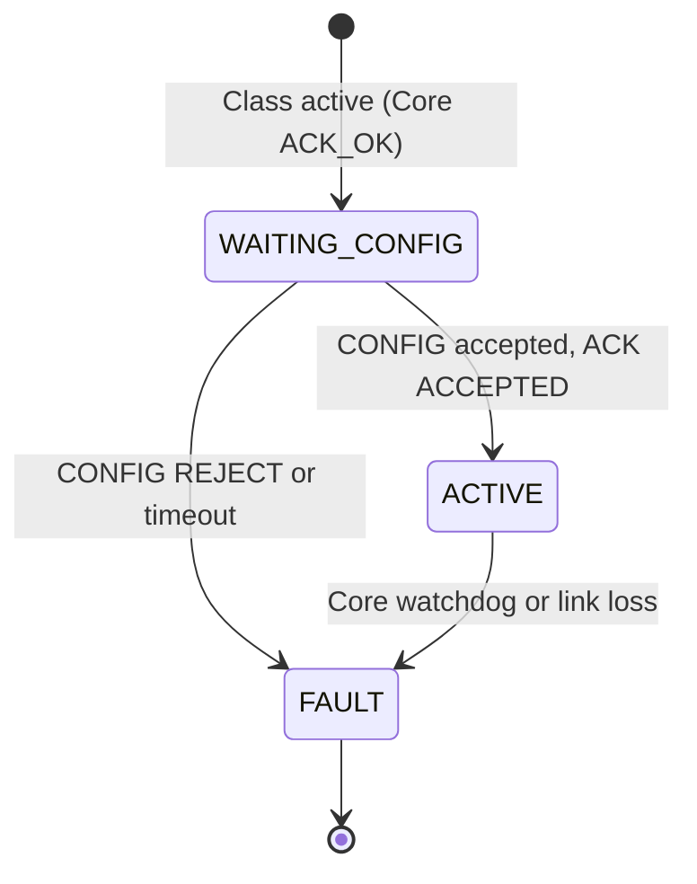
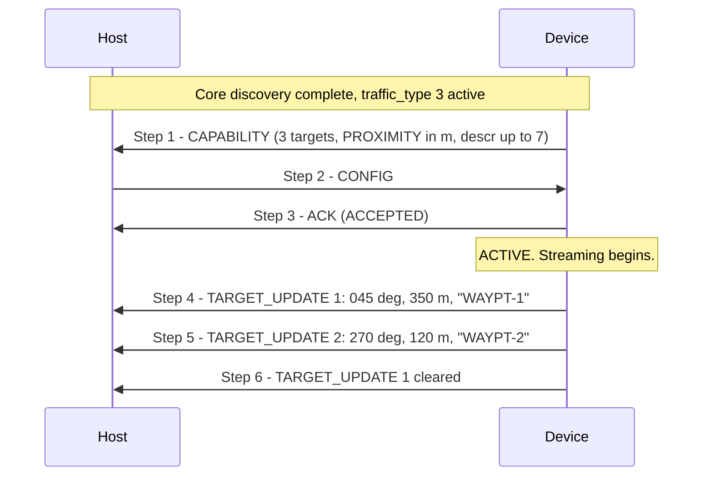

# APEX Device Class — Wayfinding

**APEX — Adaptive Payload EXchange**

**Status:** Draft | **Scope:** Wayfinding device class ([`traffic_type = 3`](APEX_Device_Classes.md#2--registry))

---

<a id="1--overview" name="1--overview"></a>
## 1.  Overview

The Wayfinding class covers Devices that produce **navigational cues** for the operator — *"point me in this direction"* updates the Host renders on its display, typically as a labeled arrow per target. The Host shows the direction and the description; the operator decides how to act.

The protocol is **agnostic to the source of the cue**. A wayfinding Device may compute its targets from anything it likes; only the resulting bearing and label appear on the wire. Each update is a small set of measurements about a **target**: a bearing the operator should look toward, optionally an elevation and a proximity value, and a short human-readable descriptor (e.g. *"WAYPOINT#1"*, *"Target #1"*, *"01"*).

**This class supports:**

- Multiple simultaneous targets, each addressed by a small index (1..N).
- A short ASCII descriptor per target to give the operator context.
- Optional per-measurement fields (elevation, proximity) that a Device may include or omit; the Host parses only what the Device declared.
- Stream-and-forget operation — the Host does not poll, and there is no per-update acknowledgement.

**This class does not support** (out of scope for the current version; future class candidates):

- Bidirectional negotiation about *which* target the operator is following.
- Bearing values at sub-degree precision. Bearings are reported in whole degrees ([§3.1](#3-1--bearing-reference)); a future version may add a higher-precision mode.

This document covers **both sides** of the class — Device role and Host role. Discovery, framing, and capability exchange at the bus level are out of scope and are handled by Core. All frames in this class carry `traffic_type = 3` in the APEX outer header.

---

<a id="2--roles" name="2--roles"></a>
## 2.  Roles

<a id="2-1--device" name="2-1--device"></a>
### 2.1.  Device

The Device declares the shape of the updates it will produce — the number of target slots it uses, which optional measurement fields it includes, and the maximum descriptor length — via the CAPABILITY frame ([§4.3](#4-3--capability-frame-device--host)). On `ACCEPTED` ([§4.5](#4-5--ack-frame-device--host)), the Device streams TARGET_UPDATE frames ([§4.6](#4-6--target_update-frame-device--host)) at its own cadence. The Device decides when to send; the Host does not poll. A Device may add, refresh, or clear targets at any time while in ACTIVE.

<a id="2-2--host" name="2-2--host"></a>
### 2.2.  Host

The Host receives CAPABILITY, replies with CONFIG ([§4.4](#4-4--config-frame-host--device)) (acceptance is essentially unconditional in the current version; the CONFIG frame exists to surface a clear malformed-capability case), and consumes incoming TARGET_UPDATE frames. The Host presents the cues however the platform sees fit — typically an OSD arrow per target index with the descriptor as a label.

The Host MUST NOT send TARGET_UPDATE frames. Wayfinding is one-way Device → Host.

---

<a id="3--bearing-reference-and-measurement-fields" name="3--bearing-reference-and-measurement-fields"></a>
## 3.  Bearing Reference and Measurement Fields

<a id="3-1--bearing-reference" name="3-1--bearing-reference"></a>
### 3.1.  Bearing reference

Bearings are reported **relative to the airframe's current heading**, in whole degrees, with `0°` straight ahead and increasing clockwise. A bearing of `90°` points to the operator's right, `180°` aft, `270°` to the left.

| Value | Meaning |
| --- | --- |
| `0`–`359` | Valid bearing in degrees relative to heading. |
| `0xFFFF` | **Clear** — remove the target at the given index from the Host's display ([§4.6](#4-6--target_update-frame-device--host)). |
| `360`–`0xFFFE` | Reserved. A Device MUST NOT send these; a Host receiving one MUST treat the TARGET_UPDATE as malformed and drop it silently ([APEX — Core §3.8](APEX_Core.md#3-8--receiver-error-handling)). |

A Device that knows its targets in an absolute frame is responsible for converting to heading-relative before transmitting. The Host is not required to provide the heading.

<a id="3-2--optional-measurement-fields" name="3-2--optional-measurement-fields"></a>
### 3.2.  Optional measurement fields

A Device may include any of the following additional measurements in each TARGET_UPDATE. Which ones are included is declared **once** in the CAPABILITY frame ([§4.3](#4-3--capability-frame-device--host)) as a bitmask, and every TARGET_UPDATE from that Device carries exactly the declared set, in the order below.

| Bit | Field | Width | Description |
| --- | --- | --- | --- |
| `0` | `ELEVATION` | `i16` | Elevation above horizontal, in whole degrees (`-90`..`+90`). Reserved bit pattern `0x8000` means *unknown*. |
| `1` | `PROXIMITY` | `i16` | A measure of how close the target is, in payload-defined units. The protocol does not assign units or interpret the value — the Device declares the unit and polarity (i.e. whether higher or lower means closer) **once** in the CAPABILITY frame ([§4.3](#4-3--capability-frame-device--host)). Reserved bit pattern `0x8000` means *unknown*. |
| `2`–`7` | *(reserved)* | — | MUST be `0`. |

Bits 2–7 are reserved and a Device MUST NOT set them in the current version; a Host that receives a CAPABILITY with any reserved bit set replies `REJECT_MALFORMED` ([§4.5](#4-5--ack-frame-device--host)).

A Device that includes no optional fields sets `optional_fields = 0`. A Device that includes elevation and proximity sets `optional_fields = 0b00000011`.

---

<a id="4--message-format" name="4--message-format"></a>
## 4.  Message Format

The class follows the APEX framing model ([APEX — Core §3](APEX_Core.md#3--communication-protocol-uart)): every frame carries `traffic_type = 3`, is COBS-framed, and uses the outer header from [APEX — Core §3.1.1](APEX_Core.md#3-1-1--outer-header-apexv0hdr_t), with the inner payload carrying class-specific content. All multi-byte fields are little-endian ([APEX — Core §3.1](APEX_Core.md#3-1--frame-layout)).

<a id="4-1--inner-payload-sub-header" name="4-1--inner-payload-sub-header"></a>
### 4.1.  Inner payload sub-header

| `class_msg_id` | Name | Direction | Meaning |
| --- | --- | --- | --- |
| `0` | *(reserved)* | — | Reserved; never sent. |
| `1` | **CAPABILITY** | Device → Host | Declares update shape ([§4.3](#4-3--capability-frame-device--host)). |
| `2` | **CONFIG** | Host → Device | Accepts or implicitly rejects the capability ([§4.4](#4-4--config-frame-host--device)). |
| `3` | **ACK** | Device → Host | Acknowledges CONFIG ([§4.5](#4-5--ack-frame-device--host)). |
| `4` | **TARGET_UPDATE** | Device → Host | One target's current measurements ([§4.6](#4-6--target_update-frame-device--host)). |

<a id="4-2--lifecycle-overview" name="4-2--lifecycle-overview"></a>
### 4.2.  Lifecycle overview

1. Core discovery completes for `device_class_req = 3` ([APEX — Core §3.3](APEX_Core.md#3-3--startup-discovery-handshake)). Class traffic on `traffic_type = 3` becomes valid.
2. Device immediately emits **CAPABILITY** ([§4.3](#4-3--capability-frame-device--host)) — unprompted, exactly once.
3. Host emits **CONFIG** ([§4.4](#4-4--config-frame-host--device)) accepting the declared shape.
4. Device replies **ACK** ([§4.5](#4-5--ack-frame-device--host)). On `ACCEPTED`, the session enters ACTIVE.
5. Device streams **TARGET_UPDATE** frames ([§4.6](#4-6--target_update-frame-device--host)) at its own cadence for the remainder of the session.

<a id="4-3--capability-frame-device--host" name="4-3--capability-frame-device--host"></a>
### 4.3.  CAPABILITY frame (Device → Host)

| Offset | Field | Width | Description |
| --- | --- | --- | --- |
| `0` | `class_msg_id` | `u8` | `1` (CAPABILITY). |
| `1` | `class_spec_version` | `u8` | Wayfinding-class spec revision the Device implements. `0` = the revision defined by this document. |
| `2` | `max_targets` | `u8` | Number of simultaneously addressable target slots. `1..16`. The Host uses indices `1..max_targets` in TARGET_UPDATE frames. |
| `3` | `optional_fields` | `u8` | Bitmask of optional measurement fields the Device includes in every TARGET_UPDATE ([§3.2](#3-2--optional-measurement-fields)). |
| `4` | `descriptor_max_bytes` | `u8` | Maximum length, in bytes, of the descriptor field the Device will ever emit. `0..32`. A value of `0` means the Device does not emit descriptors. |
| `5` | `proximity_polarity` | `u8` | Tells the Host which direction of change means *the target is getting closer*. `0` = `LOWER_IS_CLOSER` (e.g. meters, range — the value decreases as the operator approaches). `1` = `HIGHER_IS_CLOSER` (e.g. RSSI, signal strength — the value increases as the operator approaches). **Present only when bit 1 of `optional_fields` is set** ([§3.2](#3-2--optional-measurement-fields)); omitted otherwise. |
| `6…13` | `proximity_unit` | `char[8]` | ASCII unit label for the `PROXIMITY` field, NUL-padded to 8 bytes. The Host displays this string verbatim alongside the value (typical labels: `"m"`, `"km"`, `"dBm"`, `"RSSI"`). **Present only when bit 1 of `optional_fields` is set**; omitted otherwise. The string is the last field in CAPABILITY so a future revision can promote it to a variable-length representation without disturbing earlier offsets. |

A `max_targets` of `0` or `max_targets > 16` is malformed; the Host MUST reply `REJECT_MALFORMED` ([§4.5](#4-5--ack-frame-device--host)). A `descriptor_max_bytes > 32` is malformed for the same reason. A `proximity_polarity` value other than `0` or `1` is malformed.

A `class_spec_version` value the Host does not understand should be treated as `0` — the Host parses the fields it knows. Future revisions of this spec will extend CAPABILITY only by appending fields, never by repurposing existing ones.

<a id="4-4--config-frame-host--device" name="4-4--config-frame-host--device"></a>
### 4.4.  CONFIG frame (Host → Device)

| Offset | Field | Width | Description |
| --- | --- | --- | --- |
| `0` | `class_msg_id` | `u8` | `2` (CONFIG). |

The CONFIG frame carries no body in the current version. Its purpose is to give the Host an explicit handshake step on which it may decide to reject the capability — see [§4.5](#4-5--ack-frame-device--host). A Host that accepts the capability sends CONFIG; a Host that finds it malformed sends nothing and lets the Device timeout to FAULT, or sends CONFIG and lets the Device's own validation produce `REJECT_MALFORMED`.

A future revision may add negotiation fields here (e.g. cadence caps, descriptor encoding selection).

<a id="4-5--ack-frame-device--host" name="4-5--ack-frame-device--host"></a>
### 4.5.  ACK frame (Device → Host)

| Offset | Field | Width | Description |
| --- | --- | --- | --- |
| `0` | `class_msg_id` | `u8` | `3` (ACK). |
| `1` | `result` | `u8` | Result code (see below). |

**`result` values:**

| Value | Name | Meaning |
| --- | --- | --- |
| `0x00` | `ACCEPTED` | The Device has entered ACTIVE; TARGET_UPDATE streaming begins. |
| `0x01` | `REJECT_MALFORMED` | The Device's own CAPABILITY was malformed (reserved bits set, `max_targets` out of range, etc.) or the Host's CONFIG was malformed. |

A rejecting ACK is **terminal in the current version**: the Device transitions to FAULT ([§4.7](#4-7--state-machine-device)) and the operator must intervene. A Host that detects a malformed CAPABILITY SHOULD surface the reject to the operator; that is the only signal a passive operator has.

<a id="4-6--target_update-frame-device--host" name="4-6--target_update-frame-device--host"></a>
### 4.6.  TARGET_UPDATE frame (Device → Host)

| Offset | Field | Width | Description |
| --- | --- | --- | --- |
| `0` | `class_msg_id` | `u8` | `4` (TARGET_UPDATE). |
| `1` | `target_index` | `u8` | Index of the target this update applies to. `1..max_targets`. |
| `2` | `bearing` | `u16` | Heading-relative bearing in degrees ([§3.1](#3-1--bearing-reference)). `0..359` is a valid bearing; `0xFFFF` clears the target. |
| `4…` | *optional fields* | variable | The optional measurement fields the Device declared in CAPABILITY ([§3.2](#3-2--optional-measurement-fields)), in the bit order shown there: ELEVATION, then PROXIMITY. Only the declared fields are present. |
| *(after)* | `descriptor_len` | `u8` | Number of bytes of descriptor that follow. `0..descriptor_max_bytes`. Omitted entirely if `descriptor_max_bytes == 0` in CAPABILITY. |
| *(after)* | `descriptor` | `descriptor_len` × `u8` | ASCII descriptor for the target (no NUL terminator). May change between updates for the same `target_index`. |

A TARGET_UPDATE with `target_index == 0` or `target_index > max_targets` is malformed; the Host MUST drop it silently. A TARGET_UPDATE with `descriptor_len > descriptor_max_bytes` is malformed; the Host MUST drop it silently.

**Clearing a target.** A Device clears target `i` by sending a TARGET_UPDATE with `target_index = i` and `bearing = 0xFFFF`. The optional fields and descriptor SHOULD be omitted (i.e. the frame ends after `bearing`) when clearing, but the Host MUST tolerate a clear frame whose declared optional fields and descriptor are present and ignore their values.

**Refreshing a target.** The Device sends TARGET_UPDATE for the same `target_index` as often as it has new data; each update replaces the previous one for that index.

<a id="4-7--state-machine-device" name="4-7--state-machine-device"></a>
### 4.7.  State machine (Device)

The Device runs the following minimal state machine.

| Value | Name | Description |
| --- | --- | --- |
| `0x01` | **WAITING_CONFIG** | CAPABILITY has been sent; awaiting CONFIG. |
| `0x02` | **ACTIVE** | CONFIG accepted; TARGET_UPDATE streaming. |
| `0xFF` | **FAULT** | CONFIG rejected, malformed traffic, or core-layer fault. Terminal in the current version. |



The Host does not run an explicit state machine for this class beyond *pre-CONFIG* / *ACTIVE* per device — the device's Core lifecycle status ([APEX — Core §4](APEX_Core.md#4--device-lifecycle-status)) tells it everything else it needs.

<a id="4-8--reporting-cadence-and-timing" name="4-8--reporting-cadence-and-timing"></a>
### 4.8.  Reporting cadence and timing

- **CAPABILITY.** Emitted within **100 ms** of the class becoming active.
- **CONFIG.** The Host SHOULD emit CONFIG within **500 ms** of receiving CAPABILITY. A Device that has not received CONFIG within **5 s** transitions to FAULT.
- **ACK.** The Device MUST emit ACK within **200 ms** of receiving CONFIG.
- **TARGET_UPDATE.** Streaming begins immediately after the Device sends `ACCEPTED`. Cadence is payload-defined — typical wayfinding payloads emit updates at 5–25 Hz per target. The Device's TARGET_UPDATE traffic satisfies the [APEX — Core §3.5](APEX_Core.md#3-5--heartbeat) 1 Hz transmit floor; the Host's HOST_STATE broadcast satisfies the same on the Host side. A Device with currently no live targets MUST still send at least one frame per second — the implicit Core heartbeat is sufficient.

---

<a id="5--limitations" name="5--limitations"></a>
## 5.  Limitations

<a id="5-1--bearing-resolution" name="5-1--bearing-resolution"></a>
### 5.1.  Bearing resolution

Bearings are whole degrees. This matches the on-display resolution of typical arrow renderers and is plenty for *point me there* cues. A payload whose internal bearing is more precise rounds before sending. A future revision of this class may add a higher-precision mode if real use cases demand it; the current version does not.

<a id="5-2--target-count" name="5-2--target-count"></a>
### 5.2.  Target count

`max_targets` is capped at 16. Real wayfinding displays render only a handful of targets legibly; sixteen is a generous ceiling that bounds the worst-case CAPABILITY and TARGET_UPDATE frame size.

<a id="5-3--no-host-to-device-target-feedback" name="5-3--no-host-to-device-target-feedback"></a>
<a id="5-3--no-host--device-target-feedback" name="5-3--no-host--device-target-feedback"></a>
### 5.3.  No Host → Device target feedback

The Host cannot tell the Device which target the operator is currently following, nor ask the Device to refresh a specific target. The current version is strictly one-way (Device → Host) after the CONFIG handshake. A future revision may add a feedback channel for use cases where the payload could benefit from operator attention.

---

<a id="6--worked-example" name="6--worked-example"></a>
## 6.  Worked Example

A wayfinding payload that streams up to **3 targets** with a **proximity** measurement (reported in meters, lower-is-closer) and descriptors up to **7 bytes** long.

<a id="6-1--the-example-device" name="6-1--the-example-device"></a>
### 6.1.  The example Device

- `max_targets = 3`
- `optional_fields = 0b00000010` (PROXIMITY only)
- `descriptor_max_bytes = 7`
- `proximity_polarity = 0` (LOWER_IS_CLOSER)
- `proximity_unit = "m"`
- Has completed Core discovery and been assigned `device_id = 0x01`.

<a id="6-2--frame-notation" name="6-2--frame-notation"></a>
### 6.2.  Frame notation

Frames below use the common notation defined in Core [§3.1.5](APEX_Core.md#3-1-5--frame-notation): each is shown as the bytes before CRC and COBS. `PV = 00`, `TT = 03`, `ID = 01` throughout.

<a id="6-3--sequence" name="6-3--sequence"></a>
### 6.3.  Sequence



#### ▸ Step 1 — Device emits CAPABILITY

Inner payload 14 bytes (`LN = 0E`).

```
00 03 01 0E    01 00 03 02 07 00 6D 00 00 00 00 00 00 00
```

| Byte(s) | Hex | Field | Value |
| --- | --- | --- | --- |
| 0–3 | `00 03 01 0E` | outer header | `LN=0E` (14) |
| 4 | `01` | `class_msg_id` | `1` (CAPABILITY) |
| 5 | `00` | `class_spec_version` | `0` |
| 6 | `03` | `max_targets` | `3` |
| 7 | `02` | `optional_fields` | `0b00000010` (PROXIMITY) |
| 8 | `07` | `descriptor_max_bytes` | `7` |
| 9 | `00` | `proximity_polarity` | `0` (LOWER_IS_CLOSER) |
| 10–17 | `6D 00 00 00 00 00 00 00` | `proximity_unit` | `"m"` (NUL-padded to 8 bytes) |

#### ▸ Step 2 — Host emits CONFIG

Inner payload 1 byte (`LN = 01`).

```
00 03 01 01    02
```

| Byte(s) | Hex | Field | Value |
| --- | --- | --- | --- |
| 4 | `02` | `class_msg_id` | `2` (CONFIG) |

#### ▸ Step 3 — Device acknowledges

Inner payload 2 bytes (`LN = 02`).

```
00 03 01 02    03 00
```

| Byte(s) | Hex | Field | Value |
| --- | --- | --- | --- |
| 4 | `03` | `class_msg_id` | `3` (ACK) |
| 5 | `00` | `result` | `ACCEPTED` |

The Device transitions WAITING_CONFIG → ACTIVE and begins streaming.

#### ▸ Step 4 — TARGET_UPDATE for target 1: WAYPT-1 at 045°, 350 m

Inner payload 14 bytes (`LN = 0E`).

```
00 03 01 0E    04 01 2D 00 5E 01 07 57 41 59 50 54 2D 31
```

| Byte(s) | Hex | Field | Value |
| --- | --- | --- | --- |
| 4 | `04` | `class_msg_id` | `4` (TARGET_UPDATE) |
| 5 | `01` | `target_index` | `1` |
| 6–7 | `2D 00` | `bearing` | `45°` (little-endian) |
| 8–9 | `5E 01` | `PROXIMITY` | `350` (little-endian, i16; in `proximity_unit`, i.e. meters) |
| 10 | `07` | `descriptor_len` | `7` |
| 11–17 | `57 41 59 50 54 2D 31` | `descriptor` | `"WAYPT-1"` |

#### ▸ Step 5 — TARGET_UPDATE for target 2: WAYPT-2 at 270°, 120 m

Inner payload 14 bytes (`LN = 0E`).

```
00 03 01 0E    04 02 0E 01 78 00 07 57 41 59 50 54 2D 32
```

| Byte(s) | Hex | Field | Value |
| --- | --- | --- | --- |
| 4 | `04` | `class_msg_id` | `4` (TARGET_UPDATE) |
| 5 | `02` | `target_index` | `2` |
| 6–7 | `0E 01` | `bearing` | `270°` (little-endian) |
| 8–9 | `78 00` | `PROXIMITY` | `120` (little-endian, i16; in `proximity_unit`, i.e. meters) |
| 10 | `07` | `descriptor_len` | `7` |
| 11–17 | `57 41 59 50 54 2D 32` | `descriptor` | `"WAYPT-2"` |

#### ▸ Step 6 — Clear target 1

The Device clears target index 1 by sending `bearing = 0xFFFF`; the optional fields and descriptor are omitted. Inner payload 4 bytes (`LN = 04`).

```
00 03 01 04    04 01 FF FF
```

| Byte(s) | Hex | Field | Value |
| --- | --- | --- | --- |
| 4 | `04` | `class_msg_id` | `4` (TARGET_UPDATE) |
| 5 | `01` | `target_index` | `1` |
| 6–7 | `FF FF` | `bearing` | `0xFFFF` (clear) |

The Host removes the arrow for target 1 from the display. Target 2 continues to be streamed.

---